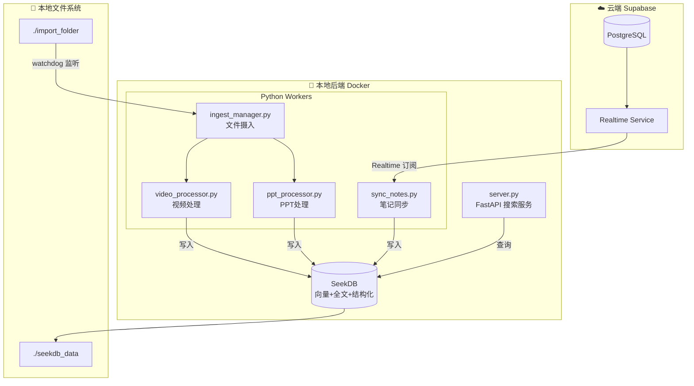

# Design Document: Echo v2.0 SeekDB 本地智能核心

## Overview

Echo v2.0 采用"双核驱动"架构，以 SeekDB 作为本地智能核心，实现多模态内容（笔记、视频、PPT）的统一检索。

核心设计目标：
1. **统一检索** - 一个搜索框找到所有内容
2. **多模态支持** - 笔记、视频、PPT 都能被索引和搜索
3. **本地优先** - 敏感数据本地存储，云端只做轻量同步
4. **AI 原生** - 向量搜索 + 全文搜索的混合检索

## Architecture

### 系统架构图



### 目录结构

```
echo/sidecar/
├── docker-compose.yml      # Docker 编排
├── .env                    # 环境变量
├── .env.example            # 环境变量模板
├── requirements.txt        # Python 依赖
├── seekdb_data/            # SeekDB 数据持久化
├── import_folder/          # 文件导入目录
├── scripts/
│   ├── init_db.sql         # 数据库初始化脚本
│   ├── sync_notes.py       # Supabase 同步脚本
│   ├── video_processor.py  # 视频处理模块
│   ├── ppt_processor.py    # PPT 处理模块
│   ├── ingest_manager.py   # 文件摄入管理器
│   └── server.py           # FastAPI 搜索服务
└── tests/
    └── test_processors.py  # 处理器测试
```

## Components and Interfaces

### 1. SeekDB 服务

SeekDB 是本地向量数据库，提供：
- 向量相似度搜索 (`<=>` 操作符)
- 全文搜索 (`MATCH...AGAINST`)
- 结构化查询 (标准 SQL)
- 自动向量生成 (`AI_EMBED` 函数)

**接口**:
- SQL 端口: 3306
- HTTP 端口: 8080 (可选)

### 2. Sync Worker (sync_notes.py)

负责 Supabase → SeekDB 的笔记同步。

```python
# 接口定义
class SyncWorker:
    def __init__(self, supabase_url: str, supabase_key: str, seekdb_conn: Connection):
        """初始化同步器"""
        pass
    
    def start(self) -> None:
        """启动 Realtime 订阅"""
        pass
    
    def on_insert(self, payload: dict) -> None:
        """处理 INSERT 事件"""
        pass
    
    def on_update(self, payload: dict) -> None:
        """处理 UPDATE 事件"""
        pass
    
    def sync_to_seekdb(self, note: dict) -> None:
        """同步单条笔记到 SeekDB"""
        pass
```

### 3. Video Processor (video_processor.py)

使用 faster-whisper 提取视频语音。

```python
# 接口定义
@dataclass
class VideoChunk:
    start_time: float  # 开始时间（秒）
    end_time: float    # 结束时间（秒）
    text: str          # 转录文本

def process_video(file_path: str, model: str = "base") -> list[VideoChunk]:
    """
    处理视频文件，返回分块后的转录结果
    
    分块策略：
    - 每 30 秒一个块，或
    - 每 200 个字符一个块
    - 以先到者为准
    """
    pass
```

### 4. PPT Processor (ppt_processor.py)

使用 python-pptx 提取 PPT 内容。

```python
# 接口定义
@dataclass
class SlideContent:
    page_number: int   # 页码（从 1 开始）
    text: str          # 页面文本（标题 + 正文）

def process_ppt(file_path: str) -> list[SlideContent]:
    """
    处理 PPT 文件，返回每页的文本内容
    """
    pass
```

### 5. Ingest Manager (ingest_manager.py)

统一管理文件摄入流程。

```python
# 接口定义
class IngestManager:
    def __init__(self, import_folder: str, seekdb_conn: Connection):
        """初始化摄入管理器"""
        pass
    
    def start_watching(self) -> None:
        """启动文件监听"""
        pass
    
    def on_file_created(self, file_path: str) -> None:
        """处理新文件"""
        pass
    
    def route_file(self, file_path: str) -> str:
        """根据扩展名路由到处理器，返回处理器名称"""
        pass
    
    def ingest_video(self, file_path: str) -> None:
        """摄入视频文件"""
        pass
    
    def ingest_ppt(self, file_path: str) -> None:
        """摄入 PPT 文件"""
        pass
```

### 6. Search API (server.py)

FastAPI 搜索服务。

```python
# 接口定义
from fastapi import FastAPI
from pydantic import BaseModel

class SearchRequest(BaseModel):
    query: str
    alpha: float = 0.5  # 向量权重，0-1

class SearchResult(BaseModel):
    id: str
    content: str        # 内容片段
    source_type: str    # note, video, ppt
    metadata: dict
    score: float

class SearchResponse(BaseModel):
    results: list[SearchResult]
    total: int

@app.post("/search")
def search(request: SearchRequest) -> SearchResponse:
    """
    混合搜索接口
    
    算法：
    score = alpha * vector_score + (1 - alpha) * fulltext_score
    """
    pass
```

## Data Models

### knowledge_base 表结构

```sql
CREATE TABLE knowledge_base (
    -- 主键
    id VARCHAR(64) PRIMARY KEY,
    
    -- 核心内容
    content TEXT NOT NULL,
    embedding VECTOR(768),
    
    -- 来源信息
    source_type VARCHAR(20) NOT NULL,  -- 'note', 'video', 'ppt'
    source_path TEXT NOT NULL,          -- 文件路径或 Supabase ID
    
    -- 元数据 (JSON)
    metadata JSON,
    
    -- 时间戳
    created_at TIMESTAMP DEFAULT CURRENT_TIMESTAMP,
    updated_at TIMESTAMP DEFAULT CURRENT_TIMESTAMP ON UPDATE CURRENT_TIMESTAMP,
    
    -- 索引
    FULLTEXT INDEX idx_content (content)
);
```

### metadata JSON 结构

```typescript
// 笔记类型
interface NoteMetadata {
    supabase_id: string;
    tags?: string[];
    is_todo?: boolean;
}

// 视频类型
interface VideoMetadata {
    start_time: number;    // 秒
    end_time: number;      // 秒
    file_path: string;
    duration?: number;     // 总时长
}

// PPT 类型
interface PPTMetadata {
    page_number: number;
    total_pages: number;
    file_path: string;
    title?: string;        // 幻灯片标题
}
```

## Correctness Properties

*A property is a characteristic or behavior that should hold true across all valid executions of a system—essentially, a formal statement about what the system should do. Properties serve as the bridge between human-readable specifications and machine-verifiable correctness guarantees.*

### Property 1: 笔记同步 Round-Trip

*For any* note synced from Supabase to SeekDB, querying SeekDB by the note's Supabase ID should return the same content.

**Validates: Requirements 2.3, 2.7**

### Property 2: 视频分块约束

*For any* video transcription chunk produced by Video_Processor, the chunk duration should be ≤ 30 seconds AND the text length should be ≤ 200 characters (with tolerance for word boundaries).

**Validates: Requirements 3.4, 3.5**

### Property 3: 文件路由正确性

*For any* file added to import_folder, the File_Watcher should route it to the correct processor based on extension:
- .mp4, .mkv → Video_Processor
- .pptx → PPT_Processor
- Other → Ignored with warning

**Validates: Requirements 5.2, 5.3, 5.4**

### Property 4: 混合搜索结果完整性

*For any* search query, all returned results should include: id, content snippet, source_type, metadata, and score; and results should be sorted by score in descending order.

**Validates: Requirements 6.5, 6.6**

### Property 5: Embedding 非空性

*For any* content inserted into SeekDB, the embedding field should not be null after insertion (AI_EMBED function should generate it).

**Validates: Requirements 2.4**

### Property 6: PPT 页面完整性

*For any* PPT file processed, the number of SlideContent items returned should equal the total number of slides in the PPT, and each item should have a valid page_number from 1 to total_pages.

**Validates: Requirements 4.3, 4.4, 4.6**

## Error Handling

### 连接错误处理

```python
# Supabase 连接重试
MAX_RETRIES = 5
INITIAL_BACKOFF = 1  # 秒

def connect_with_retry():
    for attempt in range(MAX_RETRIES):
        try:
            return supabase.connect()
        except ConnectionError as e:
            wait_time = INITIAL_BACKOFF * (2 ** attempt)
            logger.warning(f"连接失败，{wait_time}秒后重试: {e}")
            time.sleep(wait_time)
    raise ConnectionError("无法连接到 Supabase")
```

### 文件处理错误

```python
# 文件处理容错
def process_file_safely(file_path: str):
    try:
        if file_path.endswith(('.mp4', '.mkv')):
            return process_video(file_path)
        elif file_path.endswith('.pptx'):
            return process_ppt(file_path)
    except Exception as e:
        logger.error(f"处理文件失败 {file_path}: {e}")
        # 不抛出异常，继续处理其他文件
        return None
```

### 环境变量验证

```python
# 启动时验证必要环境变量
REQUIRED_ENV_VARS = [
    'SUPABASE_URL',
    'SUPABASE_KEY',
    'SEEKDB_HOST',
    'SEEKDB_PORT',
]

def validate_env():
    missing = [var for var in REQUIRED_ENV_VARS if not os.getenv(var)]
    if missing:
        raise EnvironmentError(f"缺少必要环境变量: {', '.join(missing)}")
```

## Testing Strategy

### 测试框架

- **单元测试**: pytest
- **属性测试**: hypothesis (Python 版 fast-check)
- **集成测试**: pytest + docker-compose

### 单元测试

针对具体示例和边界情况：

```python
# test_processors.py

def test_video_chunk_format():
    """测试视频分块输出格式"""
    chunks = process_video("test_video.mp4")
    for chunk in chunks:
        assert hasattr(chunk, 'start_time')
        assert hasattr(chunk, 'end_time')
        assert hasattr(chunk, 'text')

def test_ppt_empty_slide():
    """测试空白幻灯片处理"""
    slides = process_ppt("empty_slides.pptx")
    assert len(slides) > 0
    # 空白页应返回空字符串，不应崩溃

def test_search_empty_query():
    """测试空查询返回 400"""
    response = client.post("/search", json={"query": ""})
    assert response.status_code == 400
```

### 属性测试

使用 hypothesis 验证通用属性：

```python
# test_properties.py
from hypothesis import given, strategies as st

@given(st.text(min_size=1, max_size=1000))
def test_video_chunk_constraint(text):
    """
    **Feature: echo-v2-seekdb, Property 2: 视频分块约束**
    **Validates: Requirements 3.4, 3.5**
    
    对于任意转录文本，分块结果应满足：
    - 时长 ≤ 30 秒
    - 字符数 ≤ 200（允许词边界容差）
    """
    chunks = chunk_transcription(text, duration=60)
    for chunk in chunks:
        assert chunk.end_time - chunk.start_time <= 30
        assert len(chunk.text) <= 220  # 允许 10% 容差

@given(st.sampled_from(['.mp4', '.mkv', '.pptx', '.pdf', '.txt']))
def test_file_routing(extension):
    """
    **Feature: echo-v2-seekdb, Property 3: 文件路由正确性**
    **Validates: Requirements 5.2, 5.3, 5.4**
    """
    processor = route_file(f"test{extension}")
    if extension in ['.mp4', '.mkv']:
        assert processor == 'video'
    elif extension == '.pptx':
        assert processor == 'ppt'
    else:
        assert processor is None
```

### 集成测试

```python
# test_integration.py

def test_note_sync_roundtrip():
    """
    **Feature: echo-v2-seekdb, Property 1: 笔记同步 Round-Trip**
    **Validates: Requirements 2.3, 2.7**
    """
    # 1. 插入笔记到 Supabase
    note_id = supabase.insert_note("测试笔记内容")
    
    # 2. 等待同步
    time.sleep(2)
    
    # 3. 从 SeekDB 查询
    result = seekdb.query(f"SELECT * FROM knowledge_base WHERE source_path = '{note_id}'")
    
    assert result is not None
    assert result['content'] == "测试笔记内容"
    assert result['source_type'] == 'note'
```

### 测试配置

```python
# pytest.ini
[pytest]
testpaths = tests
python_files = test_*.py
python_functions = test_*

# hypothesis 配置
[hypothesis]
max_examples = 100
deadline = 5000
```

## Dependencies

### Python 依赖 (requirements.txt)

```
# 核心依赖
supabase>=2.0.0
mysql-connector-python>=8.0.0
fastapi>=0.100.0
uvicorn>=0.23.0
pydantic>=2.0.0

# 文件处理
watchdog>=3.0.0
faster-whisper>=0.9.0
python-pptx>=0.6.21

# 测试
pytest>=7.0.0
hypothesis>=6.0.0
httpx>=0.24.0

# 工具
python-dotenv>=1.0.0
```

### Docker 服务

```yaml
# docker-compose.yml
version: '3.8'

services:
  seekdb:
    image: seekdb/seekdb:latest
    ports:
      - "3306:3306"
      - "8080:8080"
    volumes:
      - ./seekdb_data:/var/lib/seekdb
    environment:
      - SEEKDB_ROOT_PASSWORD=${SEEKDB_PASSWORD}
    
  echo_worker:
    image: python:3.10-slim
    volumes:
      - .:/app
    working_dir: /app
    command: tail -f /dev/null
    depends_on:
      - seekdb
    env_file:
      - .env
```
