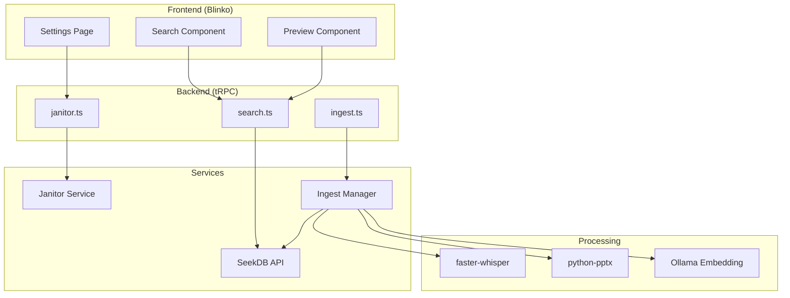

# Design Document: Echo V3 Enhancements

## Overview

Echo V3 增强功能设计，实现三个核心能力：
1. **多模态处理** - 视频/PPT 内容提取并索引
2. **向量搜索** - 基于 Embedding 的语义搜索
3. **Janitor 配置** - 可视化配置整理目录

## Architecture



## Components and Interfaces

### 1. Janitor 配置 API

```typescript
// 新增 Janitor 配置接口
interface JanitorConfig {
  // 监控目录列表
  inboxDirs: string[];
  // 输出根目录
  outputBase: string;
  // 置信度阈值
  confidenceThreshold: number;
  // 分类配置
  categories: CategoryConfig[];
  // SeekDB 自动索引
  seekdbAutoIndex: boolean;
}

interface CategoryConfig {
  id: string;
  name: string;
  path: string;
  keywords: string[];
  color?: string;
}

// tRPC 端点
janitor.getFullConfig(): JanitorConfig
janitor.updateConfig(config: Partial<JanitorConfig>): void
janitor.validatePath(path: string): { valid: boolean; error?: string }
janitor.addInboxDir(path: string): void
janitor.removeInboxDir(path: string): void
janitor.addCategory(category: CategoryConfig): void
janitor.updateCategory(id: string, updates: Partial<CategoryConfig>): void
janitor.removeCategory(id: string): void
```

### 2. Ingest Manager API

```typescript
// 文件处理接口
interface IngestRequest {
  filePath: string;
  fileType: 'video' | 'ppt' | 'pdf';
  options?: {
    whisperModel?: string;
    generateEmbedding?: boolean;
  };
}

interface IngestResult {
  taskId: string;
  status: 'pending' | 'processing' | 'completed' | 'failed';
  progress?: number;
  chunks?: ContentChunk[];
  error?: string;
}

interface ContentChunk {
  id: string;
  content: string;
  sourceType: string;
  sourcePath: string;
  metadata: {
    startTime?: number;  // 视频时间戳
    endTime?: number;
    pageNumber?: number; // PPT 页码
    title?: string;
  };
  embedding?: number[];  // 向量
}

// tRPC 端点
ingest.processFile(request: IngestRequest): IngestResult
ingest.getStatus(taskId: string): IngestResult
ingest.getRecentTasks(limit: number): IngestResult[]
ingest.retryTask(taskId: string): IngestResult
ingest.cancelTask(taskId: string): void
```

### 3. 向量搜索 API

```typescript
// 搜索接口
interface HybridSearchRequest {
  query: string;
  alpha: number;  // 0 = 纯文本, 1 = 纯向量
  sourceTypes?: string[];  // 过滤来源类型
  limit: number;
}

interface SearchResult {
  id: string;
  content: string;
  snippet: string;  // 带高亮的摘要
  sourceType: 'video' | 'ppt' | 'document' | 'note';
  sourcePath: string;
  score: number;
  metadata: {
    startTime?: number;
    endTime?: number;
    pageNumber?: number;
    title?: string;
    thumbnailUrl?: string;
  };
}

// tRPC 端点
search.hybrid(request: HybridSearchRequest): SearchResult[]
search.generateEmbedding(text: string): number[]
```

## Data Models

### SeekDB Schema 扩展

```sql
-- 知识库表 (已存在，需扩展)
ALTER TABLE knowledge_base ADD COLUMN embedding VECTOR(768);
ALTER TABLE knowledge_base ADD COLUMN embedding_model VARCHAR(50);

-- 处理任务表 (新增)
CREATE TABLE ingest_tasks (
    id VARCHAR(36) PRIMARY KEY,
    file_path VARCHAR(500) NOT NULL,
    file_type VARCHAR(20) NOT NULL,
    status ENUM('pending', 'processing', 'completed', 'failed') DEFAULT 'pending',
    progress INT DEFAULT 0,
    chunks_count INT DEFAULT 0,
    error_message TEXT,
    created_at TIMESTAMP DEFAULT CURRENT_TIMESTAMP,
    updated_at TIMESTAMP DEFAULT CURRENT_TIMESTAMP ON UPDATE CURRENT_TIMESTAMP,
    completed_at TIMESTAMP NULL
);

-- Janitor 配置表 (新增)
CREATE TABLE janitor_config (
    id INT PRIMARY KEY DEFAULT 1,
    inbox_dirs JSON NOT NULL DEFAULT '[]',
    output_base VARCHAR(500) NOT NULL DEFAULT '~/Echo',
    confidence_threshold DECIMAL(3,2) DEFAULT 0.6,
    categories JSON NOT NULL DEFAULT '[]',
    seekdb_auto_index BOOLEAN DEFAULT TRUE,
    updated_at TIMESTAMP DEFAULT CURRENT_TIMESTAMP ON UPDATE CURRENT_TIMESTAMP
);
```

### Janitor 配置文件格式

```yaml
# echo_categories.yaml (保持兼容，增加字段)
groq:
  model: "llama-3.1-70b-versatile"

ollama:
  host: "http://localhost:11434"
  model: "moondream"
  embedding_model: "nomic-embed-text"  # 新增：Embedding 模型

inbox_dirs:
  - "~/Downloads/Inbox"
  - "~/Desktop/Temp"

output_base: "~/Echo"

confidence_threshold: 0.6

seekdb:
  api_url: "http://localhost:8765"
  auto_index: true
  generate_embedding: true  # 新增：是否生成向量

categories:
  - id: "01_investment"
    name: "Investment"
    path: "01_Investment"
    keywords: ["财报", "股票", "投资"]
    color: "#4CAF50"
  # ... 其他分类
```

## Correctness Properties

*A property is a characteristic or behavior that should hold true across all valid executions of a system-essentially, a formal statement about what the system should do. Properties serve as the bridge between human-readable specifications and machine-verifiable correctness guarantees.*

### Property 1: Media Processing Round-Trip

*For any* valid video or PPT file, processing it should produce structured output containing the original content with position metadata (timestamps for video, page numbers for PPT).

**Validates: Requirements 1.1, 1.2, 1.3**

### Property 2: Hybrid Search Alpha Parameter

*For any* search query and alpha value between 0 and 1, the search results should reflect the balance between text matching (alpha=0) and vector similarity (alpha=1).

**Validates: Requirements 2.2, 2.3**

### Property 3: Embedding Fallback

*For any* search query, if embedding generation fails, the system should still return text-based search results without error.

**Validates: Requirements 2.5**

### Property 4: Configuration Persistence

*For any* valid Janitor configuration, saving and then loading it should produce an equivalent configuration object.

**Validates: Requirements 3.4**

### Property 5: Path Validation

*For any* file path string, the validation function should correctly identify whether the path exists and is accessible.

**Validates: Requirements 3.6**

### Property 6: Search Results Metadata

*For any* search result, it should contain source type, file path, relevance score, and appropriate position metadata based on source type.

**Validates: Requirements 1.4, 5.3, 5.4, 5.5**

### Property 7: Processing Status Accuracy

*For any* file being processed, the status should accurately reflect the current state (pending/processing/completed/failed) and progress percentage.

**Validates: Requirements 4.2, 4.5**

## Error Handling

### 视频处理错误

```python
try:
    chunks = process_video(file_path)
except WhisperError as e:
    logger.error(f"Whisper 转录失败: {e}")
    update_task_status(task_id, "failed", error=str(e))
    # 不崩溃，记录错误供用户查看
except Exception as e:
    logger.error(f"视频处理异常: {e}")
    update_task_status(task_id, "failed", error="处理失败，请重试")
```

### Embedding 生成错误

```python
try:
    embedding = generate_embedding(text)
except OllamaError as e:
    logger.warning(f"Embedding 生成失败，回退到纯文本: {e}")
    embedding = None  # 允许 NULL，搜索时跳过向量匹配
```

### 配置验证错误

```typescript
function validateConfig(config: JanitorConfig): ValidationResult {
  const errors: string[] = [];
  
  // 验证目录存在
  for (const dir of config.inboxDirs) {
    if (!await pathExists(dir)) {
      errors.push(`目录不存在: ${dir}`);
    }
  }
  
  // 验证分类 ID 唯一
  const ids = config.categories.map(c => c.id);
  if (new Set(ids).size !== ids.length) {
    errors.push('分类 ID 必须唯一');
  }
  
  return { valid: errors.length === 0, errors };
}
```

## Testing Strategy

### 单元测试

- 视频处理器：测试不同格式视频的转录
- PPT 处理器：测试不同结构 PPT 的文本提取
- 配置验证：测试各种边界情况
- 搜索排序：测试 alpha 参数对结果的影响

### 属性测试 (Property-Based Testing)

使用 `fast-check` 框架，每个属性测试至少 100 次迭代。

```typescript
// Property 4: Configuration Persistence
test.prop([fc.record({
  inboxDirs: fc.array(fc.string()),
  outputBase: fc.string(),
  confidenceThreshold: fc.float({ min: 0, max: 1 }),
  categories: fc.array(fc.record({
    id: fc.string(),
    name: fc.string(),
    path: fc.string(),
    keywords: fc.array(fc.string())
  }))
})])('config round-trip', async (config) => {
  await saveConfig(config);
  const loaded = await loadConfig();
  expect(loaded).toEqual(config);
});
```

### 集成测试

- 端到端文件处理流程
- 搜索结果准确性
- 配置变更生效验证
