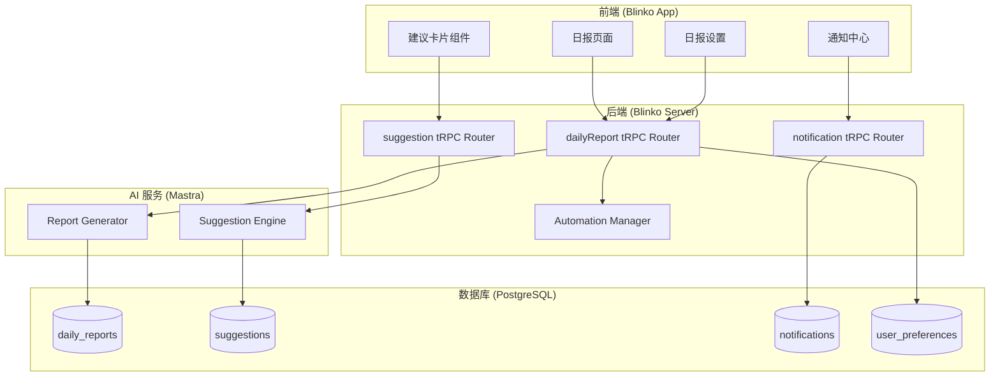

# Design Document: Echo v3.2 功能完善

## Overview

本设计文档描述 Echo v3.2 功能完善的技术实现方案，包括早报生成、建议系统、日报增强和属性测试补充。

## Architecture

### 系统架构图



## Data Models

### 1. 日报数据模型

```typescript
// 日报类型
interface DailyReport {
  id: string;
  type: 'morning' | 'evening';
  date: Date;
  content: {
    summary: string;           // AI 生成的摘要
    tasks: TaskSummary[];      // 任务统计
    notes: NoteSummary[];      // 笔记摘要
    suggestions: Suggestion[]; // 建议列表
    activities?: ActivitySummary; // 活动统计（可选）
  };
  generatedAt: Date;
  accountId: number;
}

// 任务摘要
interface TaskSummary {
  total: number;
  completed: number;
  pending: number;
  overdue: number;
  topPriority: Task[];
}

// 笔记摘要
interface NoteSummary {
  count: number;
  tags: string[];
  highlights: string[];
}
```

### 2. 建议数据模型

```typescript
// 建议
interface Suggestion {
  id: string;
  type: 'task' | 'reminder' | 'habit' | 'insight';
  content: string;
  source: string;           // 建议来源说明
  priority: 'high' | 'medium' | 'low';
  status: 'pending' | 'accepted' | 'postponed' | 'rejected';
  postponedUntil?: Date;    // 推迟到的时间
  createdAt: Date;
  respondedAt?: Date;
  accountId: number;
}

// 建议反馈
interface SuggestionFeedback {
  suggestionId: string;
  action: 'accept' | 'postpone' | 'reject';
  reason?: string;          // 拒绝原因（可选）
  postponeDuration?: number; // 推迟时长（分钟）
}
```

### 3. 通知数据模型

```typescript
// 通知
interface Notification {
  id: string;
  type: 'report' | 'suggestion' | 'task' | 'system';
  title: string;
  body: string;
  read: boolean;
  actionUrl?: string;       // 点击跳转的 URL
  createdAt: Date;
  accountId: number;
}
```

## Database Schema

```sql
-- 日报表
CREATE TABLE daily_reports (
    id SERIAL PRIMARY KEY,
    type VARCHAR(20) NOT NULL,  -- 'morning' | 'evening'
    date DATE NOT NULL,
    content JSONB NOT NULL,
    generated_at TIMESTAMP DEFAULT NOW(),
    account_id INT REFERENCES accounts(id),
    UNIQUE(type, date, account_id)
);

-- 建议表
CREATE TABLE suggestions (
    id SERIAL PRIMARY KEY,
    type VARCHAR(20) NOT NULL,
    content TEXT NOT NULL,
    source TEXT,
    priority VARCHAR(10) DEFAULT 'medium',
    status VARCHAR(20) DEFAULT 'pending',
    postponed_until TIMESTAMP,
    created_at TIMESTAMP DEFAULT NOW(),
    responded_at TIMESTAMP,
    account_id INT REFERENCES accounts(id)
);

-- 通知表
CREATE TABLE notifications (
    id SERIAL PRIMARY KEY,
    type VARCHAR(20) NOT NULL,
    title VARCHAR(255) NOT NULL,
    body TEXT,
    read BOOLEAN DEFAULT false,
    action_url VARCHAR(500),
    created_at TIMESTAMP DEFAULT NOW(),
    account_id INT REFERENCES accounts(id)
);

-- 用户偏好表（扩展）
ALTER TABLE user_preferences ADD COLUMN IF NOT EXISTS
    morning_report_time TIME DEFAULT '08:00',
    evening_report_time TIME DEFAULT '21:00',
    morning_report_enabled BOOLEAN DEFAULT true,
    evening_report_enabled BOOLEAN DEFAULT true,
    notification_enabled BOOLEAN DEFAULT true;

-- 索引
CREATE INDEX idx_daily_reports_date ON daily_reports(date, account_id);
CREATE INDEX idx_suggestions_status ON suggestions(status, account_id);
CREATE INDEX idx_notifications_read ON notifications(read, account_id);
```

## API Design

### 1. 日报 API

```typescript
// server/routerTrpc/dailyReport.ts

export const dailyReportRouter = router({
  // 生成日报
  generate: protectedProcedure
    .input(z.object({
      type: z.enum(['morning', 'evening']),
      date: z.date().optional(),
    }))
    .mutation(async ({ input, ctx }) => {
      // 调用 ReportGenerator 生成日报
    }),

  // 获取日报
  get: protectedProcedure
    .input(z.object({
      type: z.enum(['morning', 'evening']),
      date: z.date(),
    }))
    .query(async ({ input, ctx }) => {
      // 查询日报
    }),

  // 获取日报列表
  list: protectedProcedure
    .input(z.object({
      startDate: z.date().optional(),
      endDate: z.date().optional(),
      type: z.enum(['morning', 'evening', 'all']).optional(),
      limit: z.number().default(10),
    }))
    .query(async ({ input, ctx }) => {
      // 查询日报列表
    }),

  // 更新日报设置
  updateSettings: protectedProcedure
    .input(z.object({
      morningReportTime: z.string().optional(),
      eveningReportTime: z.string().optional(),
      morningReportEnabled: z.boolean().optional(),
      eveningReportEnabled: z.boolean().optional(),
    }))
    .mutation(async ({ input, ctx }) => {
      // 更新用户偏好
    }),

  // 获取日报设置
  getSettings: protectedProcedure
    .query(async ({ ctx }) => {
      // 获取用户偏好
    }),
});
```

### 2. 建议 API

```typescript
// server/routerTrpc/suggestion.ts

export const suggestionRouter = router({
  // 获取待处理建议
  getPending: protectedProcedure
    .input(z.object({
      limit: z.number().default(5),
    }))
    .query(async ({ input, ctx }) => {
      // 查询待处理建议
    }),

  // 响应建议
  respond: protectedProcedure
    .input(z.object({
      suggestionId: z.string(),
      action: z.enum(['accept', 'postpone', 'reject']),
      reason: z.string().optional(),
      postponeDuration: z.number().optional(), // 分钟
    }))
    .mutation(async ({ input, ctx }) => {
      // 处理建议响应
    }),

  // 获取建议统计
  getStats: protectedProcedure
    .query(async ({ ctx }) => {
      // 返回接受率、拒绝率等统计
    }),
});
```

### 3. 通知 API

```typescript
// server/routerTrpc/notification.ts

export const notificationRouter = router({
  // 获取通知列表
  list: protectedProcedure
    .input(z.object({
      unreadOnly: z.boolean().default(false),
      limit: z.number().default(20),
    }))
    .query(async ({ input, ctx }) => {
      // 查询通知列表
    }),

  // 标记已读
  markRead: protectedProcedure
    .input(z.object({
      notificationIds: z.array(z.string()),
    }))
    .mutation(async ({ input, ctx }) => {
      // 标记通知已读
    }),

  // 获取未读数量
  getUnreadCount: protectedProcedure
    .query(async ({ ctx }) => {
      // 返回未读通知数量
    }),
});
```

## Component Design

### 1. 早报组件

```tsx
// app/src/components/echoai/MorningReport.tsx

interface MorningReportProps {
  date: Date;
}

export function MorningReport({ date }: MorningReportProps) {
  const { data: report } = trpc.dailyReport.get.useQuery({
    type: 'morning',
    date,
  });

  return (
    <div className="morning-report">
      <h2>早安，今天是 {format(date, 'yyyy年MM月dd日')}</h2>
      
      {/* 今日待办 */}
      <section className="tasks-section">
        <h3>今日待办</h3>
        <TaskList tasks={report?.content.tasks.topPriority} />
      </section>

      {/* 昨日未完成 */}
      {report?.content.tasks.overdue > 0 && (
        <section className="overdue-section">
          <h3>昨日未完成</h3>
          <OverdueTaskList count={report.content.tasks.overdue} />
        </section>
      )}

      {/* AI 建议 */}
      <section className="suggestions-section">
        <h3>今日建议</h3>
        <SuggestionList suggestions={report?.content.suggestions} />
      </section>
    </div>
  );
}
```

### 2. 建议卡片组件

```tsx
// app/src/components/echoai/suggestions/SuggestionCard.tsx

interface SuggestionCardProps {
  suggestion: Suggestion;
  onRespond: (action: 'accept' | 'postpone' | 'reject') => void;
}

export function SuggestionCard({ suggestion, onRespond }: SuggestionCardProps) {
  return (
    <Card className="suggestion-card">
      <CardHeader>
        <Badge variant={getPriorityVariant(suggestion.priority)}>
          {suggestion.type}
        </Badge>
      </CardHeader>
      <CardContent>
        <p>{suggestion.content}</p>
        <p className="text-muted-foreground text-sm">
          来源: {suggestion.source}
        </p>
      </CardContent>
      <CardFooter className="flex gap-2">
        <Button onClick={() => onRespond('accept')} variant="default">
          接受
        </Button>
        <Button onClick={() => onRespond('postpone')} variant="outline">
          稍后
        </Button>
        <Button onClick={() => onRespond('reject')} variant="ghost">
          忽略
        </Button>
      </CardFooter>
    </Card>
  );
}
```

### 3. 通知中心组件

```tsx
// app/src/components/Layout/NotificationCenter.tsx

export function NotificationCenter() {
  const { data: notifications } = trpc.notification.list.useQuery({
    unreadOnly: false,
    limit: 20,
  });
  const { data: unreadCount } = trpc.notification.getUnreadCount.useQuery();

  return (
    <Popover>
      <PopoverTrigger asChild>
        <Button variant="ghost" className="relative">
          <Bell className="h-5 w-5" />
          {unreadCount > 0 && (
            <Badge className="absolute -top-1 -right-1">
              {unreadCount}
            </Badge>
          )}
        </Button>
      </PopoverTrigger>
      <PopoverContent className="w-80">
        <NotificationList notifications={notifications} />
      </PopoverContent>
    </Popover>
  );
}
```

## Automation Integration

### 早报调度

```typescript
// 使用 AutomationManager 调度早报生成

const morningReportAutomation = {
  name: 'Morning Report Generation',
  query: 'Generate morning report with today\'s tasks and suggestions',
  schedule: '0 8 * * *', // 每天 8:00
  naturalSchedule: '每天早上 8 点',
  resultStorage: 'note',
  enabled: true,
};

// 在用户首次启用早报时创建自动化任务
await automationManager.createAutomation(morningReportAutomation);
```

## Property Tests

### 1. 日报生成一致性测试

```typescript
// server/aiServer/dailyReport.test.ts

import { fc } from 'fast-check';

describe('DailyReport Generator', () => {
  /**
   * Property 1: 日报生成一致性
   * 相同输入应产生结构一致的输出
   * **Validates: Requirements 1.2**
   */
  it('should generate consistent report structure', () => {
    fc.assert(
      fc.property(
        fc.date(),
        fc.array(fc.record({ id: fc.string(), title: fc.string() })),
        async (date, tasks) => {
          const report1 = await generateReport(date, tasks);
          const report2 = await generateReport(date, tasks);
          
          // 结构应一致
          expect(Object.keys(report1.content)).toEqual(
            Object.keys(report2.content)
          );
          // 任务统计应一致
          expect(report1.content.tasks.total).toBe(report2.content.tasks.total);
        }
      ),
      { numRuns: 100 }
    );
  });
});
```

### 2. 建议响应状态机测试

```typescript
// server/aiServer/suggestion.test.ts

describe('Suggestion State Machine', () => {
  /**
   * Property 2: 建议状态转换正确性
   * 建议状态只能按规定路径转换
   * **Validates: Requirements 2.2, 2.3, 2.4, 2.5**
   */
  it('should follow valid state transitions', () => {
    fc.assert(
      fc.property(
        fc.constantFrom('accept', 'postpone', 'reject'),
        async (action) => {
          const suggestion = await createSuggestion();
          expect(suggestion.status).toBe('pending');
          
          await respondToSuggestion(suggestion.id, action);
          const updated = await getSuggestion(suggestion.id);
          
          // 状态应正确转换
          const expectedStatus = {
            accept: 'accepted',
            postpone: 'postponed',
            reject: 'rejected',
          }[action];
          expect(updated.status).toBe(expectedStatus);
        }
      ),
      { numRuns: 100 }
    );
  });
});
```

## Error Handling

### 日报生成失败处理

```typescript
async function generateDailyReport(type: 'morning' | 'evening', date: Date) {
  try {
    const report = await reportGenerator.generate(type, date);
    await saveDailyReport(report);
    await sendNotification({
      type: 'report',
      title: type === 'morning' ? '早报已生成' : '晚报已生成',
      body: '点击查看详情',
      actionUrl: `/daily-report/${type}/${format(date, 'yyyy-MM-dd')}`,
    });
    return report;
  } catch (error) {
    console.error(`Failed to generate ${type} report:`, error);
    // 记录失败，下次重试
    await recordReportFailure(type, date, error);
    // 不抛出错误，避免影响其他任务
    return null;
  }
}
```

## Security Considerations

1. **数据隔离**: 所有查询都需要 accountId 过滤
2. **权限验证**: 使用 protectedProcedure 确保用户已登录
3. **输入验证**: 使用 zod 验证所有输入参数
4. **通知安全**: 桌面通知不包含敏感信息

## Performance Considerations

1. **日报缓存**: 生成后缓存，避免重复生成
2. **建议批量查询**: 一次查询多个建议，减少数据库访问
3. **通知分页**: 通知列表支持分页，避免一次加载过多
4. **异步生成**: 日报生成使用后台任务，不阻塞用户操作
