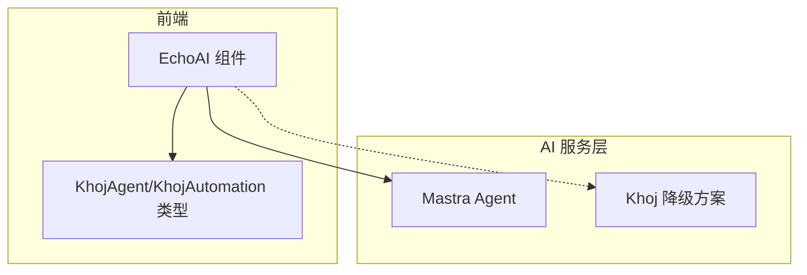
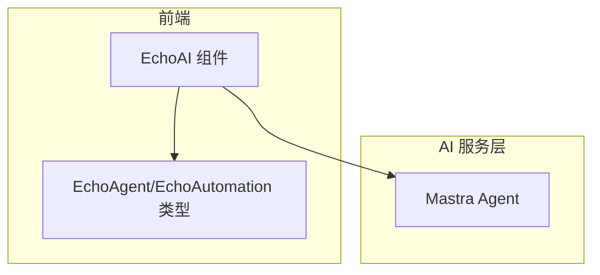

# Design Document: Khoj 完全清理

## Overview

本设计文档描述了从 Echo 系统中完全移除 Khoj 相关代码的方案。Khoj 原本作为 AI 服务的降级方案保留，但现在 Mastra 已经稳定运行，不再需要 Khoj 作为备选。

### 清理范围

| 类别 | 需要清理的内容 |
|------|---------------|
| 后端代码 | serviceRouter.ts 注释、migrate-khoj-data.ts |
| 前端代码 | KhojAgent/KhojAutomation 类型、echoaiService.ts 注释 |
| 配置文件 | dev.sh 中的 start_khoj 函数 |
| 文档 | VISION_AND_ARCHITECTURE.md、AI_MIGRATION_ROADMAP.md |
| Spec 文件 | echo-ai、khoj-deep-integration |

### 保留内容

| 内容 | 原因 |
|------|------|
| `get/khoj-main/` 目录 | 源码参考，用于学习 |
| 迁移脚本测试 | 保留作为历史记录 |

## Architecture

### 清理前架构



### 清理后架构



## Components and Interfaces

### 需要修改的文件

| 文件 | 修改内容 |
|------|---------|
| `get/blinko-main/app/src/components/echoai/agentCard/AgentCard.tsx` | 重命名 `KhojAgent` → `EchoAgent` |
| `get/blinko-main/app/src/components/echoai/agentCard/AgentForm.tsx` | 更新类型引用 |
| `get/blinko-main/app/src/components/echoai/agentCard/index.ts` | 更新导出 |
| `get/blinko-main/app/src/components/echoai/automationCard/AutomationCard.tsx` | 重命名 `KhojAutomation` → `EchoAutomation` |
| `get/blinko-main/app/src/components/echoai/automationCard/AutomationForm.tsx` | 更新类型引用 |
| `get/blinko-main/app/src/components/echoai/automationCard/index.ts` | 更新导出 |
| `get/blinko-main/app/src/components/echoai/index.ts` | 移除别名导出 |
| `get/blinko-main/app/src/lib/echoaiService.ts` | 移除 Khoj 相关注释和清理代码 |
| `get/blinko-main/server/aiServer/serviceRouter.ts` | 移除 Khoj 相关注释 |
| `dev.sh` | 移除 start_khoj、stop_khoj 函数和相关引用 |

### 需要更新的文档

| 文件 | 修改内容 |
|------|---------|
| `echo/docs/VISION_AND_ARCHITECTURE.md` | 移除 Khoj 降级方案引用，更新已知问题 |
| `echo/docs/AI_MIGRATION_ROADMAP.md` | 标记 Khoj 已完全移除 |
| `echo/docs/KHOJ_CLEANUP_PLAN.md` | 标记所有任务完成 |

### 需要归档的 Spec

| Spec | 处理方式 |
|------|---------|
| `.kiro/specs/khoj-deep-integration/` | 移动到 `_archived/` |
| `.kiro/specs/echo-ai/` | 更新设计文档，移除 Khoj 引用 |

## Data Models

本次清理不涉及数据模型变更。类型重命名是纯代码层面的修改：

```typescript
// 之前
export interface KhojAgent { ... }
export interface KhojAutomation { ... }

// 之后
export interface EchoAgent { ... }
export interface EchoAutomation { ... }
```

## Correctness Properties

*A property is a characteristic or behavior that should hold true across all valid executions of a system-essentially, a formal statement about what the system should do. Properties serve as the bridge between human-readable specifications and machine-verifiable correctness guarantees.*

由于本需求主要是代码清理和文档更新，验证主要通过示例测试（检查文件是否存在、配置是否正确）进行。没有需要属性测试的通用规则。

### 验证清单

以下是清理完成后需要验证的检查点：

1. **代码搜索验证**: 在 `get/blinko-main/` 目录下搜索 `khoj`（不区分大小写），应该只在注释和历史记录中出现
2. **类型验证**: 搜索 `KhojAgent` 和 `KhojAutomation`，应该只在 `get/khoj-main/` 目录下存在
3. **配置验证**: `dev.sh` 中不应该有 `start_khoj` 或 `stop_khoj` 函数
4. **文档验证**: `VISION_AND_ARCHITECTURE.md` 的已知问题中不应该有 Khoj 清理项

## Error Handling

本次清理是代码重构，不涉及运行时错误处理变更。

### 清理风险

| 风险 | 缓解措施 |
|------|---------|
| 遗漏某些 Khoj 引用 | 使用 grep 全局搜索验证 |
| 类型重命名导致编译错误 | 逐步修改，每步验证编译 |
| 文档更新不完整 | 检查所有相关文档 |

## Testing Strategy

### 验证方法

由于本需求是代码清理，测试策略主要是验证清理是否完成：

1. **编译验证**: 确保 TypeScript 编译通过
2. **搜索验证**: 使用 grep 搜索确认 Khoj 相关代码已移除
3. **功能验证**: 确保 EchoAI 功能正常工作

### 验证命令

```bash
# 验证 Khoj 类型已移除（排除 khoj-main 和 _archived）
grep -r "KhojAgent\|KhojAutomation" get/blinko-main/ --include="*.ts" --include="*.tsx" | grep -v "khoj-main" | grep -v "_archived"

# 验证 dev.sh 中没有 khoj 函数
grep -E "start_khoj|stop_khoj" dev.sh

# 验证编译通过
cd get/blinko-main && npm run build
```
