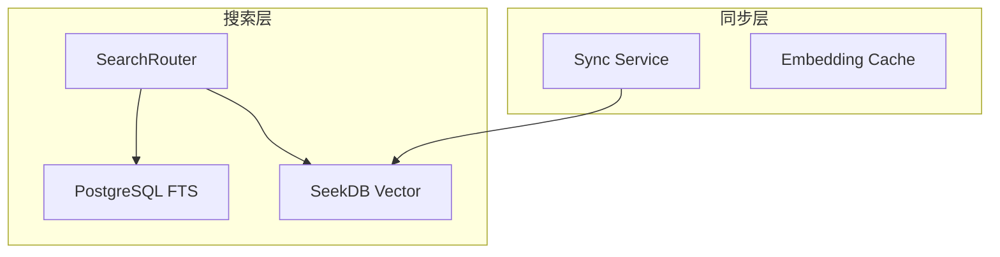
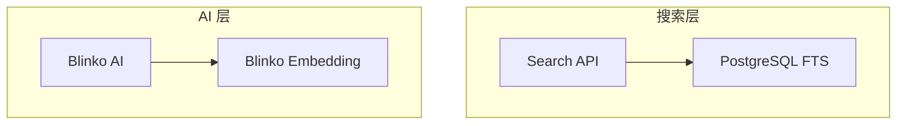

# Design Document: SeekDB Removal

## Overview

本设计文档描述了从 Echo 系统中移除 SeekDB 向量数据库的方案。移除后，系统将：
- 使用 PostgreSQL FTS 处理所有文档搜索
- 使用 Blinko 原生 embedding 服务处理 AI 相关的向量搜索
- 大幅简化系统架构和维护成本

## Architecture

### 移除前架构



### 移除后架构



## Components and Interfaces

### 需要移除的组件

| 组件 | 位置 | 说明 |
|------|------|------|
| SeekDBClient | `get/blinko-main/server/lib/seekdbClient.ts` | TypeScript 客户端 |
| search_router.py | `echo/sidecar/scripts/` | 搜索路由器 |
| vector_service.py | `echo/sidecar/scripts/` | 向量服务 |
| sync_service.py | `echo/sidecar/scripts/` | 同步服务 |
| embedding_cache.py | `echo/sidecar/scripts/` | 缓存服务 |
| connection_pool.py | `echo/sidecar/scripts/` | 连接池 |
| server_v2.py | `echo/sidecar/scripts/` | v2 API 服务 |
| health_metrics.py | `echo/sidecar/scripts/` | 健康指标 |
| SearchModeSelector | `get/blinko-main/app/src/components/Files/` | UI 组件 |

### 需要修改的组件

| 组件 | 修改内容 |
|------|---------|
| docker-compose.yml | 移除 SeekDB 容器 |
| .env.example | 移除 SEEKDB_* 环境变量 |
| ServiceStatus.tsx | 移除 SeekDB 状态显示 |
| GlobalSearch.tsx | 移除 alpha 参数 |
| ingest_api.py | 移除 SeekDB 同步逻辑 |
| VISION_AND_ARCHITECTURE.md | 更新架构说明 |

### 保留的组件

| 组件 | 说明 |
|------|------|
| PostgreSQL FTS | 全文搜索功能 |
| Blinko Embedding | AI 向量搜索 |
| video_processor.py | 视频处理 |
| ppt_processor.py | PPT 处理 |
| ingest_api.py | 摄入 API（简化版）|

## Data Models

### PostgreSQL FTS 索引（保留）

```sql
-- 已有的 FTS 索引，无需修改
CREATE INDEX idx_attachments_fts ON attachments USING GIN(search_vector);
```

### 移除的数据

- SeekDB 中的 `knowledge_base` 表
- 所有 embedding 向量数据

## Correctness Properties

*A property is a characteristic or behavior that should hold true across all valid executions of a system-essentially, a formal statement about what the system should do. Properties serve as the bridge between human-readable specifications and machine-verifiable correctness guarantees.*

由于本需求主要是移除代码和简化架构，大部分验证是示例性的（检查文件是否存在、配置是否正确）。以下是可测试的属性：

### Property 1: PostgreSQL FTS 搜索结果排序

*For any* search query and document set, the search results SHALL be ordered by ts_rank score in descending order.

**Validates: Requirements 2.1, 2.3**

### Property 2: 摄入内容 FTS 索引

*For any* ingested document (video transcript or PPT content), the content SHALL be stored in PostgreSQL with a valid tsvector for full-text search.

**Validates: Requirements 6.3**

## Error Handling

### 搜索错误

- PostgreSQL 连接失败：返回 503 Service Unavailable
- 查询超时：返回 504 Gateway Timeout
- 无结果：返回空数组，不报错

### 摄入错误

- 视频处理失败：记录错误，继续处理其他文件
- PPT 处理失败：记录错误，继续处理其他文件
- FTS 索引失败：重试 3 次后记录错误

## Testing Strategy

### 单元测试

由于本需求主要是移除代码，单元测试重点在于：
1. 验证 PostgreSQL FTS 搜索功能正常
2. 验证摄入 API 正常工作（不调用 SeekDB）
3. 验证健康检查只检查 PostgreSQL

### 集成测试

1. 端到端搜索测试：上传文档 → 搜索 → 验证结果
2. 摄入测试：上传视频/PPT → 验证内容被索引
3. 健康检查测试：验证 /health 响应格式

### 属性测试

使用 pytest + hypothesis 测试：
- Property 1: 搜索结果排序
- Property 2: 摄入内容索引

### 回归测试

确保移除 SeekDB 后，以下功能不受影响：
- 文件上传和预览
- 关键词搜索
- AI 对话（使用 Blinko 原生 embedding）
- Janitor 文件整理
