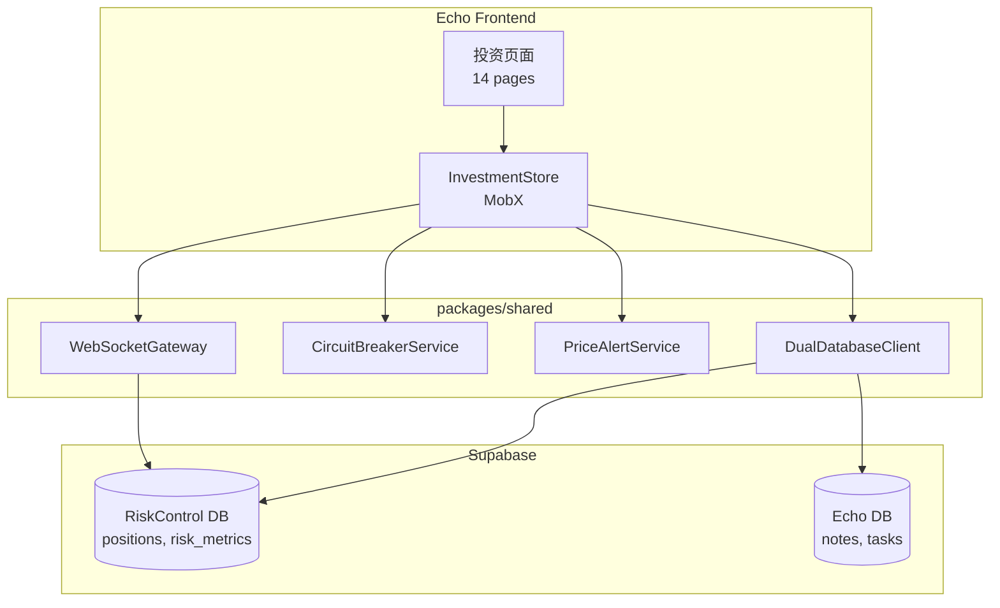

# Design Document: API Integration

## Overview

本设计文档描述如何将 Echo 前端投资模块与后端服务层进行联调。核心目标是将 InvestmentStore 从 mock 数据切换到真实 API，实现完整的数据流通。

### 当前状态

- **前端**: 14 个投资页面已迁移到 Echo，使用 HeroUI 组件
- **后端**: packages/shared 服务层已实现（279 tests passed）
- **问题**: InvestmentStore 尝试连接数据库但环境变量配置不完整

### 设计目标

1. 配置正确的环境变量，使 DualDatabaseClient 能连接到 Supabase
2. 验证 InvestmentStore 的数据获取方法正常工作
3. 实现 WebSocket 实时更新
4. 验证所有页面与真实数据的集成

## Architecture

### 数据流架构



### 环境变量配置

```bash
# 前端需要的环境变量（VITE_ 前缀）
VITE_SUPABASE_URL=https://lyqspnecudllmnajrrlm.supabase.co
VITE_SUPABASE_ANON_KEY=eyJhbGciOiJIUzI1NiIsInR5cCI6IkpXVCJ9...

# DualDatabaseClient 需要的变量（当前 InvestmentStore 使用的）
VITE_RC_SUPABASE_URL=https://lyqspnecudllmnajrrlm.supabase.co
VITE_RC_SUPABASE_ANON_KEY=eyJhbGciOiJIUzI1NiIsInR5cCI6IkpXVCJ9...
VITE_ECHO_SUPABASE_URL=https://lyqspnecudllmnajrrlm.supabase.co
VITE_ECHO_SUPABASE_ANON_KEY=eyJhbGciOiJIUzI1NiIsInR5cCI6IkpXVCJ9...
```

## Components and Interfaces

### 1. InvestmentStore 配置修复

当前 InvestmentStore 使用 `VITE_RC_SUPABASE_URL` 等变量，但 `.env` 中只有 `VITE_SUPABASE_URL`。需要统一配置。

```typescript
// 修复后的配置逻辑
private initServices(): void {
  const config: DatabaseConfig = {
    // 使用统一的 Supabase 配置（Echo 和 RiskControl 共用一个实例）
    rcSupabaseUrl: import.meta.env.VITE_SUPABASE_URL || '',
    rcSupabaseAnonKey: import.meta.env.VITE_SUPABASE_ANON_KEY || '',
    echoSupabaseUrl: import.meta.env.VITE_SUPABASE_URL,
    echoSupabaseAnonKey: import.meta.env.VITE_SUPABASE_ANON_KEY,
  };
  
  if (config.rcSupabaseUrl && config.rcSupabaseAnonKey) {
    this.databaseClient = initDatabaseClient(config);
  }
}
```

### 2. 数据库表结构验证

需要验证 RiskControl 数据库中存在以下表：

```sql
-- positions 表
CREATE TABLE positions (
  id UUID PRIMARY KEY DEFAULT gen_random_uuid(),
  ticker VARCHAR(20) NOT NULL,
  name VARCHAR(100),
  quantity DECIMAL(15, 4),
  avg_cost DECIMAL(15, 4),
  current_price DECIMAL(15, 4),
  market_value DECIMAL(15, 2),
  unrealized_pnl DECIMAL(15, 2),
  unrealized_pnl_percent DECIMAL(8, 4),
  weight DECIMAL(5, 4),
  asset_type VARCHAR(20),
  sector VARCHAR(50),
  last_updated TIMESTAMP WITH TIME ZONE DEFAULT NOW()
);

-- dashboard_snapshots 表
CREATE TABLE dashboard_snapshots (
  id UUID PRIMARY KEY DEFAULT gen_random_uuid(),
  risk_metrics JSONB,
  created_at TIMESTAMP WITH TIME ZONE DEFAULT NOW()
);

-- price_alerts 表
CREATE TABLE price_alerts (
  id UUID PRIMARY KEY DEFAULT gen_random_uuid(),
  ticker VARCHAR(20) NOT NULL,
  type VARCHAR(30) NOT NULL,
  threshold DECIMAL(15, 4),
  enabled BOOLEAN DEFAULT true,
  channels TEXT[],
  cooldown_minutes INTEGER DEFAULT 5,
  trigger_count INTEGER DEFAULT 0,
  last_triggered_at TIMESTAMP WITH TIME ZONE,
  created_at TIMESTAMP WITH TIME ZONE DEFAULT NOW()
);
```

### 3. WebSocket 集成

```typescript
// WebSocket 订阅配置
interface WebSocketConfig {
  url: string;
  reconnectAttempts: number;
  reconnectDelay: number;
  heartbeatInterval: number;
}

// 在 InvestmentStore 中添加 WebSocket 支持
class InvestmentStore {
  private wsGateway: WebSocketGateway | null = null;
  
  initWebSocket(): void {
    this.wsGateway = initWebSocketGateway({
      url: import.meta.env.VITE_WS_URL || 'wss://...',
      reconnectAttempts: 10,
      reconnectDelay: 1000,
      heartbeatInterval: 30000,
    });
    
    // 订阅持仓股票的价格更新
    const tickers = this.positions.map(p => p.ticker);
    this.wsGateway.subscribe(tickers);
    
    // 处理价格更新
    this.wsGateway.onPriceUpdate((data) => {
      this.handlePriceUpdate(data);
    });
  }
}
```

## Data Models

### Position 数据映射

```typescript
// 数据库字段 -> TypeScript 接口
interface PositionRow {
  id: string;
  ticker: string;
  name: string | null;
  quantity: number;
  avg_cost: number;
  current_price: number;
  market_value: number;
  unrealized_pnl: number;
  unrealized_pnl_percent: number;
  weight: number;
  asset_type: string;
  sector: string | null;
  last_updated: string;
}

// 转换函数
function mapPositionRow(row: PositionRow): Position {
  return {
    id: row.id,
    ticker: row.ticker,
    name: row.name || row.ticker,
    quantity: row.quantity,
    avgCost: row.avg_cost,
    currentPrice: row.current_price,
    marketValue: row.market_value,
    unrealizedPnL: row.unrealized_pnl,
    unrealizedPnLPercent: row.unrealized_pnl_percent,
    weight: row.weight,
    assetType: row.asset_type as Position['assetType'],
    sector: row.sector,
    lastUpdated: new Date(row.last_updated),
  };
}
```

## Correctness Properties

*A property is a characteristic or behavior that should hold true across all valid executions of a system—essentially, a formal statement about what the system should do. Properties serve as the bridge between human-readable specifications and machine-verifiable correctness guarantees.*

### Property 1: 数据库初始化正确性

*For any* valid Supabase URL and anon key configuration, the DualDatabaseClient SHALL successfully initialize and return non-null client instances for both Echo and RiskControl databases.

**Validates: Requirements 1.1, 1.4**

### Property 2: 持仓数据映射正确性

*For any* position row from the database with snake_case field names, the mapped Position object SHALL have correctly converted camelCase field names with identical values (id, ticker, quantity, avgCost, currentPrice, marketValue, unrealizedPnL, unrealizedPnLPercent, weight, assetType).

**Validates: Requirements 2.2**

### Property 3: 警报徽章计数准确性

*For any* array of PriceAlert objects in the store, the computed activeAlertCount SHALL equal the count of alerts where enabled === true AND triggered === false.

**Validates: Requirements 4.4**

### 已覆盖的属性（在其他测试文件中）

以下属性已在 packages/shared 的测试中验证：

- **WebSocket 订阅恢复** (websocket.test.ts - 21 tests): 断线重连后订阅自动恢复
- **熔断机制触发** (circuit-breaker.test.ts - 21 tests): 风险指标超阈值时正确触发熔断
- **价格警报去重** (price-alert.test.ts - 25 tests): 冷却期内不重复触发

## Error Handling

### 数据库连接错误

```typescript
async function handleDatabaseError(error: Error): Promise<void> {
  console.error('Database connection error:', error);
  
  // 显示用户友好的错误消息
  toast.error('数据库连接失败，请检查网络连接');
  
  // 设置错误状态
  runInAction(() => {
    this.errors.positions = '数据库连接失败';
  });
}
```

### WebSocket 错误

```typescript
async function handleWebSocketError(error: Error): Promise<void> {
  console.warn('WebSocket error:', error);
  
  // 自动重连（指数退避）
  await this.wsGateway?.reconnect();
  
  // 如果重连失败，回退到轮询
  if (!this.wsGateway?.isConnected) {
    this.startPolling();
  }
}
```

### API 错误

```typescript
async function handleAPIError(error: Error, context: string): Promise<void> {
  console.error(`API error in ${context}:`, error);
  
  // 根据错误类型处理
  if (error.message.includes('401')) {
    // 认证失败，重定向到登录
    router.push('/login');
  } else if (error.message.includes('503')) {
    // 服务不可用，显示降级 UI
    toast.warning('服务暂时不可用，显示缓存数据');
  }
}
```

## Testing Strategy

### 单元测试

使用 Vitest 测试各组件：

```typescript
describe('InvestmentStore', () => {
  it('should initialize database client with correct config', () => {
    const store = new InvestmentStore();
    expect(store.databaseClient).toBeDefined();
  });
  
  it('should fetch positions from database', async () => {
    const store = new InvestmentStore();
    await store.fetchPositions();
    expect(store.positions.length).toBeGreaterThanOrEqual(0);
  });
});
```

### 集成测试

验证前端与后端的集成：

```typescript
describe('API Integration', () => {
  it('should display real positions on Portfolio page', async () => {
    render(<PortfolioPage />);
    
    // 等待数据加载
    await waitFor(() => {
      expect(screen.queryByText('加载中')).not.toBeInTheDocument();
    });
    
    // 验证显示了持仓数据或空状态
    expect(
      screen.getByText(/持仓/) || screen.getByText(/暂无持仓/)
    ).toBeInTheDocument();
  });
});
```

### 属性测试

使用 fast-check 验证核心属性：

```typescript
import * as fc from 'fast-check';

describe('Property Tests: Alert Badge', () => {
  /**
   * **Feature: api-integration, Property 4: 警报徽章准确性**
   * **Validates: Requirements 4.4**
   */
  it('activeAlertCount should match enabled non-triggered alerts', () => {
    fc.assert(
      fc.property(
        fc.array(fc.record({
          id: fc.uuid(),
          enabled: fc.boolean(),
          triggered: fc.boolean(),
        })),
        (alerts) => {
          const store = new InvestmentStore();
          store.alerts = alerts as any;
          
          const expected = alerts.filter(a => a.enabled && !a.triggered).length;
          expect(store.activeAlertCount).toBe(expected);
        }
      ),
      { numRuns: 100 }
    );
  });
});
```

### 页面功能验证

手动验证清单：

| 页面 | 验证项 | 预期结果 |
|------|--------|----------|
| Dashboard | 资产概览 | 显示真实总市值、盈亏 |
| Portfolio | 持仓列表 | 显示真实持仓数据 |
| Risk Center | 风险指标 | 显示真实风险评分 |
| Market | 市场数据 | 显示市场指数 |
| Decision | AI 建议 | 连接 Gemini API |
| Voice | 语音通话 | 连接 LiveKit |

### 浏览器功能实际测试

每个页面需要在浏览器中实际验证：

| 页面路径 | 测试项 | 验证方法 |
|----------|--------|----------|
| `/investment` | Dashboard 加载 | 页面无报错，显示概览卡片 |
| `/investment/portfolio` | 持仓列表 | 表格渲染，支持排序筛选 |
| `/investment/risk` | 风险中心 | 风险评分卡片，熔断状态 |
| `/investment/risk/intelligent` | 智能风控 | 情绪检测面板 |
| `/investment/risk/engine` | 风险引擎 | 熔断规则配置 |
| `/investment/risk/settings` | 风险设置 | 阈值配置表单 |
| `/investment/market` | 市场分析 | 市场指数，新闻列表 |
| `/investment/decision` | 决策中心 | AI 对话框 |
| `/investment/mirror` | 投资镜像 | Placeholder UI |
| `/investment/notes` | 动态笔记 | 笔记列表 |
| `/investment/voice` | 语音通话 | LiveKit 连接状态 |
| `/investment/annual-review` | 年度回顾 | 年度统计图表 |
| `/investment/showcase` | 组件展示 | HeroUI 组件演示 |
| `/investment/agent-demo` | Agent 演示 | AI 对话演示 |

验证步骤：
1. 启动 Echo 前端 (`npm run dev`)
2. 访问 http://localhost:1111/investment
3. 逐个访问每个页面路径
4. 检查控制台无错误
5. 检查页面 UI 正常渲染
6. 检查数据加载（如有）

