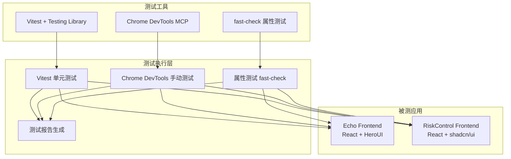
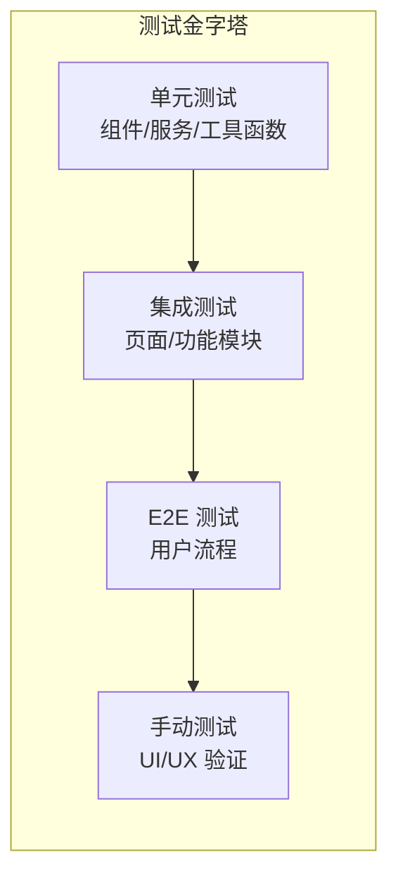
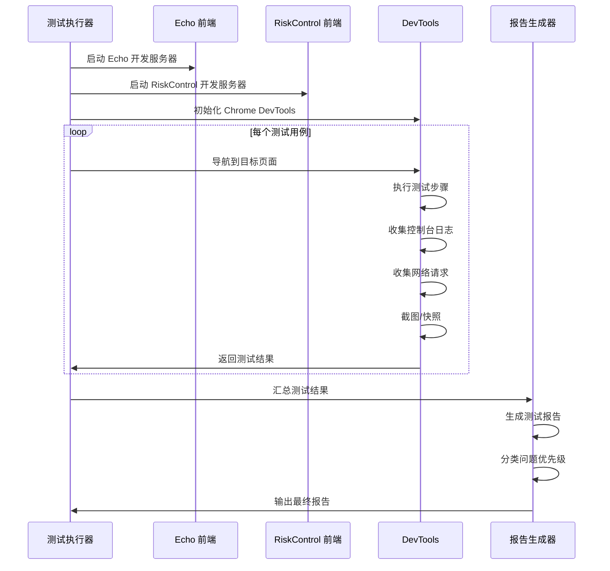

# Design Document: 前端全面测试

## Overview

本设计文档定义了 EchoAI 项目前端应用的全面测试方案，包括测试架构、工具选择、测试策略和执行流程。测试将覆盖 Echo 和 RiskControl 两个前端应用的所有功能模块，并生成详细的测试报告。

## Architecture

### 测试架构图



### 测试分层策略



## Components and Interfaces

### 1. 测试执行器 (TestRunner)

```typescript
interface TestRunner {
  // 运行单元测试
  runUnitTests(pattern?: string): Promise<TestResult>;
  
  // 运行属性测试
  runPropertyTests(pattern?: string): Promise<TestResult>;
  
  // 生成测试报告
  generateReport(results: TestResult[]): TestReport;
}

interface TestResult {
  testName: string;
  status: 'passed' | 'failed' | 'skipped';
  duration: number;
  error?: string;
  screenshot?: string;
}

interface TestReport {
  summary: TestSummary;
  bugs: BugReport[];
  i18nIssues: I18nIssue[];
  uiIssues: UIIssue[];
  performanceMetrics: PerformanceMetric[];
}
```

### 2. 浏览器调试器 (BrowserDebugger)

```typescript
interface BrowserDebugger {
  // 页面操作
  navigateTo(url: string): Promise<void>;
  takeScreenshot(): Promise<string>;
  getSnapshot(): Promise<DOMSnapshot>;
  
  // 控制台检查
  getConsoleErrors(): Promise<ConsoleMessage[]>;
  getConsoleWarnings(): Promise<ConsoleMessage[]>;
  
  // 网络检查
  getNetworkRequests(): Promise<NetworkRequest[]>;
  getFailedRequests(): Promise<NetworkRequest[]>;
  
  // 性能分析
  startPerformanceTrace(): Promise<void>;
  stopPerformanceTrace(): Promise<PerformanceTrace>;
}
```

### 3. 国际化检查器 (I18nChecker)

```typescript
interface I18nChecker {
  // 扫描页面文本
  scanPageText(snapshot: DOMSnapshot): TextNode[];
  
  // 检测未翻译文本
  detectUntranslatedText(texts: TextNode[]): I18nIssue[];
  
  // 检测硬编码字符串
  detectHardcodedStrings(sourceFiles: string[]): I18nIssue[];
}

interface I18nIssue {
  type: 'untranslated' | 'hardcoded' | 'incorrect';
  location: string;
  originalText: string;
  suggestedTranslation?: string;
  priority: 'high' | 'medium' | 'low';
}
```

### 4. Bug 报告器 (BugReporter)

```typescript
interface BugReporter {
  // 记录 Bug
  reportBug(bug: BugReport): void;
  
  // 生成修复建议
  generateFixSuggestion(bug: BugReport): string;
  
  // 导出报告
  exportReport(format: 'markdown' | 'json'): string;
}

interface BugReport {
  id: string;
  title: string;
  description: string;
  severity: 'critical' | 'high' | 'medium' | 'low';
  category: 'functional' | 'ui' | 'i18n' | 'performance';
  steps: string[];
  expectedBehavior: string;
  actualBehavior: string;
  screenshot?: string;
  consoleErrors?: string[];
  affectedComponent: string;
  suggestedFix?: string;
}
```

## Data Models

### 测试用例模型

```typescript
interface TestCase {
  id: string;
  name: string;
  description: string;
  category: TestCategory;
  priority: 'P0' | 'P1' | 'P2' | 'P3';
  steps: TestStep[];
  expectedResult: string;
  requirementRef: string;
}

type TestCategory = 
  | 'echo-core'
  | 'echo-ai'
  | 'echo-files'
  | 'echo-voice'
  | 'echo-settings'
  | 'rc-home'
  | 'rc-dashboard'
  | 'rc-risk'
  | 'rc-market'
  | 'rc-decision'
  | 'rc-voice'
  | 'rc-agent'
  | 'rc-review'
  | 'rc-portfolio'
  | 'rc-settings'
  | 'i18n'
  | 'ui-consistency'
  | 'error-handling'
  | 'performance';

interface TestStep {
  action: string;
  input?: string;
  expectedOutput?: string;
}
```

### 测试报告模型

```typescript
interface TestSummary {
  totalTests: number;
  passed: number;
  failed: number;
  skipped: number;
  duration: number;
  coverage: {
    echo: number;
    riskcontrol: number;
  };
}

interface PerformanceMetric {
  page: string;
  firstContentfulPaint: number;
  largestContentfulPaint: number;
  timeToInteractive: number;
  totalBlockingTime: number;
}
```

## Correctness Properties

*A property is a characteristic or behavior that should hold true across all valid executions of a system-essentially, a formal statement about what the system should do. Properties serve as the bridge between human-readable specifications and machine-verifiable correctness guarantees.*

### Property 1: 笔记 CRUD 操作一致性
*For any* 笔记内容，创建后应能正确读取，编辑后应反映修改，删除后应从列表消失
**Validates: Requirements 1.3, 1.4, 1.5**

### Property 2: 标签筛选正确性
*For any* 标签集合和笔记集合，按标签筛选后的结果应只包含带有该标签的笔记
**Validates: Requirements 1.6**

### Property 3: 搜索结果相关性
*For any* 搜索关键词，返回的结果应包含该关键词或其相关内容
**Validates: Requirements 2.3, 3.3**

### Property 4: 文件标签管理一致性
*For any* 文件和标签操作，添加标签后文件应显示该标签，移除后应不再显示
**Validates: Requirements 3.8**

### Property 5: 风险计算正确性
*For any* 投资组合数据，风险指标计算结果应在合理范围内且符合公式定义
**Validates: Requirements 8.1, 8.2, 8.3**

### Property 6: 国际化文本覆盖
*For any* 页面可见文本，应存在对应的中文翻译或为合法的非翻译内容（如数字、符号）
**Validates: Requirements 16.1, 16.2, 16.6, 16.7, 16.8**

### Property 7: 错误处理一致性
*For any* 网络请求失败场景，应用应显示友好的错误提示而非崩溃
**Validates: Requirements 18.1, 18.2, 18.5**

### Property 8: 表单验证正确性
*For any* 无效输入数据，表单应显示验证错误信息并阻止提交
**Validates: Requirements 18.3**

## Error Handling

### 测试执行错误处理

1. **网络超时**: 重试 3 次，每次间隔 2 秒
2. **页面加载失败**: 记录错误并跳过该测试用例
3. **组件渲染错误**: 捕获错误并记录到 Bug 报告
4. **截图失败**: 使用 DOM 快照作为替代

### 测试报告错误处理

1. **报告生成失败**: 保存原始测试结果到 JSON 文件
2. **截图上传失败**: 保存到本地并记录路径

## Testing Strategy

### 测试工具选择

| 测试类型 | 工具 | 用途 |
|---------|------|------|
| 单元测试 | Vitest + Testing Library | 组件和服务测试 |
| 属性测试 | fast-check | 业务逻辑验证 |
| 手动测试 | Chrome DevTools MCP | UI/UX 验证 |
| 性能测试 | Chrome Performance API | 性能指标收集 |

### 测试执行流程



### 测试优先级

| 优先级 | 描述 | 测试范围 |
|-------|------|---------|
| P0 | 核心功能 | 登录、笔记 CRUD、仪表盘数据显示 |
| P1 | 重要功能 | AI 对话、风控引擎、语音通话 |
| P2 | 次要功能 | 设置、年度回顾、Agent 演示 |
| P3 | 边缘功能 | 性能优化、UI 细节 |

### 属性测试配置

```typescript
// vitest.config.ts 中的属性测试配置
{
  test: {
    testTimeout: 30000, // 属性测试需要更长时间
  }
}

// 属性测试示例
import { fc } from 'fast-check';

// **Validates: Requirements 1.3, 1.4, 1.5**
test.prop([fc.string().filter(s => s.trim().length > 0)])('笔记 CRUD 一致性', (content) => {
  // 创建笔记
  const note = createNote(content);
  expect(note.content).toBe(content);
  
  // 编辑笔记
  const newContent = content + ' edited';
  const editedNote = editNote(note.id, newContent);
  expect(editedNote.content).toBe(newContent);
  
  // 删除笔记
  deleteNote(note.id);
  expect(getNoteById(note.id)).toBeNull();
});
```

### 手动测试检查清单

#### Echo 前端检查项
- [ ] 首页布局和导航
- [ ] 登录/注册流程
- [ ] 笔记创建/编辑/删除
- [ ] AI 对话功能
- [ ] 文件上传和预览
- [ ] 语音助手
- [ ] 设置页面

#### RiskControl 前端检查项
- [ ] 首页和导航
- [ ] 仪表盘数据显示
- [ ] 风控引擎功能
- [ ] 市场行情页面
- [ ] 决策中心
- [ ] 语音通话
- [ ] Agent 演示
- [ ] 年度回顾
- [ ] 投资组合
- [ ] 设置页面

#### 国际化检查项
- [ ] 所有按钮文本
- [ ] 所有标签文本
- [ ] 所有提示信息
- [ ] 所有错误信息
- [ ] 所有占位符文本

### 测试报告格式

```markdown
# 前端全面测试报告

## 测试概要
- 测试日期: YYYY-MM-DD
- 测试范围: Echo + RiskControl
- 总测试数: XX
- 通过: XX
- 失败: XX
- 跳过: XX

## Bug 列表

### 严重 (Critical)
| ID | 标题 | 组件 | 描述 |
|----|------|------|------|

### 高优先级 (High)
| ID | 标题 | 组件 | 描述 |
|----|------|------|------|

### 中优先级 (Medium)
| ID | 标题 | 组件 | 描述 |
|----|------|------|------|

### 低优先级 (Low)
| ID | 标题 | 组件 | 描述 |
|----|------|------|------|

## 汉化问题

### 未翻译文本
| 位置 | 原文 | 建议翻译 |
|------|------|---------|

### 翻译错误
| 位置 | 原文 | 当前翻译 | 建议翻译 |
|------|------|---------|---------|

## 性能指标
| 页面 | FCP | LCP | TTI | TBT |
|------|-----|-----|-----|-----|

## 修复建议
1. ...
2. ...
```
