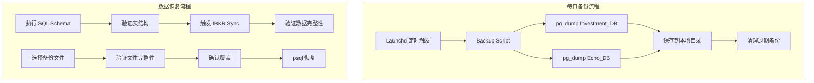

# Design Document: Database Recovery and Backup System

## Overview

本设计文档描述投资数据库恢复和每日备份系统的技术实现方案。系统需要：
1. 恢复 Investment_DB 的表结构
2. 从 IBKR 重新同步数据
3. 建立每日自动备份机制
4. 提供数据恢复脚本

## Architecture



## Components and Interfaces

### 1. Schema Executor (scripts/execute-schema.ts)

使用 Supabase service key 执行 SQL schema 创建表结构。

```typescript
interface SchemaExecutor {
  // 执行 SQL 文件
  executeSchema(sqlFilePath: string): Promise<ExecutionResult>;
  
  // 验证表是否存在
  verifyTables(tableNames: string[]): Promise<VerificationResult>;
  
  // 验证权限
  verifyPermissions(tableName: string, role: string): Promise<boolean>;
}

interface ExecutionResult {
  success: boolean;
  tablesCreated: string[];
  errors: string[];
}

interface VerificationResult {
  allExist: boolean;
  existing: string[];
  missing: string[];
}
```

### 2. IBKR Sync Trigger (existing: packages/riskcontrol/src/services/ibkrFlexQuery.ts)

复用现有的 `syncIBKRToSupabase()` 函数触发数据同步。

```typescript
// 现有接口
interface IBKRSyncResult {
  success: boolean;
  recordCounts: {
    assetSnapshots: number;
    dashboardSnapshots: number;
    transactions: number;
    navChanges: number;
    cashReports: number;
  };
  errors: string[];
}
```

### 3. Backup Script (scripts/backup-databases.sh)

Shell 脚本执行 pg_dump 备份两个数据库。

```bash
# 接口定义（命令行参数）
backup-databases.sh [--investment-only | --echo-only | --both]

# 输出文件格式
~/.echoai-backups/investment_YYYY-MM-DD.sql.gz
~/.echoai-backups/echo_YYYY-MM-DD.sql.gz
```

### 4. Restore Script (scripts/restore-database.sh)

Shell 脚本从备份文件恢复数据。

```bash
# 接口定义
restore-database.sh <backup-file> [--table <table-name>] [--force]

# 参数说明
# backup-file: 备份文件路径
# --table: 可选，只恢复指定表
# --force: 跳过确认提示
```

## Data Models

### 数据库连接配置

```typescript
interface DatabaseConfig {
  // Investment DB (lyqspnecudllmnajrrlm)
  investment: {
    url: string;           // DATABASE_URL
    serviceKey: string;    // SUPABASE_SERVICE_KEY
    anonKey: string;       // SUPABASE_ANON_KEY
  };
  
  // Echo DB (jwiocrwhqeomoybbwqcp)
  echo: {
    url: string;           // ECHO_DATABASE_URL
    serviceKey: string;    // ECHO_SERVICE_KEY
    anonKey: string;       // ECHO_ANON_KEY
  };
}
```

### 备份元数据

```typescript
interface BackupMetadata {
  filename: string;
  database: 'investment' | 'echo';
  createdAt: Date;
  sizeBytes: number;
  checksum: string;  // MD5 hash for integrity verification
}
```

## Correctness Properties

*A property is a characteristic or behavior that should hold true across all valid executions of a system—essentially, a formal statement about what the system should do. Properties serve as the bridge between human-readable specifications and machine-verifiable correctness guarantees.*

### Property 1: Backup File Lifecycle

*For any* backup file created by the backup script, if the file is older than 30 days, it SHALL be deleted during the next cleanup cycle; if it is 30 days or newer, it SHALL be retained.

**Validates: Requirements 3.4, 3.5**

### Property 2: Backup Filename Format

*For any* date on which a backup is created, the resulting filename SHALL contain that date in YYYY-MM-DD format.

**Validates: Requirements 3.3**

### Property 3: Schema Idempotence

*For any* execution of the schema SQL, running it multiple times SHALL produce the same result (tables exist with correct structure) without errors.

**Validates: Requirements 1.1**

## Error Handling

### Schema Execution Errors

| Error Type | Handling |
|------------|----------|
| Connection failed | 重试 3 次，间隔 5 秒 |
| Permission denied | 检查 service key 是否正确 |
| Table already exists | 使用 `IF NOT EXISTS`，忽略 |
| SQL syntax error | 记录错误，中止执行 |

### IBKR Sync Errors

| Error Type | Handling |
|------------|----------|
| API timeout | 重试 3 次，间隔 30 秒 |
| Invalid token | 提示用户更新 IBKR_TOKEN |
| Rate limit | 等待 60 秒后重试 |
| Partial data | 记录警告，继续处理已获取数据 |

### Backup Errors

| Error Type | Handling |
|------------|----------|
| Disk full | 记录错误到日志，发送通知 |
| Connection failed | 重试 3 次 |
| Permission denied | 检查目录权限 |

## Testing Strategy

### Unit Tests

使用 Vitest 测试核心逻辑：

1. **Schema Executor Tests**
   - 验证 SQL 解析正确
   - 验证表名提取正确
   - 验证错误处理

2. **Backup Metadata Tests**
   - 验证文件名解析
   - 验证日期计算
   - 验证 checksum 计算

### Integration Tests

1. **Schema Execution Test**
   - 在测试数据库执行 schema
   - 验证所有表创建成功
   - 验证索引存在
   - 验证权限正确

2. **Backup/Restore Round-trip Test**
   - 创建测试数据
   - 执行备份
   - 清空数据
   - 执行恢复
   - 验证数据一致

### Property-Based Tests

使用 fast-check 进行属性测试：

1. **Backup Lifecycle Property**
   - 生成随机日期的备份文件列表
   - 执行清理逻辑
   - 验证 30 天规则

2. **Filename Format Property**
   - 生成随机日期
   - 创建备份文件名
   - 验证日期格式正确

### Test Configuration

```typescript
// vitest.config.ts
export default {
  test: {
    // Property tests: minimum 100 iterations
    testTimeout: 30000,
  }
}
```

每个属性测试必须标注：
- **Feature: database-recovery-backup, Property N: [property_text]**
- **Validates: Requirements X.Y**
