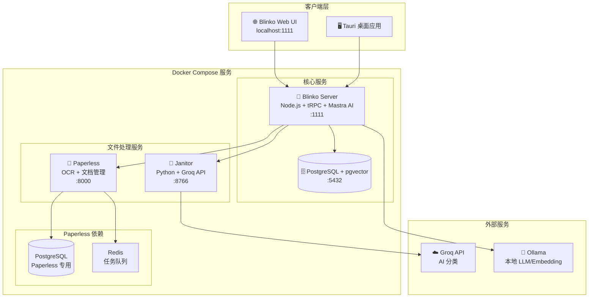

# Design Document: Echo 部署架构 v3.1

## Overview

本文档定义 Echo 项目的单数据库部署架构，基于 Docker Compose 实现本地开发和生产部署。

> 版本: v3.1 (单数据库架构，Khoj 已迁移完成)
> 最后更新: 2026-01-01

### 核心设计原则

1. **单数据库** - PostgreSQL + pgvector 满足所有存储需求
2. **容器化** - 所有服务通过 Docker Compose 编排
3. **简化架构** - 移除 SeekDB 和 Khoj，减少服务数量
4. **一键启动** - dev.sh / start.sh 脚本简化操作

## Architecture

### 整体架构图



### 服务职责划分

| 服务 | 端口 | 职责 | 技术栈 |
|------|------|------|--------|
| Blinko Server | 1111 | API 网关、业务逻辑、AI 对话、Embedding | Node.js + tRPC + Mastra |
| PostgreSQL | 5432 | 主数据库、全文搜索 (FTS)、向量搜索 (pgvector) | PostgreSQL 15 + pgvector |
| Janitor | 8766/8000 | 文件监听、AI 分类、重命名 | Python + FastAPI |
| Paperless | 8000 | 文档 OCR、标签管理、文档搜索 | Django + Tesseract |
| Ollama | 11434 | 本地 LLM、Embedding 生成 | Ollama |

## Components and Interfaces

### 1. Docker Compose 配置结构

```
项目根目录/
├── docker-compose.yml          # 生产环境配置
├── docker-compose.dev.yml      # 开发环境配置
├── .env.example                # 环境变量模板
├── .env                        # 实际环境变量 (不提交)
├── dev.sh                      # 开发环境启动脚本
├── start.sh                    # 生产环境启动脚本
└── echo/
    └── docker/
        ├── Dockerfile.blinko   # Blinko 镜像
        ├── Dockerfile.janitor  # Janitor 镜像
        ├── Dockerfile.postgres # PostgreSQL + pgvector 镜像
        └── scripts/
            └── init-postgres.sql  # 数据库初始化脚本
```

### 2. 生产环境服务配置 (docker-compose.yml)

```yaml
services:
  postgres:
    # PostgreSQL + pgvector
    # 端口: 5432 (内部)
    # 健康检查: pg_isready
    
  blinko:
    # Blinko Server
    # 端口: 1111
    # 依赖: postgres, janitor
    
  janitor:
    # Janitor AI 整理服务
    # 端口: 8000
    # 健康检查: /health
```

### 3. 开发环境服务配置 (docker-compose.dev.yml)

```yaml
services:
  blinko-postgres:
    # PostgreSQL + pgvector
    # 端口: 5432
    
  janitor:
    # Janitor (开发模式)
    # 端口: 8766
    
  paperless-broker:
    # Redis (Paperless 任务队列)
    
  paperless-db:
    # PostgreSQL (Paperless 专用)
    
  paperless:
    # Paperless 文档管理
    # 端口: 8000
```

### 4. 启动脚本功能

**dev.sh (开发环境)**
```bash
./dev.sh              # 启动所有服务
./dev.sh docker       # 仅启动 Docker 服务
./dev.sh stop         # 停止所有服务
./dev.sh logs         # 查看日志
./dev.sh status       # 查看服务状态
```

**start.sh (生产环境)**
```bash
./start.sh            # 启动所有服务
./start.sh stop       # 停止所有服务
./start.sh logs       # 查看日志
./start.sh status     # 查看服务状态
```

## Data Models

### 环境变量配置 (.env.example)

```env
# ============ 必填配置 ============
GROQ_API_KEY=your_groq_api_key_here

# ============ 服务 URL 配置 ============
JANITOR_API_URL=http://localhost:8766
PAPERLESS_API_URL=http://localhost:8000
PAPERLESS_API_TOKEN=

# ============ 可选配置 ============
POSTGRES_PASSWORD=mysecretpassword
NEXTAUTH_SECRET=my_ultra_secure_nextauth_secret
INBOX_PATH=./inbox
OLLAMA_HOST=http://localhost:11434
```

### 数据卷映射

| 卷名 | 用途 | 路径 |
|------|------|------|
| postgres_data | PostgreSQL 数据 | /var/lib/postgresql/data |
| janitor_logs | Janitor 日志 | /app/logs |
| paperless_data | Paperless 数据 | /usr/src/paperless/data |
| paperless_media | Paperless 媒体文件 | /usr/src/paperless/media |

## Correctness Properties

*A property is a characteristic or behavior that should hold true across all valid executions of a system.*

### Property 1: 服务启动顺序

*For any* 服务启动操作，PostgreSQL 必须在 Blinko Server 之前完成健康检查。

**Validates: Requirements 2.5, 3.4**

### Property 2: 健康检查响应

*For any* 服务（Blinko、Janitor、Paperless），健康检查端点应在 10 秒内返回 200 状态码。

**Validates: Requirements 3.5, 4.5**

### Property 3: 环境变量配置

*For any* 部署环境，服务启动时读取的配置应与 .env 文件设置一致。

**Validates: Requirements 6.4**

## Error Handling

### 服务启动错误处理

| 错误场景 | 处理策略 |
|---------|---------|
| PostgreSQL 启动失败 | Blinko 等待重试，最多 5 次 |
| Janitor 启动失败 | Blinko 继续启动，Janitor 功能降级 |
| Paperless 启动失败 | 文档管理功能不可用，其他功能正常 |
| .env 文件缺失 | 从 .env.example 复制并提示用户配置 |

### 运行时错误处理

| 错误场景 | 处理策略 |
|---------|---------|
| Groq API 不可用 | Janitor 暂停分类，等待恢复 |
| PostgreSQL 连接断开 | Blinko 自动重连 |
| 磁盘空间不足 | 日志告警，暂停文件处理 |

## Testing Strategy

### 单元测试

- 环境变量读取逻辑
- 健康检查端点响应
- 服务依赖检查

### 集成测试

- Docker Compose 服务启动顺序
- 服务间网络通信
- 数据卷挂载验证

### E2E 测试

- 完整的 dev.sh 启动流程
- 完整的 start.sh 启动流程
- 服务状态检查

### 属性测试

使用 `fast-check` 进行属性测试：
- 服务启动顺序正确性
- 健康检查响应格式
- 配置读取一致性
