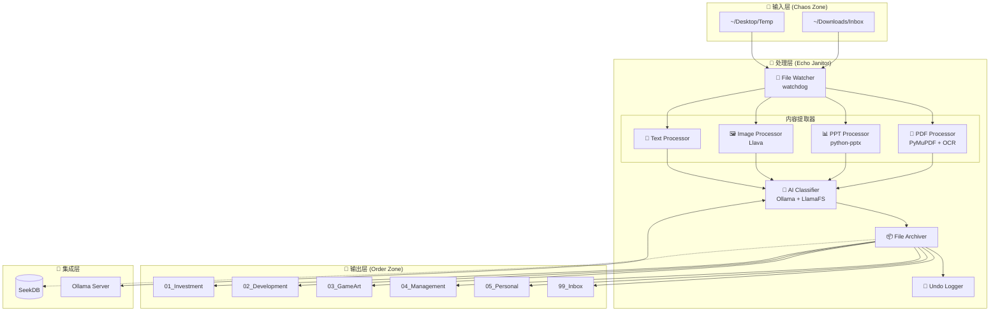

# Design Document - Echo Janitor

## Overview

Echo Janitor 基于开源项目 LlamaFS 构建，是 Echo 2.0 的文件整理模块。它作为 SeekDB 的前置流水线，自动监控混沌文件夹，利用本地 LLM 进行语义理解、智能重命名和分类归档。

### 设计原则

1. **开源优先** - 核心引擎使用 LlamaFS，仅扩展必要功能
2. **本地优先** - 所有 AI 推理使用 Ollama 本地运行
3. **安全第一** - 绝不覆盖文件，完整操作日志，支持回滚
4. **渐进增强** - 基础功能先行，多模态增强可选

### 系统架构



---

## Component Designs

### Component 1: Docker 部署配置

**对应需求**: Requirement 1

```yaml
# echo/sidecar/docker-compose.janitor.yml

version: '3.8'

services:
  echo-janitor:
    build:
      context: ./janitor
      dockerfile: Dockerfile
    container_name: echo-janitor
    restart: unless-stopped
    volumes:
      # 监控目录
      - ${JANITOR_INBOX:-~/Downloads/Inbox}:/app/inbox:ro
      # 输出目录
      - ${JANITOR_OUTPUT:-~/Echo}:/app/output
      # 配置和日志
      - ./janitor/config:/app/config
      - ./janitor/logs:/app/logs
    environment:
      - OLLAMA_HOST=${OLLAMA_HOST:-http://ollama:11434}
      - OLLAMA_MODEL=${OLLAMA_MODEL:-qwen2.5:7b}
      - LLAVA_MODEL=${LLAVA_MODEL:-llava:7b}
      - CONFIDENCE_THRESHOLD=${CONFIDENCE_THRESHOLD:-0.6}
      - SEEKDB_API=${SEEKDB_API:-http://seekdb:8080}
    depends_on:
      - ollama
    networks:
      - echo-network

  ollama:
    image: ollama/ollama:latest
    container_name: echo-ollama
    restart: unless-stopped
    volumes:
      - ollama_data:/root/.ollama
    ports:
      - "11434:11434"
    deploy:
      resources:
        reservations:
          devices:
            - driver: nvidia
              count: all
              capabilities: [gpu]
    networks:
      - echo-network

volumes:
  ollama_data:

networks:
  echo-network:
    external: true
```

### Component 2: 配置管理器

**对应需求**: Requirement 4

```python
# echo/sidecar/janitor/config_manager.py

from dataclasses import dataclass, field
from typing import Dict, List, Optional
from pathlib import Path
import yaml

@dataclass
class CategoryConfig:
    """分类配置"""
    name: str                    # 分类名称
    path: str                    # 目标目录
    keywords: List[str]          # AI 提示关键词
    file_patterns: List[str]     # 文件名模式 (可选)

@dataclass
class JanitorConfig:
    """Janitor 主配置"""
    inbox_dirs: List[str]                      # 监控目录列表
    output_base: str                           # 输出根目录
    categories: Dict[str, CategoryConfig]      # 分类配置
    confidence_threshold: float = 0.6          # 置信度阈值
    ollama_host: str = "http://localhost:11434"
    ollama_model: str = "qwen2.5:7b"
    llava_model: str = "llava:7b"
    enable_multimodal: bool = True
    enable_ocr: bool = True
    seekdb_api: Optional[str] = None

# 默认分类配置
DEFAULT_CATEGORIES = {
    "01_Investment": CategoryConfig(
        name="Investment",
        path="01_Investment",
        keywords=["财报", "股票", "投资", "K线", "盈透", "PDD", "revenue", "growth"],
        file_patterns=["*财报*", "*report*", "*Q[1-4]*"]
    ),
    "02_Development": CategoryConfig(
        name="Development", 
        path="02_Development",
        keywords=["代码", "架构", "API", "Docker", "Python", "需求", "bug"],
        file_patterns=["*.py", "*.json", "*.yaml", "*.md"]
    ),
    "03_GameArt": CategoryConfig(
        name="GameArt",
        path="03_GameArt", 
        keywords=["游戏", "美术", "贴图", "材质", "角色", "场景", "Cyberpunk"],
        file_patterns=["*.psd", "*.png", "*.jpg", "*texture*"]
    ),
    "04_Management": CategoryConfig(
        name="Management",
        path="04_Management",
        keywords=["周报", "汇报", "计划", "绩效", "HC", "团队"],
        file_patterns=["*周报*", "*汇报*", "*计划*"]
    ),
    "05_Personal": CategoryConfig(
        name="Personal",
        path="05_Personal",
        keywords=["发票", "证件", "个人", "家庭", "体检"],
        file_patterns=["*发票*", "*证件*"]
    ),
    "99_Inbox": CategoryConfig(
        name="Inbox",
        path="99_Inbox",
        keywords=[],
        file_patterns=[]
    )
}

class ConfigManager:
    """配置管理器"""
    
    def __init__(self, config_path: Path):
        self.config_path = config_path
        self.config: Optional[JanitorConfig] = None
        
    def load(self) -> JanitorConfig:
        """加载配置，不存在则创建默认配置"""
        if not self.config_path.exists():
            self._create_default_config()
        
        with open(self.config_path, 'r', encoding='utf-8') as f:
            data = yaml.safe_load(f)
        
        self.config = self._parse_config(data)
        return self.config
    
    def _create_default_config(self):
        """创建默认配置文件"""
        default = {
            "inbox_dirs": ["~/Downloads/Inbox"],
            "output_base": "~/Echo",
            "confidence_threshold": 0.6,
            "ollama": {
                "host": "http://localhost:11434",
                "model": "qwen2.5:7b",
                "llava_model": "llava:7b"
            },
            "enable_multimodal": True,
            "enable_ocr": True,
            "categories": {
                name: {
                    "path": cat.path,
                    "keywords": cat.keywords,
                    "file_patterns": cat.file_patterns
                }
                for name, cat in DEFAULT_CATEGORIES.items()
            }
        }
        
        self.config_path.parent.mkdir(parents=True, exist_ok=True)
        with open(self.config_path, 'w', encoding='utf-8') as f:
            yaml.dump(default, f, allow_unicode=True, default_flow_style=False)
    
    def _parse_config(self, data: dict) -> JanitorConfig:
        """解析配置数据"""
        categories = {}
        for name, cat_data in data.get("categories", {}).items():
            categories[name] = CategoryConfig(
                name=name,
                path=cat_data["path"],
                keywords=cat_data.get("keywords", []),
                file_patterns=cat_data.get("file_patterns", [])
            )
        
        return JanitorConfig(
            inbox_dirs=data.get("inbox_dirs", ["~/Downloads/Inbox"]),
            output_base=data.get("output_base", "~/Echo"),
            categories=categories,
            confidence_threshold=data.get("confidence_threshold", 0.6),
            ollama_host=data.get("ollama", {}).get("host", "http://localhost:11434"),
            ollama_model=data.get("ollama", {}).get("model", "qwen2.5:7b"),
            llava_model=data.get("ollama", {}).get("llava_model", "llava:7b"),
            enable_multimodal=data.get("enable_multimodal", True),
            enable_ocr=data.get("enable_ocr", True),
            seekdb_api=data.get("seekdb_api")
        )
    
    def build_category_prompt(self) -> str:
        """构建分类提示词"""
        lines = ["Available categories:"]
        for name, cat in self.config.categories.items():
            if cat.keywords:
                keywords_str = ", ".join(cat.keywords[:5])
                lines.append(f"- {name}: {keywords_str}")
            else:
                lines.append(f"- {name}: (fallback for unclassified files)")
        return "\n".join(lines)
```

### Component 3: 内容提取器

**对应需求**: Requirement 10, 11, 12

```python
# echo/sidecar/janitor/extractors.py

from abc import ABC, abstractmethod
from pathlib import Path
from typing import Optional, Dict, Any
from dataclasses import dataclass
import fitz  # PyMuPDF
from pptx import Presentation
import base64

@dataclass
class ExtractionResult:
    """内容提取结果"""
    text: str                           # 提取的文本
    metadata: Dict[str, Any]            # 元数据
    images: list[bytes] = None          # 提取的图片 (用于多模态)
    is_scanned: bool = False            # 是否为扫描件

class BaseExtractor(ABC):
    """提取器基类"""
    
    @abstractmethod
    def can_handle(self, file_path: Path) -> bool:
        """判断是否能处理该文件"""
        pass
    
    @abstractmethod
    def extract(self, file_path: Path) -> ExtractionResult:
        """提取文件内容"""
        pass

class PDFExtractor(BaseExtractor):
    """PDF 内容提取器"""
    
    SUPPORTED_EXTENSIONS = {'.pdf'}
    MAX_PAGES = 3
    
    def can_handle(self, file_path: Path) -> bool:
        return file_path.suffix.lower() in self.SUPPORTED_EXTENSIONS
    
    def extract(self, file_path: Path) -> ExtractionResult:
        doc = fitz.open(file_path)
        text_parts = []
        images = []
        is_scanned = True
        
        for page_num in range(min(self.MAX_PAGES, len(doc))):
            page = doc[page_num]
            page_text = page.get_text()
            
            if page_text.strip():
                is_scanned = False
                text_parts.append(page_text)
            
            # 提取图片用于多模态分析
            for img in page.get_images(full=True):
                xref = img[0]
                base_image = doc.extract_image(xref)
                images.append(base_image["image"])
        
        doc.close()
        
        return ExtractionResult(
            text="\n".join(text_parts)[:3000],  # 限制长度
            metadata={
                "page_count": len(doc),
                "has_images": len(images) > 0
            },
            images=images[:3] if images else None,
            is_scanned=is_scanned
        )

class PPTExtractor(BaseExtractor):
    """PPT 内容提取器"""
    
    SUPPORTED_EXTENSIONS = {'.ppt', '.pptx'}
    
    def can_handle(self, file_path: Path) -> bool:
        return file_path.suffix.lower() in self.SUPPORTED_EXTENSIONS
    
    def extract(self, file_path: Path) -> ExtractionResult:
        prs = Presentation(file_path)
        text_parts = []
        title = None
        
        for slide_num, slide in enumerate(prs.slides):
            slide_text = []
            for shape in slide.shapes:
                if hasattr(shape, "text"):
                    slide_text.append(shape.text)
            
            # 第一页作为标题
            if slide_num == 0 and slide_text:
                title = slide_text[0]
            
            text_parts.extend(slide_text)
        
        return ExtractionResult(
            text="\n".join(text_parts)[:3000],
            metadata={
                "slide_count": len(prs.slides),
                "title": title
            }
        )

class TextExtractor(BaseExtractor):
    """文本文件提取器"""
    
    SUPPORTED_EXTENSIONS = {'.txt', '.md', '.py', '.json', '.yaml', '.yml', '.js', '.ts'}
    MAX_CHARS = 1000
    
    def can_handle(self, file_path: Path) -> bool:
        return file_path.suffix.lower() in self.SUPPORTED_EXTENSIONS
    
    def extract(self, file_path: Path) -> ExtractionResult:
        try:
            with open(file_path, 'r', encoding='utf-8') as f:
                content = f.read(self.MAX_CHARS)
        except UnicodeDecodeError:
            with open(file_path, 'r', encoding='latin-1') as f:
                content = f.read(self.MAX_CHARS)
        
        return ExtractionResult(
            text=content,
            metadata={"file_type": file_path.suffix}
        )

class ImageExtractor(BaseExtractor):
    """图片提取器 (仅提取元数据，实际分析由 Llava 完成)"""
    
    SUPPORTED_EXTENSIONS = {'.jpg', '.jpeg', '.png', '.gif', '.webp'}
    
    def can_handle(self, file_path: Path) -> bool:
        return file_path.suffix.lower() in self.SUPPORTED_EXTENSIONS
    
    def extract(self, file_path: Path) -> ExtractionResult:
        with open(file_path, 'rb') as f:
            image_data = f.read()
        
        return ExtractionResult(
            text=f"Image file: {file_path.name}",
            metadata={"file_type": "image"},
            images=[image_data]
        )

class ExtractorManager:
    """提取器管理器"""
    
    def __init__(self):
        self.extractors = [
            PDFExtractor(),
            PPTExtractor(),
            TextExtractor(),
            ImageExtractor()
        ]
    
    def extract(self, file_path: Path) -> Optional[ExtractionResult]:
        """提取文件内容"""
        for extractor in self.extractors:
            if extractor.can_handle(file_path):
                try:
                    return extractor.extract(file_path)
                except Exception as e:
                    # 记录错误但不中断
                    print(f"Extraction error for {file_path}: {e}")
                    return ExtractionResult(
                        text=f"File: {file_path.name}",
                        metadata={"error": str(e)}
                    )
        
        # 不支持的文件类型，仅使用文件名
        return ExtractionResult(
            text=f"File: {file_path.name}",
            metadata={"unsupported": True}
        )
```


### Component 4: AI 分类器

**对应需求**: Requirement 3, 9, 12

```python
# echo/sidecar/janitor/classifier.py

from dataclasses import dataclass
from typing import Optional, List
import requests
import json
import base64
from datetime import datetime

@dataclass
class ClassificationResult:
    """分类结果"""
    category: str           # 分类名称
    new_name: str          # 新文件名
    confidence: float      # 置信度 0-1
    reasoning: str         # AI 推理过程 (可选)

class AIClassifier:
    """AI 分类器 - 调用 Ollama"""
    
    def __init__(self, config):
        self.config = config
        self.ollama_host = config.ollama_host
        self.model = config.ollama_model
        self.llava_model = config.llava_model
    
    def classify(
        self, 
        filename: str, 
        content: str, 
        images: Optional[List[bytes]] = None,
        category_prompt: str = ""
    ) -> ClassificationResult:
        """
        对文件进行分类
        
        Args:
            filename: 原始文件名
            content: 提取的文本内容
            images: 图片数据 (用于多模态)
            category_prompt: 分类提示词
        """
        # 构建 Prompt
        prompt = self._build_prompt(filename, content, category_prompt)
        
        # 选择模型
        if images and self.config.enable_multimodal:
            result = self._call_llava(prompt, images)
        else:
            result = self._call_ollama(prompt)
        
        return self._parse_result(result, filename)
    
    def _build_prompt(self, filename: str, content: str, category_prompt: str) -> str:
        """构建分类 Prompt"""
        today = datetime.now().strftime("%Y-%m-%d")
        
        return f"""You are a file organization assistant.
Current Date: {today}

{category_prompt}

Analyze the following file and classify it:

Filename: {filename}
Content snippet:
{content[:1500]}

Rules:
1. Choose the BEST matching category from the list above.
2. Generate a new descriptive filename in format: "YYYY-MM-DD_Subject_Description.ext"
3. Keep the original file extension.
4. Use Chinese or English based on the content language.
5. Rate your confidence from 0.0 to 1.0.

Return STRICT JSON (no markdown, no explanation):
{{
  "category": "category_name",
  "new_name": "2025-01-01_Example_File.pdf",
  "confidence": 0.85,
  "reasoning": "Brief explanation"
}}"""
    
    def _call_ollama(self, prompt: str) -> dict:
        """调用 Ollama 文本模型"""
        try:
            response = requests.post(
                f"{self.ollama_host}/api/generate",
                json={
                    "model": self.model,
                    "prompt": prompt,
                    "stream": False,
                    "format": "json"
                },
                timeout=60
            )
            response.raise_for_status()
            return json.loads(response.json()["response"])
        except Exception as e:
            return {"error": str(e)}
    
    def _call_llava(self, prompt: str, images: List[bytes]) -> dict:
        """调用 Llava 多模态模型"""
        try:
            # 编码图片
            image_b64 = [base64.b64encode(img).decode() for img in images[:1]]
            
            response = requests.post(
                f"{self.ollama_host}/api/generate",
                json={
                    "model": self.llava_model,
                    "prompt": prompt,
                    "images": image_b64,
                    "stream": False,
                    "format": "json"
                },
                timeout=120
            )
            response.raise_for_status()
            return json.loads(response.json()["response"])
        except Exception as e:
            # 降级到纯文本模型
            return self._call_ollama(prompt)
    
    def _parse_result(self, result: dict, original_filename: str) -> ClassificationResult:
        """解析 AI 返回结果"""
        if "error" in result:
            # AI 调用失败，返回默认分类
            return ClassificationResult(
                category="99_Inbox",
                new_name=original_filename,
                confidence=0.0,
                reasoning=f"AI error: {result['error']}"
            )
        
        # 验证并清理结果
        category = result.get("category", "99_Inbox")
        new_name = result.get("new_name", original_filename)
        confidence = float(result.get("confidence", 0.5))
        
        # 确保文件名合法
        new_name = self._sanitize_filename(new_name)
        
        return ClassificationResult(
            category=category,
            new_name=new_name,
            confidence=min(max(confidence, 0.0), 1.0),
            reasoning=result.get("reasoning", "")
        )
    
    def _sanitize_filename(self, filename: str) -> str:
        """清理文件名中的非法字符"""
        illegal_chars = '<>:"/\\|?*'
        for char in illegal_chars:
            filename = filename.replace(char, '_')
        return filename.strip()
```

### Component 5: 文件归档器

**对应需求**: Requirement 5, 6

```python
# echo/sidecar/janitor/archiver.py

from pathlib import Path
from typing import Optional
import shutil
from datetime import datetime
from dataclasses import dataclass
import csv

@dataclass
class ArchiveOperation:
    """归档操作记录"""
    timestamp: str
    original_path: str
    new_path: str
    original_name: str
    new_name: str
    category: str
    confidence: float
    reasoning: str

class UndoLogger:
    """操作日志记录器"""
    
    def __init__(self, log_path: Path):
        self.log_path = log_path
        self._ensure_log_file()
    
    def _ensure_log_file(self):
        """确保日志文件存在"""
        if not self.log_path.exists():
            self.log_path.parent.mkdir(parents=True, exist_ok=True)
            with open(self.log_path, 'w', newline='', encoding='utf-8') as f:
                writer = csv.writer(f)
                writer.writerow([
                    'timestamp', 'original_path', 'new_path', 
                    'original_name', 'new_name', 'category', 
                    'confidence', 'reasoning'
                ])
    
    def log(self, operation: ArchiveOperation):
        """记录操作"""
        with open(self.log_path, 'a', newline='', encoding='utf-8') as f:
            writer = csv.writer(f)
            writer.writerow([
                operation.timestamp,
                operation.original_path,
                operation.new_path,
                operation.original_name,
                operation.new_name,
                operation.category,
                operation.confidence,
                operation.reasoning
            ])
    
    def get_operations(self, since: Optional[datetime] = None) -> list[ArchiveOperation]:
        """获取操作记录"""
        operations = []
        with open(self.log_path, 'r', encoding='utf-8') as f:
            reader = csv.DictReader(f)
            for row in reader:
                op_time = datetime.fromisoformat(row['timestamp'])
                if since is None or op_time >= since:
                    operations.append(ArchiveOperation(**row))
        return operations

class FileArchiver:
    """文件归档器"""
    
    def __init__(self, config, logger: UndoLogger):
        self.config = config
        self.logger = logger
        self.output_base = Path(config.output_base).expanduser()
    
    def archive(
        self, 
        source_path: Path, 
        category: str, 
        new_name: str,
        confidence: float,
        reasoning: str = ""
    ) -> Optional[Path]:
        """
        归档文件
        
        Returns:
            新文件路径，失败返回 None
        """
        # 低置信度文件进入 Inbox
        if confidence < self.config.confidence_threshold:
            category = "99_Inbox"
        
        # 确定目标目录
        cat_config = self.config.categories.get(category)
        if not cat_config:
            cat_config = self.config.categories.get("99_Inbox")
        
        target_dir = self.output_base / cat_config.path
        target_dir.mkdir(parents=True, exist_ok=True)
        
        # 处理文件名冲突
        target_path = self._get_unique_path(target_dir, new_name)
        
        try:
            # 移动文件
            shutil.move(str(source_path), str(target_path))
            
            # 记录操作
            self.logger.log(ArchiveOperation(
                timestamp=datetime.now().isoformat(),
                original_path=str(source_path),
                new_path=str(target_path),
                original_name=source_path.name,
                new_name=target_path.name,
                category=category,
                confidence=confidence,
                reasoning=reasoning
            ))
            
            return target_path
            
        except Exception as e:
            print(f"Archive failed for {source_path}: {e}")
            return None
    
    def _get_unique_path(self, target_dir: Path, filename: str) -> Path:
        """获取唯一的文件路径，避免覆盖"""
        target_path = target_dir / filename
        
        if not target_path.exists():
            return target_path
        
        # 添加序号后缀
        stem = target_path.stem
        suffix = target_path.suffix
        counter = 2
        
        while target_path.exists():
            target_path = target_dir / f"{stem}_v{counter}{suffix}"
            counter += 1
        
        return target_path

class UndoManager:
    """回滚管理器"""
    
    def __init__(self, logger: UndoLogger):
        self.logger = logger
    
    def undo_last(self, count: int = 1) -> list[tuple[str, str]]:
        """回滚最近的操作"""
        operations = self.logger.get_operations()
        results = []
        
        for op in operations[-count:]:
            result = self._undo_operation(op)
            results.append(result)
        
        return results
    
    def undo_since(self, since: datetime) -> list[tuple[str, str]]:
        """回滚指定时间后的所有操作"""
        operations = self.logger.get_operations(since)
        results = []
        
        for op in reversed(operations):
            result = self._undo_operation(op)
            results.append(result)
        
        return results
    
    def _undo_operation(self, op: ArchiveOperation) -> tuple[str, str]:
        """执行单个回滚操作"""
        new_path = Path(op.new_path)
        original_path = Path(op.original_path)
        
        if not new_path.exists():
            return (op.new_path, "File not found")
        
        if original_path.exists():
            return (op.new_path, "Original location occupied")
        
        try:
            original_path.parent.mkdir(parents=True, exist_ok=True)
            shutil.move(str(new_path), str(original_path))
            return (op.new_path, "Restored")
        except Exception as e:
            return (op.new_path, f"Error: {e}")
```

### Component 6: 文件监听器

**对应需求**: Requirement 2

```python
# echo/sidecar/janitor/watcher.py

from pathlib import Path
from typing import Callable, Set
import time
from watchdog.observers import Observer
from watchdog.events import FileSystemEventHandler, FileCreatedEvent

class JanitorEventHandler(FileSystemEventHandler):
    """文件事件处理器"""
    
    # 忽略的文件模式
    IGNORE_PATTERNS = {'.tmp', '.part', '.crdownload', '.download'}
    
    def __init__(self, callback: Callable[[Path], None], delay: float = 2.0):
        self.callback = callback
        self.delay = delay
        self.pending: Set[Path] = set()
    
    def on_created(self, event: FileCreatedEvent):
        if event.is_directory:
            return
        
        file_path = Path(event.src_path)
        
        # 跳过隐藏文件和临时文件
        if self._should_ignore(file_path):
            return
        
        # 延迟处理，等待文件写入完成
        self.pending.add(file_path)
        time.sleep(self.delay)
        
        if file_path in self.pending:
            self.pending.remove(file_path)
            if file_path.exists():
                self.callback(file_path)
    
    def _should_ignore(self, file_path: Path) -> bool:
        """判断是否应该忽略该文件"""
        # 隐藏文件
        if file_path.name.startswith('.'):
            return True
        
        # 临时文件
        if file_path.suffix.lower() in self.IGNORE_PATTERNS:
            return True
        
        return False

class FileWatcher:
    """文件监听器"""
    
    def __init__(self, inbox_dirs: list[str], callback: Callable[[Path], None]):
        self.inbox_dirs = [Path(d).expanduser() for d in inbox_dirs]
        self.callback = callback
        self.observer = Observer()
        self.handlers = []
    
    def start(self):
        """启动监听"""
        for inbox_dir in self.inbox_dirs:
            inbox_dir.mkdir(parents=True, exist_ok=True)
            
            handler = JanitorEventHandler(self.callback)
            self.handlers.append(handler)
            self.observer.schedule(handler, str(inbox_dir), recursive=False)
        
        self.observer.start()
        print(f"Watching directories: {[str(d) for d in self.inbox_dirs]}")
    
    def stop(self):
        """停止监听"""
        self.observer.stop()
        self.observer.join()
    
    def scan_existing(self):
        """扫描现有文件"""
        for inbox_dir in self.inbox_dirs:
            for file_path in inbox_dir.iterdir():
                if file_path.is_file() and not file_path.name.startswith('.'):
                    self.callback(file_path)
```


### Component 7: 主服务

**对应需求**: Requirement 7, 8

```python
# echo/sidecar/janitor/service.py

from pathlib import Path
from typing import Optional
import signal
import sys
import requests
from flask import Flask, jsonify

from .config_manager import ConfigManager
from .extractors import ExtractorManager
from .classifier import AIClassifier
from .archiver import FileArchiver, UndoLogger
from .watcher import FileWatcher

class JanitorService:
    """Janitor 主服务"""
    
    def __init__(self, config_path: str = "config/janitor.yaml"):
        self.config_manager = ConfigManager(Path(config_path))
        self.config = self.config_manager.load()
        
        # 初始化组件
        self.extractor = ExtractorManager()
        self.classifier = AIClassifier(self.config)
        self.logger = UndoLogger(Path("logs/janitor_history.csv"))
        self.archiver = FileArchiver(self.config, self.logger)
        self.watcher: Optional[FileWatcher] = None
        
        # 失败队列
        self.failed_queue: list[Path] = []
        
        # 健康检查服务
        self.health_app = Flask(__name__)
        self._setup_health_endpoint()
    
    def _setup_health_endpoint(self):
        """设置健康检查端点"""
        @self.health_app.route('/health')
        def health():
            return jsonify({
                "status": "healthy",
                "watching": [str(d) for d in self.config.inbox_dirs],
                "failed_queue_size": len(self.failed_queue)
            })
    
    def process_file(self, file_path: Path):
        """处理单个文件"""
        print(f"Processing: {file_path}")
        
        try:
            # 1. 提取内容
            extraction = self.extractor.extract(file_path)
            
            # 2. AI 分类
            category_prompt = self.config_manager.build_category_prompt()
            result = self.classifier.classify(
                filename=file_path.name,
                content=extraction.text,
                images=extraction.images,
                category_prompt=category_prompt
            )
            
            print(f"  -> Category: {result.category}, Confidence: {result.confidence:.2f}")
            print(f"  -> New name: {result.new_name}")
            
            # 3. 归档
            new_path = self.archiver.archive(
                source_path=file_path,
                category=result.category,
                new_name=result.new_name,
                confidence=result.confidence,
                reasoning=result.reasoning
            )
            
            if new_path:
                print(f"  -> Archived to: {new_path}")
                
                # 4. 通知 SeekDB (可选)
                self._notify_seekdb(new_path, result)
            else:
                self.failed_queue.append(file_path)
                
        except Exception as e:
            print(f"  -> Error: {e}")
            self.failed_queue.append(file_path)
    
    def _notify_seekdb(self, file_path: Path, result):
        """通知 SeekDB 索引新文件"""
        if not self.config.seekdb_api:
            return
        
        try:
            requests.post(
                f"{self.config.seekdb_api}/api/ingest",
                json={
                    "path": str(file_path),
                    "category": result.category,
                    "confidence": result.confidence
                },
                timeout=10
            )
        except Exception as e:
            # SeekDB 不可用不影响归档
            print(f"SeekDB notification failed: {e}")
    
    def start(self):
        """启动服务"""
        # 注册信号处理
        signal.signal(signal.SIGTERM, self._handle_shutdown)
        signal.signal(signal.SIGINT, self._handle_shutdown)
        
        # 启动文件监听
        self.watcher = FileWatcher(
            inbox_dirs=self.config.inbox_dirs,
            callback=self.process_file
        )
        self.watcher.start()
        
        # 处理现有文件
        self.watcher.scan_existing()
        
        # 启动健康检查服务
        print("Janitor service started")
        self.health_app.run(host='0.0.0.0', port=8081, threaded=True)
    
    def _handle_shutdown(self, signum, frame):
        """优雅关闭"""
        print("Shutting down...")
        if self.watcher:
            self.watcher.stop()
        sys.exit(0)

# CLI 入口
def main():
    import argparse
    
    parser = argparse.ArgumentParser(description='Echo Janitor - AI File Organizer')
    parser.add_argument('--config', default='config/janitor.yaml', help='Config file path')
    parser.add_argument('--scan-only', action='store_true', help='Scan existing files and exit')
    args = parser.parse_args()
    
    service = JanitorService(config_path=args.config)
    
    if args.scan_only:
        # 仅扫描模式
        for inbox_dir in service.config.inbox_dirs:
            inbox_path = Path(inbox_dir).expanduser()
            for file_path in inbox_path.iterdir():
                if file_path.is_file() and not file_path.name.startswith('.'):
                    service.process_file(file_path)
    else:
        # 守护进程模式
        service.start()

if __name__ == '__main__':
    main()
```

---

## Data Models

### 配置文件格式 (janitor.yaml)

```yaml
# 监控目录
inbox_dirs:
  - ~/Downloads/Inbox
  - ~/Desktop/Temp

# 输出根目录
output_base: ~/Echo

# AI 配置
ollama:
  host: http://localhost:11434
  model: qwen2.5:7b
  llava_model: llava:7b

# 置信度阈值
confidence_threshold: 0.6

# 功能开关
enable_multimodal: true
enable_ocr: true

# SeekDB 集成 (可选)
seekdb_api: http://localhost:8080

# 分类配置
categories:
  01_Investment:
    path: 01_Investment
    keywords: [财报, 股票, 投资, K线, 盈透, PDD, revenue, growth]
    file_patterns: ["*财报*", "*report*"]
  
  02_Development:
    path: 02_Development
    keywords: [代码, 架构, API, Docker, Python, 需求, bug]
    file_patterns: ["*.py", "*.json", "*.yaml"]
  
  03_GameArt:
    path: 03_GameArt
    keywords: [游戏, 美术, 贴图, 材质, 角色, 场景]
    file_patterns: ["*.psd", "*.png", "*texture*"]
  
  04_Management:
    path: 04_Management
    keywords: [周报, 汇报, 计划, 绩效, HC, 团队]
    file_patterns: ["*周报*", "*汇报*"]
  
  05_Personal:
    path: 05_Personal
    keywords: [发票, 证件, 个人, 家庭, 体检]
    file_patterns: ["*发票*", "*证件*"]
  
  99_Inbox:
    path: 99_Inbox
    keywords: []
    file_patterns: []
```

### 操作日志格式 (janitor_history.csv)

| 字段 | 类型 | 说明 |
|------|------|------|
| timestamp | ISO8601 | 操作时间 |
| original_path | string | 原始文件路径 |
| new_path | string | 新文件路径 |
| original_name | string | 原始文件名 |
| new_name | string | 新文件名 |
| category | string | 分类名称 |
| confidence | float | AI 置信度 |
| reasoning | string | AI 推理说明 |

---

## Correctness Properties

*A property is a characteristic or behavior that should hold true across all valid executions of a system—essentially, a formal statement about what the system should do.*

### Property 1: 文件唯一性保证

*For any* file archiving operation, if a file with the same name already exists at the target location, the system SHALL generate a unique filename with version suffix (e.g., _v2, _v3) and NEVER overwrite existing files.

**Validates: Requirements 3.4, 5.3**

### Property 2: 操作日志完整性

*For any* successful file move or rename operation, the Undo_Logger SHALL record a complete entry containing timestamp, original path, new path, original name, new name, category, confidence, and reasoning.

**Validates: Requirements 5.4, 6.1**

### Property 3: 文件名格式规范

*For any* AI-generated filename, the filename SHALL match the pattern "YYYY-MM-DD_Subject_Description.ext" and preserve the original file extension.

**Validates: Requirements 3.3, 3.5, 10.4, 11.4**

### Property 4: 隐藏文件和临时文件过滤

*For any* file in the inbox directory, if the filename starts with '.' or has extension in {.tmp, .part, .crdownload, .download}, the Watcher SHALL skip processing that file.

**Validates: Requirements 2.3**

### Property 5: 低置信度文件处理

*For any* classification result with confidence below the threshold (default 0.6), the Archiver SHALL move the file to the 99_Inbox category instead of the AI-suggested category.

**Validates: Requirements 5.5**

### Property 6: 回滚时间范围正确性

*For any* undo operation with a time range, the Undo_System SHALL only restore files that were archived within that time range, leaving other files unchanged.

**Validates: Requirements 6.4**

### Property 7: 错误容错 - 原文件保留

*For any* failed file move operation, the original file SHALL remain at its original location unchanged.

**Validates: Requirements 7.1**

### Property 8: 分类 Prompt 注入

*For any* AI classification request, the Prompt SHALL include all configured category names and their associated keywords.

**Validates: Requirements 4.5**

### Property 9: PDF 内容提取限制

*For any* PDF file, the PDF_Processor SHALL extract text from at most the first 3 pages.

**Validates: Requirements 10.1**

### Property 10: PPT 标题页提取

*For any* PPT/PPTX file, the PPT_Processor SHALL extract the first slide's text as the title metadata.

**Validates: Requirements 11.5**

### Property 11: 多模态冲突解决

*For any* classification where text analysis and image analysis produce different categories, the system SHALL use the text-based category as the final result.

**Validates: Requirements 12.4**

---

## Error Handling

| 错误场景 | 处理方式 |
|---------|---------|
| Ollama 服务不可用 | 将文件移动到 99_Inbox，记录错误日志 |
| AI 返回无效 JSON | 使用原文件名和默认分类 |
| 文件移动失败 | 保留原文件，加入失败队列稍后重试 |
| PDF/PPT 解析失败 | 仅使用文件名进行分类 |
| Llava 模型不可用 | 降级到纯文本模型 |
| SeekDB 不可用 | 继续归档，索引稍后补充 |
| 配置文件不存在 | 创建默认配置 |
| 目标目录不存在 | 自动创建目录 |

---

## Testing Strategy

### 单元测试

- ConfigManager: 测试配置加载、默认配置创建、Prompt 构建
- Extractors: 测试各类型文件的内容提取
- FileArchiver: 测试文件移动、唯一文件名生成
- UndoLogger: 测试日志记录和读取

### 属性测试 (fast-check / Hypothesis)

使用 `hypothesis` 进行属性测试，每个属性至少 100 次迭代。

```python
# Property 1: 文件唯一性保证
from hypothesis import given, strategies as st

@given(
    existing_files=st.lists(st.text(min_size=1, max_size=50)),
    new_filename=st.text(min_size=1, max_size=50)
)
def test_unique_filename_generation(existing_files, new_filename):
    """**Validates: Requirements 3.4, 5.3**"""
    archiver = FileArchiver(mock_config, mock_logger)
    result = archiver._get_unique_path(mock_dir, new_filename)
    
    # 生成的文件名不应与现有文件冲突
    assert result.name not in existing_files or result.name == new_filename

# Property 4: 隐藏文件和临时文件过滤
@given(filename=st.text(min_size=1, max_size=100))
def test_ignore_hidden_and_temp_files(filename):
    """**Validates: Requirements 2.3**"""
    handler = JanitorEventHandler(lambda x: None)
    file_path = Path(filename)
    
    should_ignore = handler._should_ignore(file_path)
    
    # 隐藏文件应该被忽略
    if filename.startswith('.'):
        assert should_ignore
    
    # 临时文件应该被忽略
    if file_path.suffix.lower() in {'.tmp', '.part', '.crdownload', '.download'}:
        assert should_ignore

# Property 3: 文件名格式规范
@given(
    date=st.dates(),
    subject=st.text(min_size=1, max_size=30, alphabet=st.characters(whitelist_categories=('L', 'N'))),
    ext=st.sampled_from(['.pdf', '.pptx', '.txt', '.png'])
)
def test_filename_format(date, subject, ext):
    """**Validates: Requirements 3.3, 3.5**"""
    import re
    
    # 模拟 AI 生成的文件名
    filename = f"{date.strftime('%Y-%m-%d')}_{subject}_Description{ext}"
    
    # 验证格式
    pattern = r'^\d{4}-\d{2}-\d{2}_[^/\\]+\.[a-zA-Z0-9]+$'
    assert re.match(pattern, filename)
    
    # 验证扩展名保留
    assert filename.endswith(ext)
```

### 集成测试

- Docker Compose 启动测试
- 完整文件处理流程: 放入文件 → AI 分类 → 归档 → 日志记录
- Undo 功能测试
- SeekDB 集成测试
