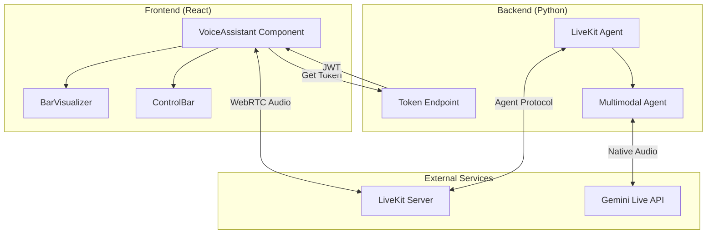
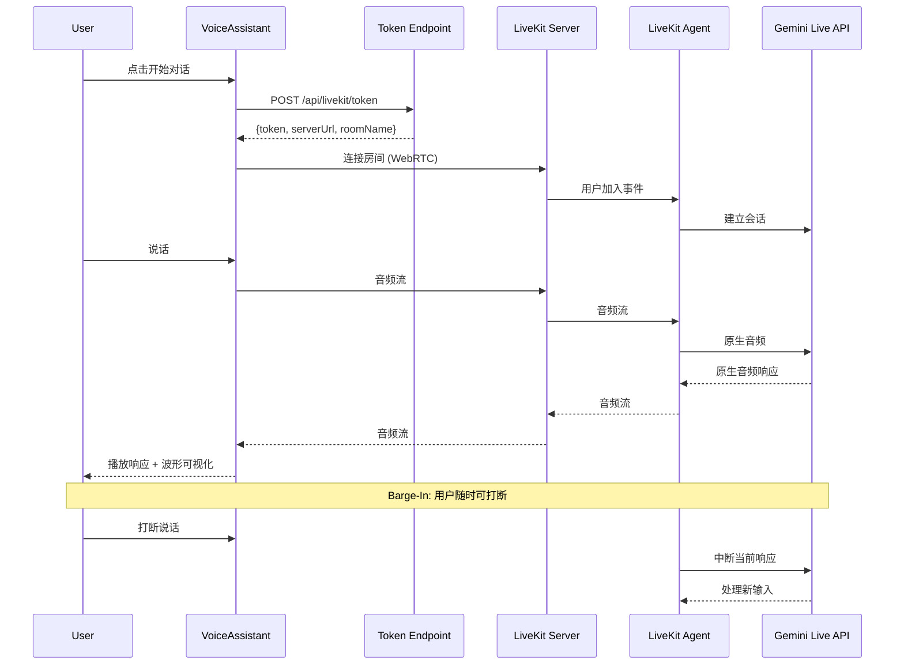

# Design Document: Realtime Voice Assistant

## Overview

本设计文档描述了一个类似豆包的超低延迟、可打断的实时语音助手的技术实现方案。系统使用 LiveKit 作为实时通信基础设施，Google Gemini Multimodal Live API 作为智能模型，实现原生 Speech-to-Speech 处理。

### 核心特性
- **超低延迟**: 使用 Gemini Live API 的原生音频处理，无需中间 STT/TTS 转换
- **可打断 (Barge-In)**: 用户可随时打断 AI 响应，实现自然对话
- **实时可视化**: 类似 Siri/豆包的动态波形效果

## Architecture



### 数据流



## Components and Interfaces

### 1. LiveKit Agent (Python Backend)

```python
# agent.py - LiveKit Agent 入口文件

from livekit import agents
from livekit.agents import AgentServer, AgentSession, Agent, room_io
from livekit.plugins import google, silero, noise_cancellation

class VoiceAssistant(Agent):
    """语音助手 Agent 类"""
    
    def __init__(self) -> None:
        super().__init__(
            instructions="""你是一个友好的语音助手。
            请用简洁、自然的方式回答用户的问题。
            保持对话流畅，像朋友一样交流。"""
        )

server = AgentServer()

@server.rtc_session()
async def voice_agent(ctx: agents.JobContext):
    """处理每个语音会话"""
    
    # 创建 AgentSession，使用 Gemini Realtime Model
    session = AgentSession(
        llm=google.realtime.RealtimeModel(
            model="gemini-2.5-flash-native-audio-preview",
            voice="Puck",  # 可选: Puck, Charon, Kore, Fenrir, Aoede
            temperature=0.8,
        ),
        vad=silero.VAD.load(),  # 语音活动检测
    )
    
    # 启动会话
    await session.start(
        room=ctx.room,
        agent=VoiceAssistant(),
        room_options=room_io.RoomOptions(
            audio_input=room_io.AudioInputOptions(
                noise_cancellation=noise_cancellation.BVC(),
            ),
        ),
    )
    
    # 发送欢迎消息
    await session.generate_reply(
        instructions="用友好的方式问候用户，告诉他们你可以帮助他们。"
    )

if __name__ == "__main__":
    agents.cli.run_app(server)
```

### 2. Token Endpoint (API)

```typescript
// 接口定义
interface TokenRequest {
  identity: string;      // 用户标识
  roomName?: string;     // 房间名称（可选，自动生成）
}

interface TokenResponse {
  token: string;         // JWT 访问令牌
  serverUrl: string;     // LiveKit 服务器 URL
  roomName: string;      // 房间名称
  participantName: string; // 参与者名称
}

interface TokenError {
  error: string;
  message: string;
}
```

### 3. VoiceAssistant React Component

```typescript
// VoiceAssistant.tsx - 主组件接口

interface VoiceAssistantProps {
  onConnectionChange?: (state: ConnectionState) => void;
  onError?: (error: Error) => void;
  className?: string;
}

type ConnectionState = 
  | 'disconnected' 
  | 'connecting' 
  | 'connected' 
  | 'error';

interface VoiceAssistantState {
  connectionState: ConnectionState;
  agentState: 'idle' | 'listening' | 'thinking' | 'speaking';
  error: Error | null;
}
```

### 4. BarVisualizer Component

```typescript
// BarVisualizer.tsx - 波形可视化组件

interface BarVisualizerProps {
  state: 'idle' | 'listening' | 'speaking';
  audioTrack?: TrackReferenceOrPlaceholder;
  barCount?: number;      // 默认 5
  className?: string;
}
```

## Data Models

### 环境变量配置

```typescript
interface EnvironmentConfig {
  // LiveKit 配置
  LIVEKIT_URL: string;           // LiveKit 服务器 URL
  LIVEKIT_API_KEY: string;       // API Key
  LIVEKIT_API_SECRET: string;    // API Secret
  
  // Google AI 配置
  GOOGLE_API_KEY: string;        // Gemini API Key
}
```

### 连接详情

```typescript
interface ConnectionDetails {
  serverUrl: string;
  roomName: string;
  participantName: string;
  participantToken: string;
}
```

### Agent 状态

```typescript
interface AgentState {
  state: 'idle' | 'listening' | 'thinking' | 'speaking';
  audioTrack: TrackReferenceOrPlaceholder | null;
  transcriptions: TranscriptionSegment[];
}
```

## Correctness Properties

*A property is a characteristic or behavior that should hold true across all valid executions of a system—essentially, a formal statement about what the system should do. Properties serve as the bridge between human-readable specifications and machine-verifiable correctness guarantees.*

### Property 1: Agent Connection Establishment

*For any* valid LiveKit credentials (LIVEKIT_URL, LIVEKIT_API_KEY, LIVEKIT_API_SECRET), the LiveKit_Agent SHALL successfully connect to the server and be ready to accept sessions.

**Validates: Requirements 1.1**

### Property 2: Session Creation on User Join

*For any* user joining a LiveKit_Room, the LiveKit_Agent SHALL create exactly one Multimodal_Agent instance for that session.

**Validates: Requirements 1.2**

### Property 3: Native Audio Pipeline

*For any* voice interaction, the system SHALL use Gemini's native Speech-to-Speech processing without intermediate STT or TTS components, ensuring the audio pipeline contains only: User Audio → Gemini → Agent Audio.

**Validates: Requirements 1.3, 1.4, 1.5**

### Property 4: Token Generation Validity

*For any* valid token request with user identity, the Token_Endpoint SHALL return a response containing: a valid JWT token, the LiveKit server URL, and a room name.

**Validates: Requirements 2.1, 2.2, 2.3**

### Property 5: Token Error Handling

*For any* invalid or missing credentials in a token request, the Token_Endpoint SHALL return an error response with appropriate HTTP status code and error message.

**Validates: Requirements 2.4**

### Property 6: Connection State Management

*For any* VoiceAssistant component instance, the connection state SHALL always be one of: 'disconnected', 'connecting', 'connected', or 'error', and state transitions SHALL follow valid paths.

**Validates: Requirements 3.6, 6.3**

### Property 7: Barge-In Interruption

*For any* ongoing AI audio response, WHEN the user starts speaking, the Multimodal_Agent SHALL stop the current response within 200ms and begin processing the new input.

**Validates: Requirements 4.1, 4.2, 4.3**

### Property 8: Audio Visualization Response

*For any* audio activity (user speaking or AI responding), the Bar_Visualizer SHALL update its bar values to reflect the current audio levels within 50ms.

**Validates: Requirements 5.1, 5.2, 5.3**

### Property 9: Environment Variable Validation

*For any* system startup, IF any required environment variable (LIVEKIT_URL, LIVEKIT_API_KEY, LIVEKIT_API_SECRET, GOOGLE_API_KEY) is missing, THEN the system SHALL log a clear error message and fail to start.

**Validates: Requirements 7.1, 7.2, 7.3, 7.4, 7.5**

## Error Handling

### 连接错误

| 错误类型 | 处理方式 |
|---------|---------|
| LiveKit 服务器不可达 | 显示错误消息，提供重试按钮 |
| Token 生成失败 | 显示错误消息，提示检查配置 |
| WebRTC 连接失败 | 自动重试 3 次，然后显示错误 |
| Agent 不可用 | 显示 fallback UI，提示稍后重试 |

### 权限错误

| 错误类型 | 处理方式 |
|---------|---------|
| 麦克风权限被拒绝 | 显示权限请求提示，引导用户授权 |
| 麦克风不可用 | 显示设备检查提示 |

### 运行时错误

| 错误类型 | 处理方式 |
|---------|---------|
| 音频流中断 | 自动重连，保持 UI 状态 |
| Gemini API 错误 | 记录日志，显示友好错误消息 |
| 网络波动 | 使用 LiveKit 内置重连机制 |

## Testing Strategy

### 单元测试

使用 Vitest 进行单元测试：

- **Token Endpoint**: 测试 token 生成逻辑、参数验证、错误处理
- **VoiceAssistant Component**: 测试状态管理、事件处理、渲染逻辑
- **BarVisualizer**: 测试波形计算、动画状态

### 属性测试

使用 fast-check 进行属性测试，最少 100 次迭代：

- **Property 4**: Token 生成有效性
- **Property 5**: Token 错误处理
- **Property 6**: 连接状态管理
- **Property 9**: 环境变量验证

### 集成测试

- **端到端连接**: 测试完整的连接流程
- **音频流**: 测试音频传输和播放
- **Barge-In**: 测试打断功能

### 测试配置

```typescript
// vitest.config.ts
export default {
  test: {
    environment: 'jsdom',
    globals: true,
    setupFiles: ['./src/test/setup.ts'],
  },
};
```

## 部署选项

### LiveKit Server 选项

#### 选项 1: LiveKit Cloud (推荐用于快速开始)

**优点:**
- 无需维护服务器
- 全球 CDN 分发
- 自动扩展

**免费额度:**
- 每月 50 小时音视频时长
- 足够开发和小规模测试

**获取方式:**
1. 访问 https://cloud.livekit.io
2. 注册账号
3. 创建项目，获取:
   - `LIVEKIT_URL`: `wss://your-project.livekit.cloud`
   - `LIVEKIT_API_KEY`: `APIxxxxxxxx`
   - `LIVEKIT_API_SECRET`: `xxxxxxxxxxxxxxxx`

**费用 (超出免费额度后):**
- 音频: $0.004/分钟
- 视频: $0.01-0.04/分钟 (根据分辨率)

#### 选项 2: 自托管 LiveKit Server (完全免费)

**优点:**
- 完全免费
- 数据完全自控
- 无调用限制

**要求:**
- 一台服务器 (推荐 2核4G 以上)
- 公网 IP 或域名
- Docker 环境

**部署方式:**

```bash
# 使用 Docker 快速部署
docker run -d \
  --name livekit \
  -p 7880:7880 \
  -p 7881:7881 \
  -p 7882:7882/udp \
  -e LIVEKIT_KEYS="devkey: secret" \
  livekit/livekit-server

# 或使用 docker-compose
# docker-compose.livekit.yml
```

```yaml
# docker-compose.livekit.yml
version: '3'
services:
  livekit:
    image: livekit/livekit-server
    ports:
      - "7880:7880"
      - "7881:7881"
      - "7882:7882/udp"
    environment:
      - LIVEKIT_KEYS=devkey: secret
    restart: unless-stopped
```

**配置:**
- `LIVEKIT_URL`: `ws://your-server:7880`
- `LIVEKIT_API_KEY`: `devkey`
- `LIVEKIT_API_SECRET`: `secret`

#### 选项 3: 本地开发 (仅限开发测试)

```bash
# 安装 LiveKit CLI
brew install livekit/tap/livekit-server

# 启动本地服务器
livekit-server --dev

# 默认配置
# LIVEKIT_URL=ws://localhost:7880
# LIVEKIT_API_KEY=devkey
# LIVEKIT_API_SECRET=secret
```

### Google Gemini API

**获取 API Key:**
1. 访问 https://aistudio.google.com/apikey
2. 登录 Google 账号
3. 点击 "Create API Key"
4. 复制 `GOOGLE_API_KEY`

**免费额度:**
- Gemini 1.5 Flash: 15 RPM (每分钟请求数), 100万 tokens/天
- Gemini 1.5 Pro: 2 RPM, 5万 tokens/天
- Gemini 2.0 Flash (实验版): 有限额度

**费用 (超出免费额度后):**
- Gemini 1.5 Flash: $0.075/百万输入 tokens
- Gemini 1.5 Pro: $1.25/百万输入 tokens

### 推荐部署方案

| 场景 | LiveKit | Gemini | 预估月费用 |
|------|---------|--------|-----------|
| 开发测试 | 本地/Cloud免费 | 免费额度 | $0 |
| 小规模 (<50h/月) | Cloud 免费 | 免费额度 | $0 |
| 中等规模 | Cloud 付费 | 付费 | $50-200 |
| 大规模/自控 | 自托管 | 付费 | 服务器费用 + API费用 |

## 依赖包

### Python Backend

```txt
livekit-agents>=1.0.0
livekit-plugins-google>=1.0.0
livekit-plugins-silero>=1.0.0
livekit-plugins-noise-cancellation>=1.0.0
python-dotenv>=1.0.0
```

### React Frontend

```json
{
  "@livekit/components-react": "^2.0.0",
  "livekit-client": "^2.0.0"
}
```
