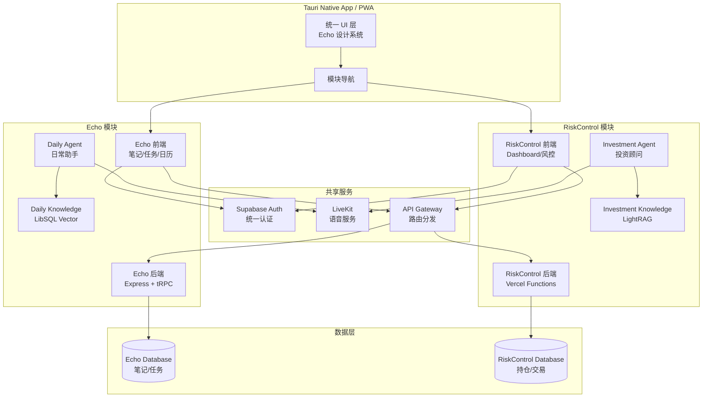

# Design Document: RiskControl Integration into Echo

## Overview

本设计文档描述如何将 RiskControl 投资风控系统作为 Echo 知识管理系统的"投资模块"进行整合。核心原则是：**基础能力复用 + 数据层隔离**。

### 设计目标

1. **复用 Echo 的前端能力**：笔记编辑、AI 对话、UI 组件库
2. **保护 RiskControl 的核心功能**：熔断机制、情绪检测、多 Agent 分析
3. **数据完全隔离**：两个 Supabase 实例，互不污染
4. **渐进式整合**：分阶段实施，每阶段可独立部署

### 技术栈对比

| 方面 | Echo (Blinko) | RiskControl | 整合策略 |
|------|---------------|-------------|----------|
| 前端框架 | React 18 + MobX | React 19 + Zustand | 使用 Echo 的 React 18 |
| UI 组件 | HeroUI + Tailwind | Radix UI + Tailwind | 统一使用 Echo 的 HeroUI |
| 后端 | Express + tRPC | Vercel Functions | 保持独立，API Gateway 统一 |
| ORM | Prisma | Drizzle | 各自保留，不强制统一 |
| 数据库 | PostgreSQL (Prisma) | Supabase (pgvector) | 双数据库架构 |
| AI | 多 Provider (ai-sdk) | Gemini | 各自保留配置 |
| 向量存储 | LibSQL | Supabase pgvector | 各自保留，命名空间隔离 |
| 包管理 | Bun | npm | 各模块使用原有工具 |

## Architecture

### 整体架构图



### 数据流架构

```mermaid
flowchart LR
    subgraph "用户交互"
        User[用户]
    end
    
    subgraph "前端路由"
        Router{模块路由}
        EchoUI[Echo UI]
        RCUI[RiskControl UI]
    end
    
    subgraph "API 层"
        GW[API Gateway]
        EchoAPI[/api/echo/*]
        RCAPI[/api/rc/*]
    end
    
    subgraph "数据存储"
        EchoDB[(Echo DB)]
        RCDB[(RC DB)]
    end
    
    User --> Router
    Router -->|/notes, /tasks| EchoUI
    Router -->|/investment, /risk| RCUI
    
    EchoUI --> GW
    RCUI --> GW
    
    GW -->|echo routes| EchoAPI
    GW -->|rc routes| RCAPI
    
    EchoAPI --> EchoDB
    RCAPI --> RCDB
```

## Components and Interfaces

### 1. 统一认证组件 (UnifiedAuth)

```typescript
// 接口定义
interface UnifiedAuthService {
  // 登录 - 使用 RiskControl 的 Supabase Auth
  login(credentials: LoginCredentials): Promise<AuthResult>;
  
  // 登出 - 同时清除两个模块的会话
  logout(): Promise<void>;
  
  // 获取当前用户
  getCurrentUser(): Promise<User | null>;
  
  // 检查模块访问权限
  hasModuleAccess(module: 'echo' | 'riskcontrol'): boolean;
  
  // 会话刷新
  refreshSession(): Promise<AuthResult>;
}

interface AuthResult {
  user: User;
  echoToken: string;      // Echo 模块访问令牌
  rcToken: string;        // RiskControl 模块访问令牌
  expiresAt: Date;
}
```

### 2. 模块导航组件 (ModuleNavigator)

```typescript
interface ModuleNavigatorProps {
  currentModule: 'echo' | 'riskcontrol';
  onModuleChange: (module: 'echo' | 'riskcontrol') => void;
}

interface NavigationState {
  lastVisitedModule: 'echo' | 'riskcontrol';
  lastVisitedPath: Record<string, string>;  // 每个模块的最后访问路径
}
```

### 3. 双数据库客户端 (DualDatabaseClient)

```typescript
interface DualDatabaseClient {
  // Echo 数据库客户端
  echo: SupabaseClient;
  
  // RiskControl 数据库客户端
  riskcontrol: SupabaseClient;
  
  // 根据数据类型自动路由
  getClientForDataType(type: DataType): SupabaseClient;
}

type DataType = 
  | 'notes' | 'tasks' | 'calendar' | 'daily_knowledge'  // -> Echo DB
  | 'positions' | 'transactions' | 'risk_metrics' | 'investment_docs';  // -> RC DB
```

### 4. 双 Agent 语音服务 (DualAgentVoiceService)

```typescript
interface DualAgentVoiceService {
  // 创建语音会话
  createSession(agentType: AgentType): Promise<VoiceSession>;
  
  // 切换 Agent（保持会话）
  switchAgent(session: VoiceSession, newAgent: AgentType): Promise<void>;
  
  // 获取 Agent 配置
  getAgentConfig(agentType: AgentType): AgentConfig;
}

type AgentType = 'investment' | 'daily';

interface AgentConfig {
  systemPrompt: string;
  personality: AgentPersonality;
  knowledgeNamespace: string;
  databaseClient: SupabaseClient;
  tools: AgentTool[];
}
```

### 5. 上下文隔离 RAG 服务 (IsolatedRAGService)

```typescript
interface IsolatedRAGService {
  // 查询知识库（自动路由）
  query(question: string, context: QueryContext): Promise<RAGResult>;
  
  // 显式指定命名空间查询
  queryNamespace(
    question: string, 
    namespace: 'investment' | 'daily'
  ): Promise<RAGResult>;
  
  // 跨域查询（需要用户确认）
  queryCrossDomain(
    question: string,
    userConfirmed: boolean
  ): Promise<RAGResult>;
  
  // 主题检测
  detectTopic(question: string): 'investment' | 'daily' | 'ambiguous';
}

interface QueryContext {
  currentModule: 'echo' | 'riskcontrol';
  currentAgent: AgentType;
  conversationHistory: Message[];
}
```

### 6. API Gateway

```typescript
interface APIGateway {
  // 路由配置
  routes: RouteConfig[];
  
  // 请求处理
  handleRequest(req: Request): Promise<Response>;
  
  // 健康检查
  healthCheck(): Promise<HealthStatus>;
}

interface RouteConfig {
  pattern: string;           // e.g., '/api/echo/*', '/api/rc/*'
  target: 'echo' | 'riskcontrol';
  requiresAuth: boolean;
  rateLimit?: RateLimitConfig;
}
```

## Data Models

### Echo 数据库 Schema（保持不变）

```prisma
// 笔记
model Note {
  id        String   @id @default(cuid())
  content   String
  tags      Tag[]
  createdAt DateTime @default(now())
  updatedAt DateTime @updatedAt
  userId    String
}

// 任务
model Task {
  id          String    @id @default(cuid())
  title       String
  completed   Boolean   @default(false)
  dueDate     DateTime?
  userId      String
}

// 日常知识向量（LibSQL）
model DailyKnowledge {
  id        String   @id
  content   String
  embedding Float[]  // LibSQL vector
  metadata  Json
}
```

### RiskControl 数据库 Schema（保持不变）

```typescript
// 持仓
export const positions = pgTable('positions', {
  id: serial('id').primaryKey(),
  ticker: varchar('ticker', { length: 20 }).notNull(),
  quantity: decimal('quantity', { precision: 15, scale: 4 }),
  avgCost: decimal('avg_cost', { precision: 15, scale: 4 }),
  marketValue: decimal('market_value', { precision: 15, scale: 2 }),
  // ... 其他字段
});

// 交易记录
export const transactions = pgTable('transactions', {
  id: serial('id').primaryKey(),
  ticker: varchar('ticker', { length: 20 }).notNull(),
  action: varchar('action', { length: 10 }),  // BUY, SELL
  quantity: decimal('quantity', { precision: 15, scale: 4 }),
  price: decimal('price', { precision: 15, scale: 4 }),
  // ... 其他字段
});

// 风险指标
export const riskMetrics = pgTable('risk_metrics', {
  id: serial('id').primaryKey(),
  date: date('date').notNull(),
  leverage: decimal('leverage', { precision: 5, scale: 2 }),
  drawdown: decimal('drawdown', { precision: 5, scale: 2 }),
  // ... 其他字段
});

// 投资知识向量（pgvector）
export const investmentKnowledge = pgTable('investment_knowledge', {
  id: serial('id').primaryKey(),
  content: text('content'),
  embedding: vector('embedding', { dimensions: 768 }),
  metadata: jsonb('metadata'),
});
```

### 共享数据模型

```typescript
// 用户（存储在 RiskControl DB，作为 Auth 主源）
interface User {
  id: string;
  email: string;
  name: string;
  createdAt: Date;
  
  // 模块权限
  modules: {
    echo: boolean;
    riskcontrol: boolean;
  };
  
  // 偏好设置
  preferences: {
    defaultModule: 'echo' | 'riskcontrol';
    theme: 'light' | 'dark';
    language: 'zh' | 'en';
  };
}
```

## Correctness Properties

*A property is a characteristic or behavior that should hold true across all valid executions of a system—essentially, a formal statement about what the system should do. Properties serve as the bridge between human-readable specifications and machine-verifiable correctness guarantees.*

### Property 1: 认证状态一致性

*For any* user session, if the user is authenticated in one module, they SHALL be authenticated in the other module with the same identity.

**Validates: Requirements 1.1, 1.2**

### Property 2: 数据隔离完整性

*For any* data write operation, financial data (positions, transactions, risk metrics) SHALL only be written to RiskControl_Database, and notes/tasks SHALL only be written to Echo_Database.

**Validates: Requirements 3.2, 3.3, 3.6**

### Property 3: Agent 知识库隔离

*For any* RAG query from Investment_Agent, the query SHALL only retrieve from Investment_Knowledge namespace, never from Daily_Knowledge.

**Validates: Requirements 5.2, 5.5**

### Property 4: Agent 知识库隔离（Daily）

*For any* RAG query from Daily_Agent, the query SHALL only retrieve from Daily_Knowledge namespace, never from Investment_Knowledge.

**Validates: Requirements 5.3, 5.6**

### Property 5: API 路由正确性

*For any* API request matching pattern `/api/echo/*`, the request SHALL be routed to Echo handlers; for pattern `/api/rc/*`, to RiskControl handlers.

**Validates: Requirements 6.2, 6.3**

### Property 6: 熔断机制触发正确性

*For any* risk metrics where leverage > 1.5x OR monthly drawdown > 10%, the circuit breaker SHALL be triggered and trading operations SHALL be blocked.

**Validates: Requirements 28.3, 28.4**

### Property 7: 情绪交易检测准确性

*For any* trading behavior pattern matching revenge trading criteria (loss > 5% followed by position increase > 50% within 1 hour), the emotional trading detector SHALL trigger a warning.

**Validates: Requirements 29.2, 29.3**

### Property 8: WebSocket 订阅恢复

*For any* WebSocket disconnection and reconnection, the subscription state before disconnection SHALL be fully restored after reconnection.

**Validates: Requirements 33.2, 33.3**

### Property 9: 导航状态持久化

*For any* module switch followed by session refresh, the last visited module SHALL be preserved and restored.

**Validates: Requirements 2.4**

### Property 10: Investment Agent 提示词保护

*For any* integration update, the Investment_Agent's system prompts SHALL remain identical to the original RiskControl implementation.

**Validates: Requirements 4.3, 4.9**

### Property 11: 价格警报去重

*For any* price alert rule, after triggering once, the same rule SHALL NOT trigger again within the cooldown period (5 minutes).

**Validates: Requirements 30.3**

### Property 12: 认证一致性

*For any* authenticated session, both Echo and RiskControl modules SHALL accept the same authentication token.

**Validates: Requirements 6.4**

## Error Handling

### 认证错误

```typescript
class AuthError extends Error {
  constructor(
    public code: 'SESSION_EXPIRED' | 'INVALID_TOKEN' | 'UNAUTHORIZED',
    message: string
  ) {
    super(message);
  }
}

// 处理策略
async function handleAuthError(error: AuthError): Promise<void> {
  switch (error.code) {
    case 'SESSION_EXPIRED':
      // 尝试刷新 token
      await authService.refreshSession();
      break;
    case 'INVALID_TOKEN':
    case 'UNAUTHORIZED':
      // 重定向到登录页
      router.push('/login');
      break;
  }
}
```

### 数据库连接错误

```typescript
class DatabaseError extends Error {
  constructor(
    public database: 'echo' | 'riskcontrol',
    public code: 'CONNECTION_FAILED' | 'QUERY_FAILED' | 'TIMEOUT',
    message: string
  ) {
    super(message);
  }
}

// 处理策略：优雅降级
async function handleDatabaseError(error: DatabaseError): Promise<void> {
  if (error.database === 'riskcontrol') {
    // RiskControl DB 不可用时，Echo 模块继续工作
    showToast('投资模块暂时不可用，笔记功能正常');
  } else {
    // Echo DB 不可用时，RiskControl 模块继续工作
    showToast('笔记模块暂时不可用，投资功能正常');
  }
}
```

### RAG 服务错误

```typescript
class RAGError extends Error {
  constructor(
    public namespace: 'investment' | 'daily',
    public code: 'SERVICE_UNAVAILABLE' | 'EMBEDDING_FAILED' | 'NO_RESULTS',
    message: string
  ) {
    super(message);
  }
}

// 处理策略：回退到基础 AI
async function handleRAGError(error: RAGError): Promise<string> {
  console.warn(`RAG service error: ${error.message}`);
  // 回退到不带 RAG 的基础 AI 响应
  return await aiService.generateWithoutRAG(query);
}
```

### WebSocket 错误

```typescript
// 自动重连策略（指数退避）
const reconnectStrategy = {
  maxAttempts: 10,
  initialDelay: 1000,
  maxDelay: 30000,
  backoffMultiplier: 1.5,
};

async function handleWebSocketError(error: Error): Promise<void> {
  // 3 秒内自动重连
  await websocketGateway.reconnect();
  
  // 恢复订阅状态
  await websocketGateway.restoreSubscriptions();
}
```

## Testing Strategy

### 单元测试

使用 Vitest + React Testing Library：

```typescript
// 认证服务测试
describe('UnifiedAuthService', () => {
  it('should grant access to both modules after login', async () => {
    const result = await authService.login(credentials);
    expect(result.echoToken).toBeDefined();
    expect(result.rcToken).toBeDefined();
  });
});

// 数据路由测试
describe('DualDatabaseClient', () => {
  it('should route notes to Echo DB', () => {
    const client = dualClient.getClientForDataType('notes');
    expect(client).toBe(dualClient.echo);
  });
  
  it('should route positions to RiskControl DB', () => {
    const client = dualClient.getClientForDataType('positions');
    expect(client).toBe(dualClient.riskcontrol);
  });
});
```

### 属性测试 (Property-Based Testing)

使用 fast-check，每个属性测试至少 100 次迭代：

```typescript
import * as fc from 'fast-check';

// Property 2: 数据隔离完整性
describe('Property Tests: Data Isolation', () => {
  /**
   * **Feature: riskcontrol-integration, Property 2: 数据隔离完整性**
   * **Validates: Requirements 3.2, 3.3, 3.6**
   */
  it('financial data should only go to RiskControl DB', () => {
    fc.assert(
      fc.property(
        fc.record({
          ticker: fc.string({ minLength: 1, maxLength: 10 }),
          quantity: fc.float({ min: 0, max: 10000 }),
          price: fc.float({ min: 0, max: 10000 }),
        }),
        async (position) => {
          await writePosition(position);
          
          // 验证数据在 RiskControl DB
          const rcResult = await rcClient.from('positions').select().eq('ticker', position.ticker);
          expect(rcResult.data?.length).toBeGreaterThan(0);
          
          // 验证数据不在 Echo DB
          const echoResult = await echoClient.from('positions').select().eq('ticker', position.ticker);
          expect(echoResult.data?.length).toBe(0);
        }
      ),
      { numRuns: 100 }
    );
  });
});

// Property 3 & 4: Agent 知识库隔离
describe('Property Tests: RAG Isolation', () => {
  /**
   * **Feature: riskcontrol-integration, Property 3: Agent 知识库隔离**
   * **Validates: Requirements 5.2, 5.5**
   */
  it('Investment Agent queries should only hit Investment Knowledge', () => {
    fc.assert(
      fc.property(
        fc.string({ minLength: 5, maxLength: 200 }),  // 随机查询
        async (query) => {
          const result = await ragService.queryNamespace(query, 'investment');
          
          // 验证所有结果来自 investment 命名空间
          for (const doc of result.documents) {
            expect(doc.namespace).toBe('investment');
          }
        }
      ),
      { numRuns: 100 }
    );
  });
});

// Property 8: WebSocket 订阅恢复
describe('Property Tests: WebSocket Recovery', () => {
  /**
   * **Feature: riskcontrol-integration, Property 8: WebSocket 订阅恢复**
   * **Validates: Requirements 33.2, 33.3**
   */
  it('subscriptions should be restored after reconnection', () => {
    fc.assert(
      fc.property(
        fc.array(fc.string({ minLength: 1, maxLength: 10 }), { minLength: 1, maxLength: 20 }),
        async (tickers) => {
          // 订阅
          websocketGateway.subscribe(tickers);
          const originalSubs = websocketGateway.getSubscriptions();
          
          // 模拟断开
          websocketGateway.disconnect();
          
          // 重连
          await websocketGateway.connect();
          
          // 验证订阅恢复
          const restoredSubs = websocketGateway.getSubscriptions();
          expect(new Set(restoredSubs)).toEqual(new Set(originalSubs));
        }
      ),
      { numRuns: 100 }
    );
  });
});
```

### 集成测试

```typescript
// 端到端模块切换测试
describe('Module Navigation Integration', () => {
  it('should preserve state when switching modules', async () => {
    // 在 Echo 模块创建笔记
    await navigateTo('/notes');
    await createNote('Test note');
    
    // 切换到 RiskControl
    await switchModule('riskcontrol');
    expect(currentPath()).toBe('/investment');
    
    // 切换回 Echo
    await switchModule('echo');
    expect(currentPath()).toBe('/notes');
    
    // 验证笔记仍然存在
    const notes = await getNotes();
    expect(notes).toContainEqual(expect.objectContaining({ content: 'Test note' }));
  });
});
```

### 测试配置

```typescript
// vitest.config.ts
export default defineConfig({
  test: {
    environment: 'jsdom',
    include: [
      'src/**/*.test.ts',
      'src/**/*.test.tsx',
    ],
    setupFiles: ['./src/test/setup.ts'],
    testTimeout: 30000,  // Property tests need more time
    coverage: {
      provider: 'v8',
      reporter: ['text', 'html'],
      exclude: ['node_modules', 'dist'],
    },
  },
});
```
