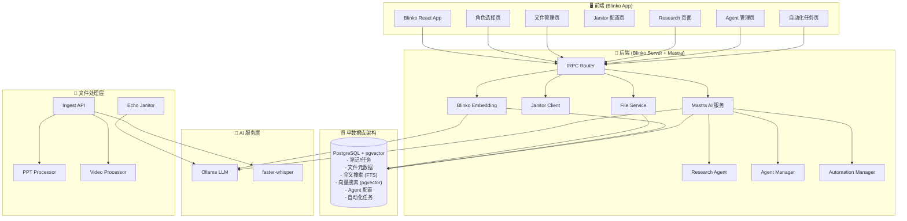

# Echo - 愿景与架构规划 v3.2

> 这是 Echo 项目的核心愿景文档，定义了产品目标、架构设计和开源集成策略。
> 所有开发工作都应回溯到这个文档，确保方向一致。
> 
> 创建日期: 2025-12-30
> 最后更新: 2026-01-01
> 版本: v3.2.1 (日报系统完善 + 属性测试)

---

## 🎯 产品愿景

### 一句话定义

**Echo 是一个基于 Blinko 扩展的 AI 个人助手，帮助你捕捉想法、管理文件、整理混乱、做出决策。**

### 核心价值主张

在 AI 时代，你需要一个个人应用：

1. **能读取你的各种信息，帮助你做各种决策**
2. **能记录你的零散想法，记录了就不会丢掉，时不时提醒你，甚至帮你细化**
3. **有笔记和待办事项功能，能调整优先级，标注任务完成**
4. **每天早晚有日报，做昨日总结和今日建议，建议可选择完成或不完成**
5. **带 AI 对话功能，有什么心思可以交流**
6. **文件管理，重要文件能快速找到，不再乱七八糟**
7. **多模态检索，视频、PPT 等内容也能被搜索和理解**
8. **智能整理，混乱的文件夹自动分类和重命名**

---

## 🆕 v3.2 架构升级说明

### 核心变化

| 变化点 | v3.0 | v3.1 | v3.2 |
|--------|------|------|------|
| 核心平台 | Blinko 扩展 | Blinko 扩展 | **Blinko 扩展** |
| 数据库架构 | 双数据库 | 单数据库 | **单数据库** (PostgreSQL + pgvector) |
| 搜索策略 | 混合搜索 | PostgreSQL FTS | **PostgreSQL FTS** + Blinko embedding |
| AI 服务 | Khoj + Blinko | Khoj + Mastra | **Mastra 统一** (Khoj 降级方案) |
| 文件整理 | AI Janitor | AI Janitor | **AI Janitor** (LlamaFS 风格) |

### 为什么升级到 v3.2？

1. **AI 服务统一** - 从 Khoj (Python) 迁移到 Mastra (TypeScript)，单一技术栈
2. **简化架构** - 移除 SeekDB，减少运维复杂度
3. **复用 Blinko** - 使用 Blinko 原生的 embedding 功能进行向量搜索
4. **降低资源占用** - 单数据库架构减少内存和 CPU 占用
5. **更好的稳定性** - 减少服务间依赖，降低故障点

---

## 👤 用户画像

### 主要用户

一位多角色、多领域的专业人士：

| 角色 | 描述 | 优先级 | 实现状态 |
|------|------|--------|---------|
| 🎯 **通用助手** | 日常笔记、翻译、活动监控 | P0 | ✅ 已实现 |
| 📁 **文件管理者** | 文件搜索、OCR、自动整理 | P0 | ✅ 已实现 |
| 🧑‍💻 **AI 开发者** | GitHub 监控、项目追踪、知识学习 | P1 | ⏳ 规划中 |
| 👨‍🎨 **美术经理** | 团队管理、周报、会议记录 | P2 | ⏳ 规划中 |
| 📈 **投资者** | 投资数据、情绪管理、风控 | P2 | ⏳ 规划中 |
| 👨‍👩‍👧 **家庭成员** | 家庭关怀、健康追踪 | P3 | ⏳ 规划中 |

### 核心痛点

1. **想法容易丢失** - 零散想法没有地方记录，记了也找不到 ✅ 已解决
2. **文件管理混乱** - 没有好的命名习惯，重要文件找不到 ✅ 已解决
3. **缺少主动提醒** - 任务和想法需要自己记得去看 ⚠️ 部分解决
4. **决策缺少支持** - 信息分散，难以做出好的决策 ⚠️ 部分解决
5. **多模态内容难检索** - 视频、PPT 里的知识无法被搜索 ✅ 已解决

---

## 🏗️ 架构设计 v3.2

### 核心原则

1. **开源优先** - 能用现有开源方案就不自己写
2. **渐进式开发** - 一次只做一个阶段，避免失控
3. **单数据库** - PostgreSQL (FTS + pgvector) 满足所有需求
4. **单一技术栈** - TypeScript 为主，Python 仅用于文件处理
5. **最小侵入** - 扩展而非修改 Blinko 核心代码

### 系统架构图 (v3.2)



### 数据流说明

1. **笔记流**: Blinko UI → tRPC → PostgreSQL → Blinko Embedding (pgvector)
2. **文件摄入流**: 上传 → Ingest API → 处理器 (Whisper/PPT) → PostgreSQL
3. **搜索流**: 搜索请求 → PostgreSQL FTS → 返回结果
4. **AI 搜索流**: AI 对话 → Blinko Embedding → pgvector 向量搜索 → RAG 增强
5. **整理流**: 混乱文件夹 → Janitor → Ollama 分类 → 有序文件夹
6. **Research 流**: 查询 → Research Agent → 多轮迭代 → 汇总结果

### 开源项目集成策略 (v3.2 更新)

| 开源项目 | 集成方式 | 负责功能 | 状态 |
|---------|---------|---------|------|
| **Blinko** | 核心平台 (代码级集成) | 笔记、任务、AI 对话、Embedding | ✅ 已集成 |
| **PostgreSQL + pgvector** | Docker 部署 | 主数据库、全文搜索、向量搜索 | ✅ 已部署 |
| **PostgreSQL 文件服务** | 内置服务 | 文件存储、OCR、预览 | ✅ 已实现 |
| **faster-whisper** | Python 库 | 视频语音转文字 | ✅ 已集成 |
| **python-pptx** | Python 库 | PPT 文本提取 | ✅ 已集成 |
| **Ollama** | Docker 部署 | 本地 LLM + Embedding | ✅ 已部署 |
| **LlamaFS 风格** | 自研 Janitor | 文件自动整理 | ✅ 已实现 |
| **Mastra** | TypeScript 框架 | AI Agent、Research、Automation | ✅ 已集成 |
| ~~SeekDB~~ | ~~已移除~~ | ~~向量数据库~~ | ❌ 已移除 |
| ~~Khoj~~ | ~~降级方案~~ | ~~AI 知识库~~ | ⚠️ 保留但不推荐 |

---

## 📦 核心数据 Schema (v3.2)

### PostgreSQL + pgvector (单数据库架构)

```sql
-- Blinko 原有表 (笔记、任务、用户等)
-- 包含 pgvector 扩展用于向量搜索

-- Echo 扩展表: 文件附件
CREATE TABLE attachments (
    id SERIAL PRIMARY KEY,
    filename VARCHAR(255),
    content TEXT,                    -- 文档内容 (OCR/提取)
    search_vector TSVECTOR,          -- 全文搜索向量
    embedding VECTOR(384),           -- Blinko embedding (pgvector)
    source_type VARCHAR(20),         -- 'pdf', 'video', 'ppt'
    metadata JSONB,                  -- 元数据
    created_at TIMESTAMP DEFAULT NOW()
);

-- Echo 扩展表: Agent 配置
CREATE TABLE agents (
    id SERIAL PRIMARY KEY,
    slug VARCHAR(100) UNIQUE NOT NULL,
    name VARCHAR(255) NOT NULL,
    persona TEXT,
    system_prompt TEXT,
    tools TEXT[],
    model_id INT,
    privacy VARCHAR(20),
    account_id INT,
    created_at TIMESTAMP DEFAULT NOW()
);

-- Echo 扩展表: 自动化任务
CREATE TABLE ai_scheduled_tasks (
    id SERIAL PRIMARY KEY,
    name VARCHAR(255) NOT NULL,
    query TEXT NOT NULL,
    schedule VARCHAR(100),
    natural_schedule VARCHAR(255),
    result_storage VARCHAR(20),
    enabled BOOLEAN DEFAULT true,
    account_id INT,
    created_at TIMESTAMP DEFAULT NOW()
);

-- Echo 扩展表: Research 会话
CREATE TABLE research_sessions (
    id SERIAL PRIMARY KEY,
    query TEXT NOT NULL,
    summary TEXT,
    iterations JSONB,
    sources JSONB,
    confidence FLOAT,
    status VARCHAR(20),
    account_id INT,
    created_at TIMESTAMP DEFAULT NOW()
);

CREATE INDEX idx_attachments_fts ON attachments USING GIN(search_vector);
CREATE INDEX idx_attachments_embedding ON attachments USING hnsw(embedding vector_cosine_ops);
```

---

## 📋 核心需求清单 (v3.2 更新)

### 需求 1: 想法捕捉与提醒

**用户故事**: 作为用户，我想快速记录零散想法，系统会帮我保存、提醒、细化。

| 子需求 | 描述 | 开源方案 | 状态 |
|--------|------|---------|------|
| 1.1 | 快速输入想法 | Blinko 闪念笔记 | ✅ 已实现 |
| 1.2 | 想法不会丢失 | Blinko + PostgreSQL | ✅ 已实现 |
| 1.3 | 定时提醒回顾 | 日报系统 | ✅ 已实现 |
| 1.4 | AI 帮助细化 | Blinko AI 增强 | ✅ 已实现 |

### 需求 2: 笔记与待办管理

**用户故事**: 作为用户，我想管理笔记和待办事项，能调整优先级，标注完成。

| 子需求 | 描述 | 开源方案 | 状态 |
|--------|------|---------|------|
| 2.1 | 创建笔记 | Blinko | ✅ 已实现 |
| 2.2 | 创建待办 | Blinko | ✅ 已实现 |
| 2.3 | 优先级调整 | Blinko | ✅ 已实现 |
| 2.4 | 标注完成 | Blinko | ✅ 已实现 |
| 2.5 | 标签分类 | Blinko | ✅ 已实现 |

### 需求 3: 统一知识检索

**用户故事**: 作为用户，我想通过一个搜索框找到所有相关内容，包括笔记、文件、视频、PPT。

| 子需求 | 描述 | 开源方案 | 状态 |
|--------|------|---------|------|
| 3.1 | 全文搜索 | PostgreSQL FTS | ✅ 已实现 |
| 3.2 | 向量语义搜索 | Blinko Embedding + pgvector | ✅ 已实现 |
| 3.3 | AI 对话增强 | Blinko RAG | ✅ 已实现 |
| 3.4 | 视频内容检索 | PostgreSQL FTS + Whisper | ✅ 已实现 |
| 3.5 | PPT 内容检索 | PostgreSQL FTS + python-pptx | ✅ 已实现 |

### 需求 4: 多模态摄入

**用户故事**: 作为用户，我想上传视频和 PPT，系统自动提取内容并索引。

| 子需求 | 描述 | 开源方案 | 状态 |
|--------|------|---------|------|
| 4.1 | 视频语音转文字 | faster-whisper | ✅ 已实现 |
| 4.2 | PPT 文本提取 | python-pptx | ✅ 已实现 |
| 4.3 | 自动分块索引 | Ingest API | ✅ 已实现 |
| 4.4 | 处理进度显示 | IngestStatus UI | ✅ 已实现 |

### 需求 5: 文件管理

**用户故事**: 作为用户，我想管理重要文件，能快速搜索和预览。

| 子需求 | 描述 | 开源方案 | 状态 |
|--------|------|---------|------|
| 5.1 | 文件上传 | PostgreSQL + 本地存储 | ✅ 已实现 |
| 5.2 | OCR 文字提取 | Tesseract OCR | ✅ 已实现 |
| 5.3 | 文件预览 | FilePreview 组件 | ✅ 已实现 |
| 5.4 | 标签管理 | PostgreSQL | ✅ 已实现 |

### 需求 6: 智能整理

**用户故事**: 作为用户，我想把文件丢到一个文件夹，系统自动分类和重命名。

| 子需求 | 描述 | 开源方案 | 状态 |
|--------|------|---------|------|
| 6.1 | 文件夹监听 | Janitor watchdog | ✅ 已实现 |
| 6.2 | AI 分类决策 | Ollama LLM | ✅ 已实现 |
| 6.3 | 语义重命名 | Janitor | ✅ 已实现 |
| 6.4 | 分类配置 UI | JanitorConfigPanel | ✅ 已实现 |

### 需求 7: 日报系统

**用户故事**: 作为用户，我想每天收到日报，总结今日、建议明日。

| 子需求 | 描述 | 开源方案 | 状态 |
|--------|------|---------|------|
| 7.1 | 晚报生成 | dailyReportRouter | ✅ 已实现 |
| 7.2 | 早报生成 | ReportGenerator | ✅ 已实现 |
| 7.3 | 建议可接受 | SuggestionEngine | ✅ 已实现 |
| 7.4 | 日报调度 | ReportScheduler + AutomationManager | ✅ 已实现 |
| 7.5 | 桌面通知 | desktopNotification | ✅ 已实现 |

### 需求 8: AI 对话

**用户故事**: 作为用户，我想有个 AI 可以交流心思，帮助思考。

| 子需求 | 描述 | 开源方案 | 状态 |
|--------|------|---------|------|
| 8.1 | AI 对话 | Blinko + Mastra | ✅ 已实现 |
| 8.2 | 上下文记忆 | Memory System | ✅ 已实现 |
| 8.3 | 知识库增强 | Blinko Embedding RAG | ✅ 已实现 |

### 需求 9: AI 服务统一 (v3.2 新增)

**用户故事**: 作为用户，我想使用统一的 AI 服务进行研究、Agent 管理和自动化任务。

| 子需求 | 描述 | 开源方案 | 状态 |
|--------|------|---------|------|
| 9.1 | Research Agent | Mastra | ✅ 已实现 |
| 9.2 | Agent 管理 | Mastra | ✅ 已实现 |
| 9.3 | 自动化任务 | Mastra | ✅ 已实现 |
| 9.4 | 工具注册系统 | Mastra | ✅ 已实现 |
| 9.5 | 功能开关路由 | ServiceRouter | ✅ 已实现 |

---

## 🚀 开发路线图 (v3.2)

### ✅ Phase 1: Blinko 扩展基础 (已完成)
- [x] 基于 Blinko 搭建开发环境
- [x] 实现截图翻译功能
- [x] 实现活动监控功能
- [x] 实现 AI 记忆系统
- [x] 实现本地嵌入服务

### ✅ Phase 2: 文件管理系统 (已完成)
- [x] 实现 PostgreSQL 文件服务
- [x] 实现文件上传/预览/搜索
- [x] 实现标签和类型管理
- [x] 创建文件管理 UI

### ✅ Phase 3: 单数据库架构 (已完成)
- [x] PostgreSQL 全文搜索扩展
- [x] 移除 SeekDB，简化架构
- [x] 使用 Blinko 原生 embedding 功能
- [x] 实现健康检查和监控

### ✅ Phase 4: 多模态摄入 (已完成)
- [x] 集成 faster-whisper 视频处理
- [x] 集成 python-pptx PPT 处理
- [x] 实现 Ingest API
- [x] 创建处理状态 UI

### ✅ Phase 5: 智能整理 (已完成)
- [x] 实现 Echo Janitor 服务
- [x] 实现分类配置 UI
- [x] 实现数据流程说明页面

### ✅ Phase 6: AI 服务统一 (已完成)
- [x] 实现 Research Agent
- [x] 实现 Agent 管理系统
- [x] 实现自动化任务系统
- [x] 实现工具注册系统
- [x] 实现功能开关路由
- [x] 创建 Research/Agents/Automations UI

### ⏳ Phase 7: 功能完善 (已完成)
- [x] 实现角色选择主页
- [x] 实现早报生成功能 (ReportGenerator)
- [x] 实现建议可接受/拒绝功能 (SuggestionEngine)
- [x] 实现日报调度系统 (ReportScheduler)
- [x] 实现桌面通知 (desktopNotification)
- [x] 补充属性测试覆盖 (fast-check)

### 📋 Phase 8: 角色功能扩展 (规划中)
- [ ] AI 开发者角色功能
- [ ] 投资者角色功能
- [ ] 其他角色功能

---

## 📊 需求覆盖率追踪 (v3.2)

| 需求类别 | 总数 | 已实现 | 进行中 | 未开始 | 覆盖率 |
|---------|------|--------|--------|--------|--------|
| 想法捕捉 | 4 | 4 | 0 | 0 | 100% |
| 笔记待办 | 5 | 5 | 0 | 0 | 100% |
| 统一检索 | 5 | 5 | 0 | 0 | 100% |
| 多模态摄入 | 4 | 4 | 0 | 0 | 100% |
| 文件管理 | 4 | 4 | 0 | 0 | 100% |
| 智能整理 | 4 | 4 | 0 | 0 | 100% |
| 日报系统 | 5 | 5 | 0 | 0 | 100% |
| AI 对话 | 3 | 3 | 0 | 0 | 100% |
| AI 服务统一 | 5 | 5 | 0 | 0 | 100% |
| **总计** | **39** | **39** | **0** | **0** | **100%** |

---

## 🔧 技术栈 (v3.2)

### 核心平台
- **Blinko** - 笔记、任务、AI 对话、Embedding 的核心
- **Tauri** - 跨平台桌面应用框架 (Blinko 原生)

### 单数据库架构
- **PostgreSQL + pgvector** - 主数据库 + 全文搜索 (FTS) + 向量搜索

### 文件处理
- **PostgreSQL 文件服务** - 文件存储和管理
- **Tesseract OCR** - 文档 OCR 识别
- **faster-whisper** - 视频语音转文字
- **python-pptx** - PPT 解析
- **Echo Janitor** - 智能文件整理

### AI 能力
- **Ollama** - 本地 LLM + Embedding
- **Mastra** - AI Agent 框架
- **Blinko AiModelFactory** - AI 模型调用
- **Blinko Embedding** - 向量化服务
- **Memory System** - AI 记忆管理
- **Research Agent** - 多轮研究
- **Agent Manager** - Agent 管理
- **Automation Manager** - 自动化任务

---

## 🛠️ 技术债务清单 (v3.2)

| 债务 | 优先级 | 状态 | 说明 |
|------|--------|------|------|
| ~~属性测试覆盖不足~~ | ~~P1~~ | ✅ 已解决 | 已添加 17 个属性测试 |
| ~~早报功能未实现~~ | ~~P1~~ | ✅ 已解决 | ReportGenerator 已实现 |
| ~~建议系统未实现~~ | ~~P2~~ | ✅ 已解决 | SuggestionEngine 已实现 |
| Khoj 代码待清理 | P2 | 待处理 | 保留作为降级方案，待完全验证后移除 |
| 角色功能未扩展 | P2 | 待处理 | 仅 UI，功能待扩展 |
| 移动端未适配 | P3 | 待处理 | Tauri Mobile |
| ~~文档不同步~~ | ~~P3~~ | ✅ 已解决 | 本次更新已同步 |

---

## 🤖 AI 协作准则

1. **搬运优先** - 先找开源方案再自己写
2. **环境隔离** - 所有 Python 脚本基于 venv，提供 requirements.txt
3. **Mock 优先** - 遇到连接问题先用 Mock 数据验证逻辑
4. **错误处理** - 视频/PPT 解析必须 try-except，确保主进程不崩溃
5. **注释清晰** - 关键逻辑必须写清楚注释
6. **UI 设计** - 复用 Blinko 的 glass-effect 样式
7. **单一技术栈** - TypeScript 为主，Python 仅用于文件处理

---

## ✅ 成功标准

### 已达成
- [x] Blinko 扩展成功运行
- [x] 文件上传、OCR、搜索完整流程
- [x] PostgreSQL FTS 搜索正常工作
- [x] 视频和 PPT 内容可被检索
- [x] Janitor 自动整理文件
- [x] AI 服务统一到 Mastra
- [x] Research Agent 可用
- [x] Agent 管理系统可用
- [x] 自动化任务系统可用
- [x] 早报生成功能
- [x] 建议可接受/拒绝功能
- [x] 属性测试覆盖

### 待达成
- [ ] 角色功能扩展

### 最终成功标准
- [x] 所有 P0 需求实现 (覆盖率 100%)
- [x] 日常使用稳定
- [x] 文件不再乱七八糟
- [x] 想法不再丢失
- [x] 视频和 PPT 内容可被检索
- [x] AI 服务统一，架构简化

---

*这是 Echo 项目的核心愿景文档 v3.2，所有开发工作都应回溯到这里。*
*如有重大方向调整，请更新此文档。*
