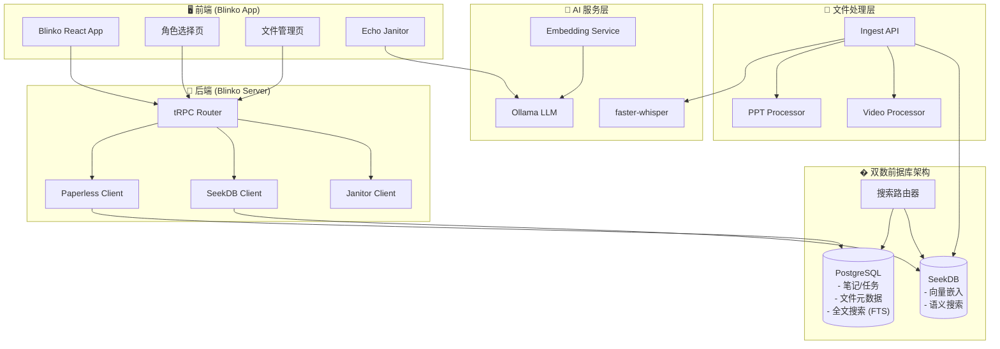

# Echo - 愿景与架构规划 v3.0

> 这是 Echo 项目的核心愿景文档，定义了产品目标、架构设计和开源集成策略。
> 所有开发工作都应回溯到这个文档，确保方向一致。
> 
> 创建日期: 2025-12-30
> 最后更新: 2025-12-30
> 版本: v3.0 (Blinko 扩展版 + 双数据库架构)

---

## 🎯 产品愿景

### 一句话定义

**Echo 是一个基于 Blinko 扩展的 AI 个人助手，帮助你捕捉想法、管理文件、整理混乱、做出决策。**

### 核心价值主张

在 AI 时代，你需要一个个人应用：

1. **能读取你的各种信息，帮助你做各种决策**
2. **能记录你的零散想法，记录了就不会丢掉，时不时提醒你，甚至帮你细化**
3. **有笔记和待办事项功能，能调整优先级，标注任务完成**
4. **每天早晚有日报，做昨日总结和今日建议，建议可选择完成或不完成**
5. **带 AI 对话功能，有什么心思可以交流**
6. **文件管理，重要文件能快速找到，不再乱七八糟**
7. **多模态检索，视频、PPT 等内容也能被搜索和理解**
8. **智能整理，混乱的文件夹自动分类和重命名** (v3.0 新增)

---

## 🆕 v3.0 架构升级说明

### 核心变化

| 变化点 | v2.0 | v3.0 |
|--------|------|------|
| 核心平台 | 独立 Tauri 应用 | **Blinko 扩展** (代码级集成) |
| 数据库架构 | 单一 SeekDB | **双数据库** (PostgreSQL + SeekDB) |
| 搜索策略 | 纯向量搜索 | **混合搜索** (FTS + Vector, alpha 参数) |
| 文件整理 | 手动分类 | **AI Janitor** (LlamaFS 风格) |
| 性能优化 | 无 | **连接池 + LRU 缓存 + 超时降级** |

### 为什么升级？

1. **复用成熟方案** - Blinko 已有完整的笔记/任务/AI 对话，无需重复造轮子
2. **性能优化** - 双数据库架构解决了 SeekDB 单点延迟问题
3. **智能整理** - AI Janitor 解决"文件乱"的核心痛点
4. **渐进式开发** - 在 Blinko 基础上逐步扩展，降低风险

---

## 👤 用户画像

### 主要用户

一位多角色、多领域的专业人士：

| 角色 | 描述 | 优先级 | 实现状态 |
|------|------|--------|---------|
| 🎯 **通用助手** | 日常笔记、翻译、活动监控 | P0 | ✅ 已实现 |
| � * *文件管理者** | 文件搜索、OCR、自动整理 | P0 | ✅ 已实现 |
| 🧑‍�投 **AI 开发者** | GitHub 监控、项目追踪、知识学习 | P1 | ⏳ 规划中 |
| 👨‍🎨 **美术经理** | 团队管理、周报、会议记录 | P2 | ⏳ 规划中 |
| 📈 **投资者** | 投资数据、情绪管理、风控 | P2 | ⏳ 规划中 |
| 👨‍👩‍👧 **家庭成员** | 家庭关怀、健康追踪 | P3 | ⏳ 规划中 |

### 核心痛点

1. **想法容易丢失** - 零散想法没有地方记录，记了也找不到 ✅ 已解决
2. **文件管理混乱** - 没有好的命名习惯，重要文件找不到 ✅ 已解决
3. **缺少主动提醒** - 任务和想法需要自己记得去看 ⚠️ 部分解决
4. **决策缺少支持** - 信息分散，难以做出好的决策 ⚠️ 部分解决
5. **多模态内容难检索** - 视频、PPT 里的知识无法被搜索 ✅ 已解决

---

## 🏗️ 架构设计 v3.0

### 核心原则

1. **开源优先** - 能用现有开源方案就不自己写
2. **渐进式开发** - 一次只做一个阶段，避免失控
3. **双核驱动** - PostgreSQL (高频操作) + SeekDB (语义搜索)
4. **最小侵入** - 扩展而非修改 Blinko 核心代码

### 系统架构图 (v3.0)



### 数据流说明

1. **笔记流**: Blinko UI → tRPC → PostgreSQL → 同步到 SeekDB (embedding)
2. **文件摄入流**: 上传 → Ingest API → 处理器 (Whisper/PPT) → SeekDB + PostgreSQL
3. **搜索流**: 搜索请求 → SearchRouter → alpha 路由 → PostgreSQL FTS / SeekDB Vector → 合并结果
4. **整理流**: 混乱文件夹 → Janitor → Ollama 分类 → 有序文件夹

### 开源项目集成策略 (v3.0 更新)

| 开源项目 | 集成方式 | 负责功能 | 状态 |
|---------|---------|---------|------|
| **Blinko** | 核心平台 (代码级集成) | 笔记、任务、AI 对话 | ✅ 已集成 |
| **PostgreSQL** | Docker 部署 | 主数据库、全文搜索 | ✅ 已部署 |
| **SeekDB** | Docker 部署 | 向量搜索 | ✅ 已部署 |
| **Paperless-ngx** | Docker 部署 + API | 文件 OCR、预览 | ✅ 已集成 |
| **faster-whisper** | Python 库 | 视频语音转文字 | ✅ 已集成 |
| **python-pptx** | Python 库 | PPT 文本提取 | ✅ 已集成 |
| **Ollama** | Docker 部署 | 本地 LLM、Embedding | ✅ 已部署 |
| **LlamaFS 风格** | 自研 Janitor | 文件自动整理 | ✅ 已实现 |

---

## � 核心数据 Schema (v3.0)

### PostgreSQL (主数据库)

```sql
-- Blinko 原有表 (笔记、任务、用户等)
-- ...

-- Echo 扩展表
CREATE TABLE attachments (
    id SERIAL PRIMARY KEY,
    filename VARCHAR(255),
    content TEXT,                    -- 文档内容 (OCR/提取)
    search_vector TSVECTOR,          -- 全文搜索向量
    source_type VARCHAR(20),         -- 'pdf', 'video', 'ppt'
    metadata JSONB,                  -- 元数据
    created_at TIMESTAMP DEFAULT NOW()
);

CREATE INDEX idx_attachments_fts ON attachments USING GIN(search_vector);
```

### SeekDB (向量数据库)

```sql
CREATE TABLE knowledge_base (
    id VARCHAR(64) PRIMARY KEY,
    content TEXT,
    embedding VECTOR(384),           -- nomic-embed-text 维度
    source_type VARCHAR(20),
    source_id VARCHAR(64),           -- 关联 PostgreSQL ID
    metadata JSON,
    created_at TIMESTAMP DEFAULT CURRENT_TIMESTAMP
);

CREATE INDEX idx_embedding ON knowledge_base USING HNSW(embedding);
```

---

## 📋 核心需求清单 (v3.0 更新)

### 需求 1: 想法捕捉与提醒

**用户故事**: 作为用户，我想快速记录零散想法，系统会帮我保存、提醒、细化。

| 子需求 | 描述 | 开源方案 | 状态 |
|--------|------|---------|------|
| 1.1 | 快速输入想法 | Blinko 闪念笔记 | ✅ 已实现 |
| 1.2 | 想法不会丢失 | Blinko + PostgreSQL | ✅ 已实现 |
| 1.3 | 定时提醒回顾 | 日报系统 | ✅ 已实现 |
| 1.4 | AI 帮助细化 | Blinko AI 增强 | ✅ 已实现 |

### 需求 2: 笔记与待办管理

**用户故事**: 作为用户，我想管理笔记和待办事项，能调整优先级，标注完成。

| 子需求 | 描述 | 开源方案 | 状态 |
|--------|------|---------|------|
| 2.1 | 创建笔记 | Blinko | ✅ 已实现 |
| 2.2 | 创建待办 | Blinko | ✅ 已实现 |
| 2.3 | 优先级调整 | Blinko | ✅ 已实现 |
| 2.4 | 标注完成 | Blinko | ✅ 已实现 |
| 2.5 | 标签分类 | Blinko | ✅ 已实现 |

### 需求 3: 统一知识检索

**用户故事**: 作为用户，我想通过一个搜索框找到所有相关内容，包括笔记、文件、视频、PPT。

| 子需求 | 描述 | 开源方案 | 状态 |
|--------|------|---------|------|
| 3.1 | 全文搜索 | PostgreSQL FTS | ✅ 已实现 |
| 3.2 | 向量语义搜索 | SeekDB | ✅ 已实现 |
| 3.3 | 混合搜索 (alpha) | SearchRouter | ✅ 已实现 |
| 3.4 | 视频内容检索 | SeekDB + Whisper | ✅ 已实现 |
| 3.5 | PPT 内容检索 | SeekDB + python-pptx | ✅ 已实现 |

### 需求 4: 多模态摄入

**用户故事**: 作为用户，我想上传视频和 PPT，系统自动提取内容并索引。

| 子需求 | 描述 | 开源方案 | 状态 |
|--------|------|---------|------|
| 4.1 | 视频语音转文字 | faster-whisper | ✅ 已实现 |
| 4.2 | PPT 文本提取 | python-pptx | ✅ 已实现 |
| 4.3 | 自动分块索引 | Ingest API | ✅ 已实现 |
| 4.4 | 处理进度显示 | IngestStatus UI | ✅ 已实现 |

### 需求 5: 文件管理

**用户故事**: 作为用户，我想管理重要文件，能快速搜索和预览。

| 子需求 | 描述 | 开源方案 | 状态 |
|--------|------|---------|------|
| 5.1 | 文件上传 | Paperless-ngx | ✅ 已实现 |
| 5.2 | OCR 文字提取 | Paperless-ngx | ✅ 已实现 |
| 5.3 | 文件预览 | FilePreview 组件 | ✅ 已实现 |
| 5.4 | 标签管理 | Paperless-ngx | ✅ 已实现 |

### 需求 6: 智能整理 (v3.0 新增)

**用户故事**: 作为用户，我想把文件丢到一个文件夹，系统自动分类和重命名。

| 子需求 | 描述 | 开源方案 | 状态 |
|--------|------|---------|------|
| 6.1 | 文件夹监听 | Janitor watchdog | ✅ 已实现 |
| 6.2 | AI 分类决策 | Ollama LLM | ✅ 已实现 |
| 6.3 | 语义重命名 | Janitor | ✅ 已实现 |
| 6.4 | 分类配置 UI | JanitorConfigPanel | ✅ 已实现 |

### 需求 7: 日报系统

**用户故事**: 作为用户，我想每天收到日报，总结今日、建议明日。

| 子需求 | 描述 | 开源方案 | 状态 |
|--------|------|---------|------|
| 7.1 | 晚报生成 | dailyReportRouter | ✅ 已实现 |
| 7.2 | 早报生成 | 待实现 | ⏳ 规划中 |
| 7.3 | 建议可接受 | 待实现 | ⏳ 规划中 |

### 需求 8: AI 对话

**用户故事**: 作为用户，我想有个 AI 可以交流心思，帮助思考。

| 子需求 | 描述 | 开源方案 | 状态 |
|--------|------|---------|------|
| 8.1 | AI 对话 | Blinko | ✅ 已实现 |
| 8.2 | 上下文记忆 | Memory System | ✅ 已实现 |
| 8.3 | 知识库增强 | SeekDB RAG | ✅ 已实现 |

---

## 🚀 开发路线图 (v3.0)

### ✅ Phase 1: Blinko 扩展基础 (已完成)
- [x] 基于 Blinko 搭建开发环境
- [x] 实现截图翻译功能
- [x] 实现活动监控功能
- [x] 实现 AI 记忆系统
- [x] 实现本地嵌入服务

### ✅ Phase 2: 文件管理系统 (已完成)
- [x] 集成 Paperless-ngx
- [x] 实现文件上传/预览/搜索
- [x] 实现标签和类型管理
- [x] 创建文件管理 UI

### ✅ Phase 3: 双数据库架构 (已完成)
- [x] PostgreSQL 全文搜索扩展
- [x] SeekDB 向量服务重构
- [x] 实现 SearchRouter 混合搜索
- [x] 实现数据同步服务
- [x] 实现健康检查和监控

### ✅ Phase 4: 多模态摄入 (已完成)
- [x] 集成 faster-whisper 视频处理
- [x] 集成 python-pptx PPT 处理
- [x] 实现 Ingest API
- [x] 创建处理状态 UI

### ✅ Phase 5: 智能整理 (已完成)
- [x] 实现 Echo Janitor 服务
- [x] 实现分类配置 UI
- [x] 实现数据流程说明页面

### ⏳ Phase 6: 角色功能扩展 (进行中)
- [x] 实现角色选择主页
- [ ] AI 开发者角色功能
- [ ] 其他角色功能

---

## 📊 需求覆盖率追踪 (v3.0)

| 需求类别 | 总数 | 已实现 | 进行中 | 未开始 | 覆盖率 |
|---------|------|--------|--------|--------|--------|
| 想法捕捉 | 4 | 4 | 0 | 0 | 100% |
| 笔记待办 | 5 | 5 | 0 | 0 | 100% |
| 统一检索 | 5 | 5 | 0 | 0 | 100% |
| 多模态摄入 | 4 | 4 | 0 | 0 | 100% |
| 文件管理 | 4 | 4 | 0 | 0 | 100% |
| 智能整理 | 4 | 4 | 0 | 0 | 100% |
| 日报系统 | 3 | 1 | 0 | 2 | 33% |
| AI 对话 | 3 | 3 | 0 | 0 | 100% |
| **总计** | **32** | **30** | **0** | **2** | **94%** |

---

## 🔧 技术栈 (v3.0)

### 核心平台
- **Blinko** - 笔记、任务、AI 对话的核心
- **Tauri** - 跨平台桌面应用框架 (Blinko 原生)

### 双数据库架构
- **PostgreSQL** - 主数据库 + 全文搜索 (FTS)
- **SeekDB** - 向量数据库 + 语义搜索

### 文件处理
- **Paperless-ngx** - 文件 OCR 和管理
- **faster-whisper** - 视频语音转文字
- **python-pptx** - PPT 解析
- **Echo Janitor** - 智能文件整理

### AI 能力
- **Ollama** - 本地 LLM + Embedding
- **Blinko AiModelFactory** - AI 模型调用
- **Memory System** - AI 记忆管理

### 性能优化
- **连接池** - MySQL/PostgreSQL 连接复用
- **LRU 缓存** - Embedding 缓存
- **超时降级** - SeekDB 不可用时回退到 FTS

---

## 🤖 AI 协作准则

1. **搬运优先** - 先找开源方案再自己写
2. **环境隔离** - 所有 Python 脚本基于 venv，提供 requirements.txt
3. **Mock 优先** - 遇到连接问题先用 Mock 数据验证逻辑
4. **错误处理** - 视频/PPT 解析必须 try-except，确保主进程不崩溃
5. **注释清晰** - 关键逻辑必须写清楚注释
6. **UI 设计** - 复用 Blinko 的 glass-effect 样式

---

## ✅ 成功标准

### 已达成
- [x] Blinko 扩展成功运行
- [x] 文件上传、OCR、搜索完整流程
- [x] 混合搜索 (FTS + Vector) 正常工作
- [x] 视频和 PPT 内容可被检索
- [x] Janitor 自动整理文件

### 待达成
- [ ] 早报生成功能
- [ ] 建议可接受/拒绝功能
- [ ] 角色功能扩展

### 最终成功标准
- [x] 所有 P0 需求实现 (覆盖率 100%)
- [x] 日常使用稳定
- [x] 文件不再乱七八糟
- [x] 想法不再丢失
- [x] 视频和 PPT 内容可被检索

---

*这是 Echo 项目的核心愿景文档 v3.0，所有开发工作都应回溯到这里。*
*如有重大方向调整，请更新此文档。*
