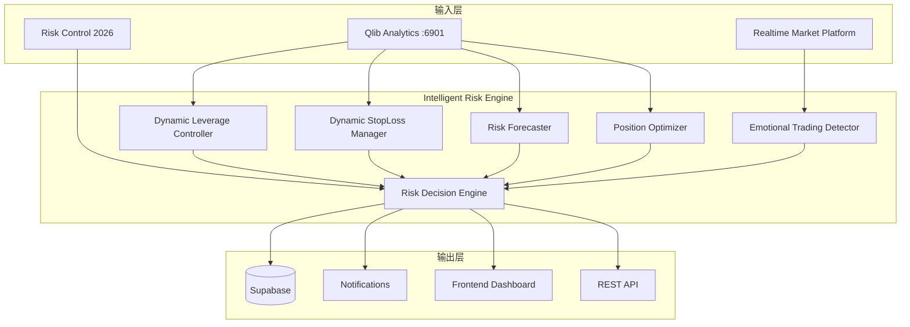

# Design Document: Intelligent Risk Engine

## Overview

Intelligent Risk Engine 是 RiskControl 系统的智能风控决策层，综合 Qlib Analytics 的预测结果和实时行情数据，实现动态风控阈值调整、AI 风险预警和仓位优化建议。

### 依赖关系

- **依赖**: `qlib-analytics` - 波动率预测、回撤概率、市场状态
- **依赖**: `risk-control-2026` - 基础风控规则
- **依赖**: `realtime-market-platform` - 实时行情数据

### 设计原则

1. **保守优先**：多模块冲突时采用最保守决策
2. **可解释性**：每个决策附带依据和置信度
3. **可覆盖性**：支持手动覆盖自动决策
4. **审计追踪**：记录所有决策和覆盖操作

## Architecture



## Components and Interfaces

### 1. Dynamic Leverage Controller

```typescript
// client/src/services/dynamicLeverageController.ts
import { qlibClient, MarketRegime } from './qlibClient';

interface LeverageLimit {
  maxLeverage: number;
  reason: string;
  marketRegime: string;
  volatilityAdjustment: number;
  effectiveAt: Date;
  expiresAt: Date;
}

class DynamicLeverageController {
  // 基础杠杆限制映射
  private readonly baseLimits: Record<string, number> = {
    bull: 1.5,
    sideways: 1.3,
    bear: 1.0,
    high_volatility: 1.0,
  };

  async calculateLeverageLimit(market: string = 'us'): Promise<LeverageLimit> {
    // 获取市场状态
    const regime = await qlibClient.getMarketRegime(market);
    
    // 获取波动率预测
    const volatility = await qlibClient.predictVolatility('SPY', [5]);
    
    // 基础限制
    let maxLeverage = this.baseLimits[regime.currentRegime];
    let volatilityAdjustment = 0;
    
    // 波动率调整：超过 80 分位额外降低 0.2x
    if (this.isHighVolatility(volatility[0].predictedVolatility)) {
      volatilityAdjustment = -0.2;
      maxLeverage = Math.max(1.0, maxLeverage + volatilityAdjustment);
    }
    
    return {
      maxLeverage,
      reason: this.generateReason(regime, volatilityAdjustment),
      marketRegime: regime.currentRegime,
      volatilityAdjustment,
      effectiveAt: new Date(),
      expiresAt: new Date(Date.now() + 60 * 60 * 1000), // 1 小时后过期
    };
  }

  private isHighVolatility(vol: number): boolean {
    // 判断是否超过历史 80 分位
    const historicalP80 = 0.025; // 示例值，实际应从数据库获取
    return vol > historicalP80;
  }

  private generateReason(regime: MarketRegime, adjustment: number): string {
    let reason = `市场状态: ${regime.currentRegime}`;
    if (adjustment < 0) {
      reason += `，波动率偏高额外降低 ${Math.abs(adjustment)}x`;
    }
    return reason;
  }
}

export const dynamicLeverageController = new DynamicLeverageController();
```

### 2. Dynamic StopLoss Manager

```typescript
// client/src/services/dynamicStopLossManager.ts
import { qlibClient } from './qlibClient';

interface StopLossConfig {
  stopLossPercent: number;  // 负数，如 -0.10 表示 -10%
  reason: string;
  volatilityPercentile: number;
  effectiveAt: Date;
}

class DynamicStopLossManager {
  // 波动率分位数对应的止损线
  private readonly stopLossMap = [
    { maxPercentile: 30, stopLoss: -0.08 },   // 低波动：-8%
    { maxPercentile: 70, stopLoss: -0.10 },   // 中波动：-10%
    { maxPercentile: 90, stopLoss: -0.12 },   // 高波动：-12%
    { maxPercentile: 100, stopLoss: -0.15 },  // 极高波动：-15%
  ];

  // 用户可配置范围
  private readonly minStopLoss = -0.05;  // 最小 -5%
  private readonly maxStopLoss = -0.20;  // 最大 -20%

  async calculateStopLoss(ticker: string): Promise<StopLossConfig> {
    // 获取波动率预测
    const predictions = await qlibClient.predictVolatility(ticker, [5]);
    const predictedVol = predictions[0].predictedVolatility;
    
    // 计算波动率分位数
    const percentile = await this.getVolatilityPercentile(ticker, predictedVol);
    
    // 确定止损线
    let stopLoss = -0.10; // 默认值
    for (const config of this.stopLossMap) {
      if (percentile <= config.maxPercentile) {
        stopLoss = config.stopLoss;
        break;
      }
    }
    
    return {
      stopLossPercent: stopLoss,
      reason: `预测波动率处于历史 ${percentile} 分位`,
      volatilityPercentile: percentile,
      effectiveAt: new Date(),
    };
  }

  private async getVolatilityPercentile(
    ticker: string, 
    currentVol: number
  ): Promise<number> {
    // 从历史数据计算分位数
    // 实际实现需要查询历史波动率数据
    return 50; // 示例返回
  }
}

export const dynamicStopLossManager = new DynamicStopLossManager();
```

### 3. Risk Forecaster

```typescript
// client/src/services/riskForecaster.ts
import { qlibClient } from './qlibClient';

type RiskLevel = 'low' | 'medium' | 'high' | 'critical';

interface RiskForecast {
  level: RiskLevel;
  horizonDays: number;
  drawdownProbabilities: {
    threshold: number;
    probability: number;
  }[];
  regimeTransition: {
    from: string;
    to: string;
    probability: number;
  } | null;
  alerts: RiskAlert[];
  confidence: number;
  generatedAt: Date;
}

interface RiskAlert {
  type: 'drawdown_warning' | 'regime_change' | 'volatility_spike';
  severity: 'info' | 'warning' | 'critical';
  message: string;
  suggestedAction: string;
}

class RiskForecaster {
  async generateForecast(
    tickers: string[],
    market: string = 'us'
  ): Promise<RiskForecast> {
    // 获取回撤概率
    const drawdownProbs = await this.getDrawdownProbabilities(tickers);
    
    // 获取市场状态转换概率
    const regime = await qlibClient.getMarketRegime(market);
    const regimeTransition = this.detectRegimeTransition(regime);
    
    // 生成警报
    const alerts = this.generateAlerts(drawdownProbs, regimeTransition);
    
    // 计算综合风险等级
    const level = this.calculateRiskLevel(drawdownProbs, regimeTransition);
    
    return {
      level,
      horizonDays: 5,
      drawdownProbabilities: drawdownProbs,
      regimeTransition,
      alerts,
      confidence: 0.75,
      generatedAt: new Date(),
    };
  }

  private async getDrawdownProbabilities(tickers: string[]) {
    // 获取组合级别的回撤概率
    const probs = await qlibClient.predictDrawdown(
      tickers[0], // 简化：使用第一个标的
      [5, 10, 20],
      [0.05, 0.10, 0.15]
    );
    
    return probs.map(p => ({
      threshold: p.threshold,
      probability: p.probability,
    }));
  }

  private detectRegimeTransition(regime: MarketRegime) {
    // 检测是否有显著的状态转换概率
    const transitions = regime.transitionProbabilities;
    const currentRegime = regime.currentRegime;
    
    // 如果从 bull 转 bear 概率 > 40%
    if (currentRegime === 'bull' && transitions['bear'] > 0.4) {
      return {
        from: 'bull',
        to: 'bear',
        probability: transitions['bear'],
      };
    }
    
    return null;
  }

  private generateAlerts(
    drawdownProbs: { threshold: number; probability: number }[],
    regimeTransition: { from: string; to: string; probability: number } | null
  ): RiskAlert[] {
    const alerts: RiskAlert[] = [];
    
    // 回撤概率警报
    const prob10 = drawdownProbs.find(p => p.threshold === 0.10);
    const prob15 = drawdownProbs.find(p => p.threshold === 0.15);
    
    if (prob10 && prob10.probability > 0.5) {
      alerts.push({
        type: 'drawdown_warning',
        severity: 'warning',
        message: `未来 5 天内发生 >10% 回撤的概率为 ${(prob10.probability * 100).toFixed(0)}%`,
        suggestedAction: '建议降低仓位或设置止损',
      });
    }
    
    if (prob15 && prob15.probability > 0.3) {
      alerts.push({
        type: 'drawdown_warning',
        severity: 'critical',
        message: `未来 5 天内发生 >15% 回撤的概率为 ${(prob15.probability * 100).toFixed(0)}%`,
        suggestedAction: '强烈建议减仓并设置严格止损',
      });
    }
    
    // 趋势转换警报
    if (regimeTransition) {
      alerts.push({
        type: 'regime_change',
        severity: 'warning',
        message: `市场可能从 ${regimeTransition.from} 转为 ${regimeTransition.to}，概率 ${(regimeTransition.probability * 100).toFixed(0)}%`,
        suggestedAction: '建议调整策略以适应新的市场状态',
      });
    }
    
    return alerts;
  }

  private calculateRiskLevel(
    drawdownProbs: { threshold: number; probability: number }[],
    regimeTransition: { from: string; to: string; probability: number } | null
  ): RiskLevel {
    const prob15 = drawdownProbs.find(p => p.threshold === 0.15);
    const prob10 = drawdownProbs.find(p => p.threshold === 0.10);
    
    if (prob15 && prob15.probability > 0.3) return 'critical';
    if (prob10 && prob10.probability > 0.5) return 'high';
    if (regimeTransition && regimeTransition.probability > 0.4) return 'medium';
    return 'low';
  }
}

export const riskForecaster = new RiskForecaster();
```

### 4. Emotional Trading Detector

```typescript
// client/src/services/emotionalTradingDetector.ts

interface TradingBehavior {
  timestamp: Date;
  action: 'buy' | 'sell';
  ticker: string;
  amount: number;
  pnlBefore: number;  // 交易前的盈亏
}

interface EmotionalTradingAlert {
  type: 'revenge_trading' | 'overtrading' | 'panic_selling' | 'fomo_buying';
  severity: 'warning' | 'critical';
  message: string;
  suggestedCooldown: number;  // 建议冷静期（分钟）
  detectedAt: Date;
}

class EmotionalTradingDetector {
  private recentTrades: TradingBehavior[] = [];
  
  // 检测阈值
  private readonly thresholds = {
    revengeTrading: {
      lossThreshold: -0.05,      // 亏损 5% 后
      positionIncrease: 1.5,     // 仓位增加 50%
      timeWindow: 60 * 60 * 1000, // 1 小时内
    },
    overtrading: {
      maxTradesPerHour: 5,
      timeWindow: 60 * 60 * 1000,
    },
    panicSelling: {
      sellRatio: 0.5,            // 卖出 50% 以上仓位
      timeWindow: 30 * 60 * 1000, // 30 分钟内
    },
  };

  recordTrade(trade: TradingBehavior): void {
    this.recentTrades.push(trade);
    // 清理超过 24 小时的记录
    const cutoff = Date.now() - 24 * 60 * 60 * 1000;
    this.recentTrades = this.recentTrades.filter(
      t => t.timestamp.getTime() > cutoff
    );
  }

  detect(): EmotionalTradingAlert[] {
    const alerts: EmotionalTradingAlert[] = [];
    
    // 检测报复性交易
    const revengeAlert = this.detectRevengeTading();
    if (revengeAlert) alerts.push(revengeAlert);
    
    // 检测过度交易
    const overtradingAlert = this.detectOvertrading();
    if (overtradingAlert) alerts.push(overtradingAlert);
    
    // 检测恐慌性卖出
    const panicAlert = this.detectPanicSelling();
    if (panicAlert) alerts.push(panicAlert);
    
    return alerts;
  }

  private detectRevengeTading(): EmotionalTradingAlert | null {
    const { lossThreshold, positionIncrease, timeWindow } = this.thresholds.revengeTrading;
    const now = Date.now();
    
    // 查找最近的亏损
    const recentLoss = this.recentTrades.find(
      t => t.pnlBefore < lossThreshold && 
           now - t.timestamp.getTime() < timeWindow
    );
    
    if (!recentLoss) return null;
    
    // 检查亏损后是否加大仓位
    const tradesAfterLoss = this.recentTrades.filter(
      t => t.timestamp > recentLoss.timestamp && t.action === 'buy'
    );
    
    const totalBuyAmount = tradesAfterLoss.reduce((sum, t) => sum + t.amount, 0);
    
    if (totalBuyAmount > recentLoss.amount * positionIncrease) {
      return {
        type: 'revenge_trading',
        severity: 'critical',
        message: '检测到报复性交易：亏损后大幅加仓',
        suggestedCooldown: 120,
        detectedAt: new Date(),
      };
    }
    
    return null;
  }

  private detectOvertrading(): EmotionalTradingAlert | null {
    const { maxTradesPerHour, timeWindow } = this.thresholds.overtrading;
    const now = Date.now();
    
    const recentCount = this.recentTrades.filter(
      t => now - t.timestamp.getTime() < timeWindow
    ).length;
    
    if (recentCount > maxTradesPerHour) {
      return {
        type: 'overtrading',
        severity: 'warning',
        message: `过去 1 小时内交易 ${recentCount} 次，超过建议频率`,
        suggestedCooldown: 60,
        detectedAt: new Date(),
      };
    }
    
    return null;
  }

  private detectPanicSelling(): EmotionalTradingAlert | null {
    // 简化实现
    return null;
  }
}

export const emotionalTradingDetector = new EmotionalTradingDetector();
```

### 5. Risk Decision Engine

```typescript
// client/src/services/riskDecisionEngine.ts
import { dynamicLeverageController, LeverageLimit } from './dynamicLeverageController';
import { dynamicStopLossManager, StopLossConfig } from './dynamicStopLossManager';
import { riskForecaster, RiskForecast } from './riskForecaster';
import { emotionalTradingDetector, EmotionalTradingAlert } from './emotionalTradingDetector';

interface RiskDecision {
  id: string;
  timestamp: Date;
  
  // 各模块输出
  leverageLimit: LeverageLimit;
  stopLossConfig: StopLossConfig;
  riskForecast: RiskForecast;
  emotionalAlerts: EmotionalTradingAlert[];
  
  // 综合决策
  overallRiskLevel: 'low' | 'medium' | 'high' | 'critical';
  effectiveLeverage: number;
  effectiveStopLoss: number;
  tradingAllowed: boolean;
  cooldownUntil: Date | null;
  
  // 决策依据
  reasoning: string[];
  confidence: number;
  
  // 覆盖信息
  isOverridden: boolean;
  overrideReason?: string;
  overrideBy?: string;
}

class RiskDecisionEngine {
  async generateDecision(
    tickers: string[],
    market: string = 'us'
  ): Promise<RiskDecision> {
    // 并行获取各模块输出
    const [leverageLimit, stopLossConfig, riskForecast] = await Promise.all([
      dynamicLeverageController.calculateLeverageLimit(market),
      dynamicStopLossManager.calculateStopLoss(tickers[0]),
      riskForecaster.generateForecast(tickers, market),
    ]);
    
    const emotionalAlerts = emotionalTradingDetector.detect();
    
    // 综合决策
    const decision = this.synthesizeDecision(
      leverageLimit,
      stopLossConfig,
      riskForecast,
      emotionalAlerts
    );
    
    // 保存决策记录
    await this.saveDecision(decision);
    
    return decision;
  }

  private synthesizeDecision(
    leverageLimit: LeverageLimit,
    stopLossConfig: StopLossConfig,
    riskForecast: RiskForecast,
    emotionalAlerts: EmotionalTradingAlert[]
  ): RiskDecision {
    const reasoning: string[] = [];
    
    // 确定综合风险等级（取最高）
    const riskLevels = [riskForecast.level];
    if (emotionalAlerts.some(a => a.severity === 'critical')) {
      riskLevels.push('high');
    }
    const overallRiskLevel = this.getHighestRiskLevel(riskLevels);
    reasoning.push(`综合风险等级: ${overallRiskLevel}`);
    
    // 确定有效杠杆（取最低）
    let effectiveLeverage = leverageLimit.maxLeverage;
    if (overallRiskLevel === 'critical') {
      effectiveLeverage = Math.min(effectiveLeverage, 1.0);
      reasoning.push('风险等级为 critical，杠杆限制为 1.0x');
    }
    
    // 确定有效止损（取最严格）
    const effectiveStopLoss = stopLossConfig.stopLossPercent;
    reasoning.push(`动态止损线: ${(effectiveStopLoss * 100).toFixed(0)}%`);
    
    // 确定是否允许交易
    let tradingAllowed = true;
    let cooldownUntil: Date | null = null;
    
    const criticalEmotional = emotionalAlerts.find(a => a.severity === 'critical');
    if (criticalEmotional) {
      tradingAllowed = false;
      cooldownUntil = new Date(Date.now() + criticalEmotional.suggestedCooldown * 60 * 1000);
      reasoning.push(`检测到情绪化交易，建议冷静 ${criticalEmotional.suggestedCooldown} 分钟`);
    }
    
    return {
      id: crypto.randomUUID(),
      timestamp: new Date(),
      leverageLimit,
      stopLossConfig,
      riskForecast,
      emotionalAlerts,
      overallRiskLevel,
      effectiveLeverage,
      effectiveStopLoss,
      tradingAllowed,
      cooldownUntil,
      reasoning,
      confidence: 0.8,
      isOverridden: false,
    };
  }

  private getHighestRiskLevel(levels: string[]): 'low' | 'medium' | 'high' | 'critical' {
    const order = ['low', 'medium', 'high', 'critical'];
    let highest = 0;
    for (const level of levels) {
      const idx = order.indexOf(level);
      if (idx > highest) highest = idx;
    }
    return order[highest] as any;
  }

  async overrideDecision(
    decisionId: string,
    overrides: Partial<RiskDecision>,
    reason: string,
    userId: string
  ): Promise<RiskDecision> {
    // 实现手动覆盖逻辑
    // 需要记录覆盖操作用于审计
    throw new Error('Not implemented');
  }

  private async saveDecision(decision: RiskDecision): Promise<void> {
    // 保存到 Supabase
  }
}

export const riskDecisionEngine = new RiskDecisionEngine();
```

## Data Models

### 数据库表结构

```sql
-- 风控决策记录
CREATE TABLE risk_decisions (
  id UUID PRIMARY KEY DEFAULT gen_random_uuid(),
  user_id INTEGER NOT NULL DEFAULT 1,
  timestamp TIMESTAMPTZ NOT NULL DEFAULT NOW(),
  
  -- 各模块输出
  leverage_limit JSONB NOT NULL,
  stop_loss_config JSONB NOT NULL,
  risk_forecast JSONB NOT NULL,
  emotional_alerts JSONB,
  
  -- 综合决策
  overall_risk_level VARCHAR(20) NOT NULL,
  effective_leverage DECIMAL(3, 2) NOT NULL,
  effective_stop_loss DECIMAL(5, 4) NOT NULL,
  trading_allowed BOOLEAN NOT NULL DEFAULT true,
  cooldown_until TIMESTAMPTZ,
  
  -- 决策依据
  reasoning TEXT[] NOT NULL,
  confidence DECIMAL(3, 2) NOT NULL,
  
  -- 覆盖信息
  is_overridden BOOLEAN NOT NULL DEFAULT false,
  override_reason TEXT,
  override_by VARCHAR(100),
  override_at TIMESTAMPTZ
);

CREATE INDEX idx_decisions_user ON risk_decisions(user_id);
CREATE INDEX idx_decisions_timestamp ON risk_decisions(timestamp);
CREATE INDEX idx_decisions_risk_level ON risk_decisions(overall_risk_level);

-- 风险预警历史
CREATE TABLE risk_alerts_history (
  id UUID PRIMARY KEY DEFAULT gen_random_uuid(),
  user_id INTEGER NOT NULL DEFAULT 1,
  alert_type VARCHAR(50) NOT NULL,
  severity VARCHAR(20) NOT NULL,
  message TEXT NOT NULL,
  suggested_action TEXT,
  acknowledged BOOLEAN NOT NULL DEFAULT false,
  acknowledged_at TIMESTAMPTZ,
  created_at TIMESTAMPTZ NOT NULL DEFAULT NOW()
);

CREATE INDEX idx_alerts_user ON risk_alerts_history(user_id);
CREATE INDEX idx_alerts_created ON risk_alerts_history(created_at);

-- 用户风控配置
CREATE TABLE user_risk_config (
  user_id INTEGER PRIMARY KEY DEFAULT 1,
  risk_preference VARCHAR(20) NOT NULL DEFAULT 'balanced', -- conservative, balanced, aggressive
  max_acceptable_drawdown DECIMAL(5, 4) NOT NULL DEFAULT 0.10,
  notification_channels TEXT[] NOT NULL DEFAULT ARRAY['toast', 'email'],
  cooldown_duration INTEGER NOT NULL DEFAULT 60, -- 分钟
  auto_stop_loss_enabled BOOLEAN NOT NULL DEFAULT true,
  updated_at TIMESTAMPTZ NOT NULL DEFAULT NOW()
);

-- 情绪化交易记录
CREATE TABLE emotional_trading_events (
  id UUID PRIMARY KEY DEFAULT gen_random_uuid(),
  user_id INTEGER NOT NULL DEFAULT 1,
  event_type VARCHAR(50) NOT NULL,
  severity VARCHAR(20) NOT NULL,
  details JSONB NOT NULL,
  cooldown_applied BOOLEAN NOT NULL DEFAULT false,
  cooldown_duration INTEGER,
  detected_at TIMESTAMPTZ NOT NULL DEFAULT NOW()
);

CREATE INDEX idx_emotional_user ON emotional_trading_events(user_id);
CREATE INDEX idx_emotional_detected ON emotional_trading_events(detected_at);
```

## Correctness Properties

### Property 1: 杠杆限制范围

*For any* 动态杠杆计算结果，maxLeverage 必须在 [1.0, 1.5] 范围内。

**Validates: Requirements 1.1, 1.2, 1.3**

### Property 2: 止损线范围

*For any* 动态止损计算结果，stopLossPercent 必须在 [-0.20, -0.05] 范围内。

**Validates: Requirements 2.1, 2.2, 2.3, 2.4, 2.5**

### Property 3: 风险等级一致性

*For any* 风险决策，overallRiskLevel 必须 >= 各模块输出的最高风险等级。

**Validates: Requirements 6.2**

### Property 4: 冷静期执行

*For any* 检测到 critical 级别情绪化交易，tradingAllowed 必须为 false 且 cooldownUntil 必须设置。

**Validates: Requirements 5.2, 5.4**

### Property 5: 决策可追溯

*For any* 风险决策，必须包含非空的 reasoning 数组，解释决策依据。

**Validates: Requirements 6.5, 7.5**

### Property 6: 覆盖审计

*For any* 手动覆盖的决策，必须记录 overrideReason、overrideBy 和 overrideAt。

**Validates: Requirements 6.4, 6.5**

### Property 7: 市场状态响应

*For any* 市场状态变化，杠杆限制必须在 1 小时内更新。

**Validates: Requirements 1.5**

### Property 8: 预警完整性

*For any* 风险预警，必须包含 type、severity、message、suggestedAction 四个字段。

**Validates: Requirements 3.5, 3.6**

## Error Handling

```typescript
class RiskEngineError extends Error {
  constructor(
    public code: string,
    message: string,
    public recoverable: boolean = true
  ) {
    super(message);
  }
}

// 错误处理策略
const errorHandling = {
  // Qlib 服务不可用：使用缓存的最后决策
  qlib_unavailable: {
    action: 'use_cached_decision',
    fallback: { riskLevel: 'high', leverage: 1.0 },
    alert: true,
  },
  
  // 数据不足：使用保守默认值
  insufficient_data: {
    action: 'use_conservative_defaults',
    fallback: { riskLevel: 'medium', leverage: 1.0 },
    alert: false,
  },
  
  // 决策冲突：采用最保守
  decision_conflict: {
    action: 'use_most_conservative',
    alert: true,
  },
};
```

## Testing Strategy

### 单元测试

1. **动态杠杆计算** - 测试各市场状态下的杠杆限制
2. **动态止损计算** - 测试各波动率分位下的止损线
3. **风险预警生成** - 测试各种风险场景的预警触发
4. **情绪化交易检测** - 测试各种交易模式的检测

### 属性测试

```typescript
import fc from 'fast-check';

// Property 1: 杠杆限制范围
fc.assert(
  fc.property(
    fc.constantFrom('bull', 'bear', 'sideways', 'high_volatility'),
    fc.float({ min: 0, max: 0.1 }),
    async (regime, volatility) => {
      const limit = await controller.calculateLeverageLimit(regime, volatility);
      return limit.maxLeverage >= 1.0 && limit.maxLeverage <= 1.5;
    }
  )
);

// Property 2: 止损线范围
fc.assert(
  fc.property(
    fc.integer({ min: 0, max: 100 }),
    async (percentile) => {
      const config = await manager.calculateStopLoss(percentile);
      return config.stopLossPercent >= -0.20 && config.stopLossPercent <= -0.05;
    }
  )
);
```

### 集成测试

1. **端到端决策流程** - 数据输入 → 各模块计算 → 综合决策 → 存储
2. **决策覆盖流程** - 自动决策 → 手动覆盖 → 审计记录
3. **预警通知流程** - 风险检测 → 预警生成 → 多渠道通知
