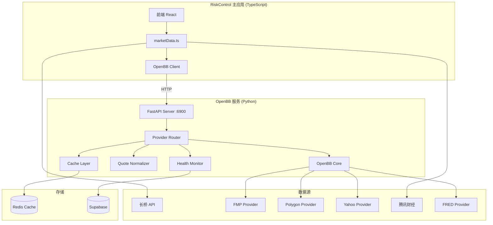

# Design Document: OpenBB Integration

## Overview

OpenBB Integration 是 RiskControl 系统的统一数据获取层。通过部署 OpenBB FastAPI 服务，为前端和其他服务提供标准化的金融数据 API。本设计采用"OpenBB 服务 + TypeScript 客户端"的架构，实现数据获取逻辑的集中管理。

### 设计原则

1. **统一入口**：所有金融数据通过 OpenBB 服务获取（长桥/腾讯除外）
2. **故障隔离**：Python 服务独立运行，不影响主应用
3. **渐进迁移**：TypeScript 客户端兼容现有接口，支持逐步替换
4. **可观测性**：完善的健康检查和监控指标

## Architecture



## Components and Interfaces

### 1. OpenBB FastAPI Server

```python
# openbb_service/main.py
from fastapi import FastAPI, HTTPException
from openbb import obb

app = FastAPI(title="OpenBB Data Service", version="1.0.0")

@app.get("/api/v1/equity/price/quote")
async def get_quote(
    ticker: str,
    provider: str = "fmp"
) -> QuoteResponse:
    """获取实时报价"""
    pass

@app.get("/api/v1/equity/price/historical")
async def get_historical(
    ticker: str,
    start_date: str = None,
    end_date: str = None,
    provider: str = "fmp"
) -> HistoricalResponse:
    """获取历史价格"""
    pass

@app.get("/api/v1/equity/fundamental/overview")
async def get_overview(
    ticker: str,
    provider: str = "fmp"
) -> OverviewResponse:
    """获取公司概况"""
    pass

@app.get("/api/v1/economy/gdp")
async def get_gdp(
    country: str = "united_states",
    provider: str = "fred"
) -> GDPResponse:
    """获取 GDP 数据"""
    pass

@app.get("/health")
async def health_check() -> HealthResponse:
    """健康检查"""
    pass

@app.get("/metrics")
async def get_metrics() -> MetricsResponse:
    """监控指标"""
    pass
```

### 2. Provider Router

```python
# openbb_service/router.py
from dataclasses import dataclass
from typing import List, Optional
from enum import Enum

class Market(Enum):
    US = "us"
    HK = "hk"
    CN = "cn"

@dataclass
class ProviderConfig:
    name: str
    priority: int
    markets: List[Market]
    is_healthy: bool = True
    consecutive_failures: int = 0

class ProviderRouter:
    def __init__(self):
        self.providers = {
            Market.US: [
                ProviderConfig("fmp", 1, [Market.US]),
                ProviderConfig("polygon", 2, [Market.US]),
                ProviderConfig("yfinance", 3, [Market.US, Market.HK]),
            ],
            Market.HK: [
                ProviderConfig("yfinance", 1, [Market.HK]),
            ],
        }
    
    def get_provider(self, market: Market) -> Optional[str]:
        """获取当前市场的最优可用数据源"""
        providers = self.providers.get(market, [])
        for p in sorted(providers, key=lambda x: x.priority):
            if p.is_healthy:
                return p.name
        return None
    
    def mark_failure(self, provider: str) -> None:
        """标记数据源失败"""
        pass
    
    def mark_success(self, provider: str) -> None:
        """标记数据源成功"""
        pass
```

### 3. Quote Normalizer

```python
# openbb_service/normalizer.py
from dataclasses import dataclass
from typing import Optional
from datetime import datetime

@dataclass
class LiveQuote:
    ticker: str
    price: float
    prev_close: float
    change_percent: float
    volume: int
    timestamp: int  # Unix timestamp in ms
    source: str
    market: str
    currency: str
    
    # 可选字段
    open: Optional[float] = None
    high: Optional[float] = None
    low: Optional[float] = None
    name: Optional[str] = None

class QuoteNormalizer:
    def normalize_fmp(self, data: dict) -> LiveQuote:
        """标准化 FMP 数据"""
        return LiveQuote(
            ticker=data["symbol"],
            price=data["price"],
            prev_close=data["previousClose"],
            change_percent=data["changesPercentage"],
            volume=data["volume"],
            timestamp=int(datetime.now().timestamp() * 1000),
            source="fmp",
            market="us",
            currency="USD",
            open=data.get("open"),
            high=data.get("dayHigh"),
            low=data.get("dayLow"),
            name=data.get("name"),
        )
    
    def normalize_polygon(self, data: dict) -> LiveQuote:
        """标准化 Polygon 数据"""
        pass
    
    def normalize_yahoo(self, data: dict) -> LiveQuote:
        """标准化 Yahoo 数据"""
        pass
```

### 4. Cache Layer

```python
# openbb_service/cache.py
from typing import Optional, Any
import redis
import json

class CacheLayer:
    def __init__(self, redis_url: str):
        self.redis = redis.from_url(redis_url)
        self.ttl_config = {
            "quote": 5,           # 实时报价 5 秒
            "historical": 300,    # 历史数据 5 分钟
            "fundamental": 3600,  # 基本面 1 小时
            "economic": 3600,     # 经济数据 1 小时
        }
    
    def get(self, key: str) -> Optional[Any]:
        """获取缓存"""
        data = self.redis.get(key)
        if data:
            return json.loads(data)
        return None
    
    def set(self, key: str, value: Any, category: str) -> None:
        """设置缓存"""
        ttl = self.ttl_config.get(category, 60)
        self.redis.setex(key, ttl, json.dumps(value))
    
    def invalidate(self, ticker: str) -> None:
        """清除指定 ticker 的所有缓存"""
        pattern = f"*:{ticker}:*"
        keys = self.redis.keys(pattern)
        if keys:
            self.redis.delete(*keys)
```

### 5. Health Monitor

```python
# openbb_service/health.py
from dataclasses import dataclass, field
from typing import Dict, List
from datetime import datetime
import statistics

@dataclass
class ProviderMetrics:
    total_requests: int = 0
    successful_requests: int = 0
    failed_requests: int = 0
    latencies: List[float] = field(default_factory=list)
    consecutive_failures: int = 0
    last_success: datetime = None
    last_failure: datetime = None
    
    @property
    def success_rate(self) -> float:
        if self.total_requests == 0:
            return 1.0
        return self.successful_requests / self.total_requests
    
    @property
    def avg_latency(self) -> float:
        if not self.latencies:
            return 0.0
        return statistics.mean(self.latencies[-100:])  # 最近 100 次

class HealthMonitor:
    def __init__(self):
        self.metrics: Dict[str, ProviderMetrics] = {}
        self.unhealthy_threshold = 3  # 连续失败 3 次标记为不健康
        self.recovery_delay = 300     # 5 分钟后尝试恢复
    
    def record_request(
        self, 
        provider: str, 
        success: bool, 
        latency: float
    ) -> None:
        """记录请求结果"""
        if provider not in self.metrics:
            self.metrics[provider] = ProviderMetrics()
        
        m = self.metrics[provider]
        m.total_requests += 1
        m.latencies.append(latency)
        
        if success:
            m.successful_requests += 1
            m.consecutive_failures = 0
            m.last_success = datetime.now()
        else:
            m.failed_requests += 1
            m.consecutive_failures += 1
            m.last_failure = datetime.now()
    
    def is_healthy(self, provider: str) -> bool:
        """检查数据源是否健康"""
        m = self.metrics.get(provider)
        if not m:
            return True
        return m.consecutive_failures < self.unhealthy_threshold
    
    def get_all_metrics(self) -> Dict[str, dict]:
        """获取所有监控指标"""
        return {
            name: {
                "success_rate": m.success_rate,
                "avg_latency": m.avg_latency,
                "total_requests": m.total_requests,
                "consecutive_failures": m.consecutive_failures,
                "is_healthy": self.is_healthy(name),
            }
            for name, m in self.metrics.items()
        }
```

### 6. TypeScript Client

```typescript
// client/src/services/openbbClient.ts

interface LiveQuote {
  ticker: string;
  price: number;
  prevClose: number;
  changePercent: number;
  volume: number;
  timestamp: number;
  source: string;
  market: string;
  currency: string;
  open?: number;
  high?: number;
  low?: number;
  name?: string;
}

interface HistoricalBar {
  date: string;
  open: number;
  high: number;
  low: number;
  close: number;
  volume: number;
}

interface OpenBBClientConfig {
  baseUrl: string;
  timeout?: number;
  retries?: number;
}

class OpenBBClient {
  private baseUrl: string;
  private timeout: number;
  private retries: number;

  constructor(config: OpenBBClientConfig) {
    this.baseUrl = config.baseUrl;
    this.timeout = config.timeout ?? 10000;
    this.retries = config.retries ?? 3;
  }

  async getQuote(ticker: string, provider?: string): Promise<LiveQuote> {
    const params = new URLSearchParams({ ticker });
    if (provider) params.append('provider', provider);
    
    const response = await this.fetch(`/api/v1/equity/price/quote?${params}`);
    return response.data;
  }

  async getQuotes(tickers: string[]): Promise<Map<string, LiveQuote>> {
    const promises = tickers.map(t => this.getQuote(t));
    const results = await Promise.allSettled(promises);
    
    const map = new Map<string, LiveQuote>();
    results.forEach((result, index) => {
      if (result.status === 'fulfilled') {
        map.set(tickers[index], result.value);
      }
    });
    return map;
  }

  async getHistorical(
    ticker: string,
    startDate?: string,
    endDate?: string
  ): Promise<HistoricalBar[]> {
    const params = new URLSearchParams({ ticker });
    if (startDate) params.append('start_date', startDate);
    if (endDate) params.append('end_date', endDate);
    
    const response = await this.fetch(`/api/v1/equity/price/historical?${params}`);
    return response.data;
  }

  async getHealth(): Promise<HealthStatus> {
    const response = await this.fetch('/health');
    return response;
  }

  private async fetch(path: string): Promise<any> {
    let lastError: Error | null = null;
    
    for (let i = 0; i < this.retries; i++) {
      try {
        const controller = new AbortController();
        const timeoutId = setTimeout(() => controller.abort(), this.timeout);
        
        const response = await fetch(`${this.baseUrl}${path}`, {
          signal: controller.signal,
        });
        
        clearTimeout(timeoutId);
        
        if (!response.ok) {
          throw new Error(`HTTP ${response.status}: ${response.statusText}`);
        }
        
        return await response.json();
      } catch (error) {
        lastError = error as Error;
        if (i < this.retries - 1) {
          await this.delay(1000 * (i + 1)); // 指数退避
        }
      }
    }
    
    throw lastError;
  }

  private delay(ms: number): Promise<void> {
    return new Promise(resolve => setTimeout(resolve, ms));
  }
}

// 单例导出
export const openbbClient = new OpenBBClient({
  baseUrl: import.meta.env.VITE_OPENBB_API_URL || 'http://localhost:6900',
});
```

## Data Models

### API Response 格式

```typescript
// 统一响应格式
interface ApiResponse<T> {
  success: boolean;
  data: T;
  error?: {
    code: string;
    message: string;
  };
  meta: {
    source: string;
    cached: boolean;
    timestamp: number;
  };
}

// 健康检查响应
interface HealthStatus {
  status: 'healthy' | 'degraded' | 'unhealthy';
  providers: {
    [name: string]: {
      healthy: boolean;
      successRate: number;
      avgLatency: number;
    };
  };
  uptime: number;
  version: string;
}
```

### 环境变量配置

```bash
# .env.openbb
# OpenBB 服务配置
OPENBB_PORT=6900
OPENBB_HOST=0.0.0.0

# 数据源 API 密钥
FMP_API_KEY=your_fmp_key
POLYGON_API_KEY=your_polygon_key
FRED_API_KEY=your_fred_key

# Redis 缓存
REDIS_URL=redis://localhost:6379/0

# 日志级别
LOG_LEVEL=INFO
```

## Correctness Properties

*A property is a characteristic or behavior that should hold true across all valid executions of a system—essentially, a formal statement about what the system should do.*

### Property 1: LiveQuote 结构完整性

*For any* 成功的报价请求，返回的 LiveQuote 必须包含所有必需字段（ticker, price, prevClose, changePercent, volume, timestamp, source, market, currency），且 price > 0。

**Validates: Requirements 3.2**

### Property 2: 数据源故障转移

*For any* 数据源故障场景，当主数据源连续失败 3 次后，Provider_Router 应自动选择下一优先级的健康数据源。

**Validates: Requirements 2.2, 2.3**

### Property 3: 缓存一致性

*For any* 缓存的数据，在 TTL 过期前重复请求应返回相同的数据；TTL 过期后应重新获取。

**Validates: Requirements 4.1, 4.2, 4.3, 4.4**

### Property 4: 健康状态追踪

*For any* 数据源请求序列，Health_Monitor 应正确计算成功率和平均延迟，且连续失败 3 次后 is_healthy 返回 false。

**Validates: Requirements 2.3, 9.2, 9.3**

### Property 5: 数据源优先级

*For any* 市场的数据请求，Provider_Router 应按配置的优先级顺序选择数据源，跳过不健康的数据源。

**Validates: Requirements 2.1, 2.6**

### Property 6: 报价标准化

*For any* 数据源返回的原始数据，Quote_Normalizer 应将其转换为统一的 LiveQuote 格式，不丢失关键信息。

**Validates: Requirements 3.1, 3.4, 3.5**

### Property 7: API 密钥安全

*For any* 日志输出或错误响应，不应包含完整的 API 密钥信息。

**Validates: Requirements 10.3**

### Property 8: 重试机制

*For any* 失败的请求，TypeScript 客户端应按配置的次数重试，每次重试间隔递增。

**Validates: Requirements 8.2**

## Error Handling

### 数据源错误

```python
class DataSourceError(Exception):
    def __init__(self, provider: str, message: str, retryable: bool = True):
        self.provider = provider
        self.message = message
        self.retryable = retryable
        super().__init__(f"[{provider}] {message}")

# 错误处理策略
ERROR_HANDLING = {
    "rate_limited": {"retryable": True, "delay": 60},
    "unauthorized": {"retryable": False, "action": "disable_provider"},
    "timeout": {"retryable": True, "delay": 5},
    "invalid_symbol": {"retryable": False, "action": "return_error"},
}
```

### HTTP 错误码

| 状态码 | 含义 | 处理方式 |
|--------|------|----------|
| 200 | 成功 | 返回数据 |
| 400 | 参数错误 | 返回错误信息 |
| 404 | 标的不存在 | 返回空数据 |
| 429 | 请求过多 | 等待后重试 |
| 500 | 服务器错误 | 切换数据源 |
| 503 | 服务不可用 | 切换数据源 |

## Testing Strategy

### 单元测试

使用 pytest 进行 Python 单元测试：

1. **Quote Normalizer** - 测试各数据源格式转换
2. **Provider Router** - 测试优先级选择和故障转移
3. **Cache Layer** - 测试缓存读写和过期
4. **Health Monitor** - 测试指标计算和健康判断

### 属性测试

使用 Hypothesis (Python) 和 fast-check (TypeScript) 进行属性测试：

```python
# Python 属性测试示例
from hypothesis import given, strategies as st

@given(st.floats(min_value=0.01, max_value=10000))
def test_quote_price_positive(price):
    """Property 1: 价格必须为正数"""
    quote = create_quote(price=price)
    assert quote.price > 0
```

### 集成测试

1. **端到端数据获取** - 从 API 调用到返回数据
2. **故障转移流程** - 模拟数据源故障，验证自动切换
3. **缓存行为** - 验证缓存命中和过期

### 测试配置

```python
# pytest.ini
[pytest]
testpaths = tests
python_files = test_*.py
python_functions = test_*
asyncio_mode = auto
```

