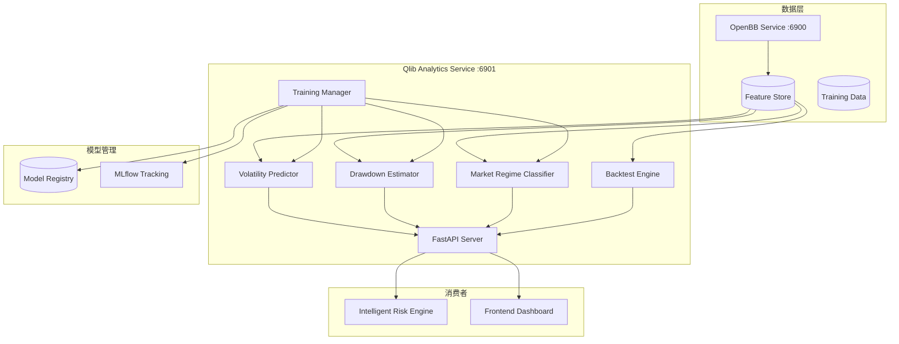

# Design Document: Qlib Analytics

## Overview

Qlib Analytics 是基于微软 Qlib 框架的量化分析服务，提供波动率预测、回撤概率估算、市场状态分类等 AI 驱动的风险分析能力。采用 Python + FastAPI + Qlib 技术栈，作为独立服务部署。

### 依赖关系

- **依赖**: `openbb-integration` - 通过 OpenBB API 获取历史数据
- **被依赖**: `intelligent-risk-engine` - 消费预测结果

### 设计原则

1. **模型可解释性**：预测结果附带置信区间和特征重要性
2. **持续学习**：定期重训练，适应市场变化
3. **故障隔离**：独立服务，不影响主应用
4. **可观测性**：完善的模型监控和性能追踪

## Architecture



## Components and Interfaces

### 1. FastAPI Server

```python
# qlib_service/main.py
from fastapi import FastAPI
from pydantic import BaseModel
from typing import List, Optional
from datetime import date

app = FastAPI(title="Qlib Analytics Service", version="1.0.0")

# === 波动率预测 ===
class VolatilityRequest(BaseModel):
    ticker: str
    horizons: List[int] = [1, 3, 5]  # 预测天数

class VolatilityPrediction(BaseModel):
    ticker: str
    horizon: int
    predicted_volatility: float
    confidence_lower: float
    confidence_upper: float
    model_version: str

@app.post("/api/v1/predict/volatility")
async def predict_volatility(req: VolatilityRequest) -> List[VolatilityPrediction]:
    """预测未来波动率"""
    pass

# === 回撤概率 ===
class DrawdownRequest(BaseModel):
    ticker: str
    horizons: List[int] = [5, 10, 20]  # 预测天数
    thresholds: List[float] = [0.05, 0.10, 0.15]  # 回撤阈值

class DrawdownProbability(BaseModel):
    ticker: str
    horizon: int
    threshold: float
    probability: float
    model_version: str

@app.post("/api/v1/predict/drawdown")
async def predict_drawdown(req: DrawdownRequest) -> List[DrawdownProbability]:
    """预测回撤概率"""
    pass

# === 市场状态 ===
class MarketRegimeRequest(BaseModel):
    market: str  # us, hk, cn

class MarketRegime(BaseModel):
    market: str
    current_regime: str  # bull, bear, sideways, high_volatility
    regime_probabilities: dict  # {regime: probability}
    transition_probabilities: dict  # {next_regime: probability}
    detected_at: str
    model_version: str

@app.get("/api/v1/market/regime")
async def get_market_regime(market: str = "us") -> MarketRegime:
    """获取市场状态"""
    pass

# === 回测 ===
class BacktestRequest(BaseModel):
    strategy: dict  # 策略配置
    start_date: date
    end_date: date
    initial_capital: float = 100000

class BacktestResult(BaseModel):
    total_return: float
    annualized_return: float
    max_drawdown: float
    sharpe_ratio: float
    win_rate: float
    trade_count: int
    report_url: Optional[str]

@app.post("/api/v1/backtest")
async def run_backtest(req: BacktestRequest) -> BacktestResult:
    """运行回测"""
    pass

# === 健康检查 ===
@app.get("/health")
async def health_check():
    return {"status": "healthy", "models_loaded": True}
```

### 2. Volatility Predictor

```python
# qlib_service/models/volatility.py
import qlib
from qlib.data import D
from qlib.model.base import Model
import numpy as np
from typing import List, Tuple

class VolatilityPredictor:
    """波动率预测模型 - 基于 GARCH + LSTM 集成"""
    
    def __init__(self, model_path: str = None):
        self.garch_model = None
        self.lstm_model = None
        self.model_version = "1.0.0"
        if model_path:
            self.load(model_path)
    
    def predict(
        self, 
        ticker: str, 
        horizons: List[int] = [1, 3, 5]
    ) -> List[Tuple[int, float, float, float]]:
        """
        预测未来波动率
        
        Returns:
            List of (horizon, predicted_vol, lower_bound, upper_bound)
        """
        # 获取历史数据
        features = self._prepare_features(ticker)
        
        # GARCH 预测
        garch_pred = self._garch_predict(features, horizons)
        
        # LSTM 预测
        lstm_pred = self._lstm_predict(features, horizons)
        
        # 集成预测 (加权平均)
        predictions = []
        for h in horizons:
            pred = 0.4 * garch_pred[h] + 0.6 * lstm_pred[h]
            std = self._estimate_uncertainty(features, h)
            predictions.append((
                h,
                pred,
                pred - 1.96 * std,  # 95% 置信区间下界
                pred + 1.96 * std,  # 95% 置信区间上界
            ))
        
        return predictions
    
    def train(self, data: np.ndarray, labels: np.ndarray) -> dict:
        """训练模型"""
        # 训练 GARCH
        self._train_garch(data, labels)
        
        # 训练 LSTM
        self._train_lstm(data, labels)
        
        # 返回训练指标
        return {
            "mse": self._evaluate_mse(data, labels),
            "mae": self._evaluate_mae(data, labels),
        }
    
    def save(self, path: str) -> None:
        """保存模型"""
        pass
    
    def load(self, path: str) -> None:
        """加载模型"""
        pass
    
    def _prepare_features(self, ticker: str) -> np.ndarray:
        """准备特征"""
        pass
    
    def _garch_predict(self, features: np.ndarray, horizons: List[int]) -> dict:
        """GARCH 预测"""
        pass
    
    def _lstm_predict(self, features: np.ndarray, horizons: List[int]) -> dict:
        """LSTM 预测"""
        pass
    
    def _estimate_uncertainty(self, features: np.ndarray, horizon: int) -> float:
        """估计预测不确定性"""
        pass
```

### 3. Drawdown Estimator

```python
# qlib_service/models/drawdown.py
import numpy as np
from typing import List, Tuple

class DrawdownEstimator:
    """回撤概率估算器 - 基于蒙特卡洛模拟 + 历史分布"""
    
    def __init__(self, model_path: str = None):
        self.model_version = "1.0.0"
        if model_path:
            self.load(model_path)
    
    def estimate(
        self,
        ticker: str,
        horizons: List[int] = [5, 10, 20],
        thresholds: List[float] = [0.05, 0.10, 0.15],
        n_simulations: int = 10000
    ) -> List[Tuple[int, float, float]]:
        """
        估算回撤概率
        
        Returns:
            List of (horizon, threshold, probability)
        """
        # 获取历史数据和当前波动率
        returns = self._get_historical_returns(ticker)
        current_vol = self._get_current_volatility(ticker)
        
        results = []
        for horizon in horizons:
            # 蒙特卡洛模拟
            simulated_paths = self._monte_carlo_simulation(
                returns, current_vol, horizon, n_simulations
            )
            
            for threshold in thresholds:
                # 计算回撤概率
                prob = self._calculate_drawdown_probability(
                    simulated_paths, threshold
                )
                results.append((horizon, threshold, prob))
        
        return results
    
    def _monte_carlo_simulation(
        self,
        returns: np.ndarray,
        volatility: float,
        horizon: int,
        n_simulations: int
    ) -> np.ndarray:
        """蒙特卡洛模拟价格路径"""
        pass
    
    def _calculate_drawdown_probability(
        self,
        paths: np.ndarray,
        threshold: float
    ) -> float:
        """计算回撤概率"""
        max_drawdowns = []
        for path in paths:
            peak = path[0]
            max_dd = 0
            for price in path:
                if price > peak:
                    peak = price
                dd = (peak - price) / peak
                max_dd = max(max_dd, dd)
            max_drawdowns.append(max_dd)
        
        return np.mean(np.array(max_drawdowns) >= threshold)
```

### 4. Market Regime Classifier

```python
# qlib_service/models/regime.py
from enum import Enum
from typing import Dict
import numpy as np

class MarketRegime(Enum):
    BULL = "bull"
    BEAR = "bear"
    SIDEWAYS = "sideways"
    HIGH_VOLATILITY = "high_volatility"

class MarketRegimeClassifier:
    """市场状态分类器 - 基于隐马尔可夫模型 (HMM)"""
    
    def __init__(self, model_path: str = None):
        self.hmm_model = None
        self.model_version = "1.0.0"
        if model_path:
            self.load(model_path)
    
    def classify(self, market: str) -> Dict:
        """
        分类当前市场状态
        
        Returns:
            {
                "current_regime": "bull",
                "regime_probabilities": {"bull": 0.7, "bear": 0.1, ...},
                "transition_probabilities": {"bull": 0.6, "bear": 0.2, ...}
            }
        """
        # 获取市场特征
        features = self._prepare_market_features(market)
        
        # HMM 预测
        current_state = self.hmm_model.predict(features[-1:])
        state_probs = self.hmm_model.predict_proba(features[-1:])
        
        # 获取转换概率
        transition_probs = self._get_transition_probabilities(current_state)
        
        return {
            "current_regime": MarketRegime(current_state).value,
            "regime_probabilities": {
                r.value: float(state_probs[0][i])
                for i, r in enumerate(MarketRegime)
            },
            "transition_probabilities": transition_probs,
        }
    
    def train(self, data: np.ndarray) -> dict:
        """训练 HMM 模型"""
        pass
    
    def _prepare_market_features(self, market: str) -> np.ndarray:
        """
        准备市场特征：
        - 20日收益率
        - 20日波动率
        - RSI
        - 成交量变化
        - 均线位置
        """
        pass
    
    def _get_transition_probabilities(self, current_state: int) -> Dict[str, float]:
        """获取状态转换概率"""
        pass
```

### 5. Feature Store

```python
# qlib_service/features/store.py
from typing import Dict, List, Optional
import pandas as pd
from datetime import date

class FeatureStore:
    """特征存储 - 管理模型输入特征"""
    
    def __init__(self, openbb_client, db_connection):
        self.openbb = openbb_client
        self.db = db_connection
        
        # 特征定义
        self.feature_definitions = {
            # 价格特征
            "return_1d": lambda df: df["close"].pct_change(1),
            "return_5d": lambda df: df["close"].pct_change(5),
            "return_20d": lambda df: df["close"].pct_change(20),
            
            # 波动率特征
            "volatility_5d": lambda df: df["close"].pct_change().rolling(5).std(),
            "volatility_20d": lambda df: df["close"].pct_change().rolling(20).std(),
            
            # 技术指标
            "rsi_14": lambda df: self._calculate_rsi(df, 14),
            "ma_20": lambda df: df["close"].rolling(20).mean(),
            "ma_50": lambda df: df["close"].rolling(50).mean(),
            "ma_position": lambda df: (df["close"] - df["close"].rolling(20).mean()) / df["close"].rolling(20).std(),
            
            # 成交量特征
            "volume_ratio": lambda df: df["volume"] / df["volume"].rolling(20).mean(),
        }
    
    def get_features(
        self,
        ticker: str,
        feature_names: List[str],
        start_date: Optional[date] = None,
        end_date: Optional[date] = None
    ) -> pd.DataFrame:
        """获取特征数据"""
        # 从 OpenBB 获取原始数据
        raw_data = self._fetch_raw_data(ticker, start_date, end_date)
        
        # 计算特征
        features = pd.DataFrame(index=raw_data.index)
        for name in feature_names:
            if name in self.feature_definitions:
                features[name] = self.feature_definitions[name](raw_data)
        
        return features.dropna()
    
    def update_features(self, ticker: str) -> None:
        """更新特征（增量计算）"""
        pass
    
    def _fetch_raw_data(
        self,
        ticker: str,
        start_date: Optional[date],
        end_date: Optional[date]
    ) -> pd.DataFrame:
        """从 OpenBB 获取原始数据"""
        pass
    
    def _calculate_rsi(self, df: pd.DataFrame, period: int) -> pd.Series:
        """计算 RSI"""
        delta = df["close"].diff()
        gain = (delta.where(delta > 0, 0)).rolling(window=period).mean()
        loss = (-delta.where(delta < 0, 0)).rolling(window=period).mean()
        rs = gain / loss
        return 100 - (100 / (1 + rs))
```

### 6. Training Manager

```python
# qlib_service/training/manager.py
import mlflow
from datetime import datetime
from typing import Dict, Any

class TrainingManager:
    """模型训练管理器"""
    
    def __init__(self, feature_store, model_registry):
        self.feature_store = feature_store
        self.model_registry = model_registry
        mlflow.set_tracking_uri("sqlite:///mlflow.db")
    
    def train_volatility_model(self) -> Dict[str, Any]:
        """训练波动率模型"""
        with mlflow.start_run(run_name=f"volatility_{datetime.now().isoformat()}"):
            # 准备数据
            data = self._prepare_volatility_data()
            
            # 训练模型
            model = VolatilityPredictor()
            metrics = model.train(data["X"], data["y"])
            
            # 记录指标
            mlflow.log_metrics(metrics)
            
            # 保存模型
            model_path = f"models/volatility_{datetime.now().strftime('%Y%m%d')}"
            model.save(model_path)
            mlflow.log_artifact(model_path)
            
            # 注册模型
            if self._should_deploy(metrics):
                self.model_registry.register("volatility", model_path, metrics)
            
            return metrics
    
    def train_regime_model(self) -> Dict[str, Any]:
        """训练市场状态模型"""
        pass
    
    def schedule_training(self) -> None:
        """设置定时训练任务"""
        # 波动率模型：每周日训练
        # 市场状态模型：每月 1 号训练
        pass
    
    def _should_deploy(self, metrics: Dict[str, float]) -> bool:
        """判断是否应该部署新模型"""
        current_metrics = self.model_registry.get_current_metrics("volatility")
        if not current_metrics:
            return True
        return metrics["mse"] < current_metrics["mse"] * 0.95  # 提升 5% 以上
```

### 7. TypeScript Client SDK

```typescript
// client/src/services/qlibClient.ts

interface VolatilityPrediction {
  ticker: string;
  horizon: number;
  predictedVolatility: number;
  confidenceLower: number;
  confidenceUpper: number;
  modelVersion: string;
}

interface DrawdownProbability {
  ticker: string;
  horizon: number;
  threshold: number;
  probability: number;
  modelVersion: string;
}

interface MarketRegime {
  market: string;
  currentRegime: 'bull' | 'bear' | 'sideways' | 'high_volatility';
  regimeProbabilities: Record<string, number>;
  transitionProbabilities: Record<string, number>;
  detectedAt: string;
  modelVersion: string;
}

class QlibClient {
  private baseUrl: string;

  constructor(baseUrl: string = 'http://localhost:6901') {
    this.baseUrl = baseUrl;
  }

  async predictVolatility(
    ticker: string,
    horizons: number[] = [1, 3, 5]
  ): Promise<VolatilityPrediction[]> {
    const response = await fetch(`${this.baseUrl}/api/v1/predict/volatility`, {
      method: 'POST',
      headers: { 'Content-Type': 'application/json' },
      body: JSON.stringify({ ticker, horizons }),
    });
    return response.json();
  }

  async predictDrawdown(
    ticker: string,
    horizons: number[] = [5, 10, 20],
    thresholds: number[] = [0.05, 0.10, 0.15]
  ): Promise<DrawdownProbability[]> {
    const response = await fetch(`${this.baseUrl}/api/v1/predict/drawdown`, {
      method: 'POST',
      headers: { 'Content-Type': 'application/json' },
      body: JSON.stringify({ ticker, horizons, thresholds }),
    });
    return response.json();
  }

  async getMarketRegime(market: string = 'us'): Promise<MarketRegime> {
    const response = await fetch(
      `${this.baseUrl}/api/v1/market/regime?market=${market}`
    );
    return response.json();
  }
}

export const qlibClient = new QlibClient(
  import.meta.env.VITE_QLIB_API_URL || 'http://localhost:6901'
);
```

## Data Models

### 数据库表结构

```sql
-- 预测历史记录
CREATE TABLE qlib_predictions (
  id UUID PRIMARY KEY DEFAULT gen_random_uuid(),
  prediction_type VARCHAR(20) NOT NULL, -- volatility, drawdown, regime
  ticker VARCHAR(20),
  market VARCHAR(10),
  horizon INTEGER,
  threshold DECIMAL(5, 4),
  predicted_value DECIMAL(10, 6) NOT NULL,
  confidence_lower DECIMAL(10, 6),
  confidence_upper DECIMAL(10, 6),
  actual_value DECIMAL(10, 6), -- 事后填充
  model_version VARCHAR(20) NOT NULL,
  created_at TIMESTAMPTZ NOT NULL DEFAULT NOW()
);

CREATE INDEX idx_predictions_ticker ON qlib_predictions(ticker);
CREATE INDEX idx_predictions_type ON qlib_predictions(prediction_type);
CREATE INDEX idx_predictions_created ON qlib_predictions(created_at);

-- 模型注册表
CREATE TABLE qlib_model_registry (
  id UUID PRIMARY KEY DEFAULT gen_random_uuid(),
  model_name VARCHAR(50) NOT NULL,
  model_version VARCHAR(20) NOT NULL,
  model_path VARCHAR(255) NOT NULL,
  metrics JSONB NOT NULL,
  is_active BOOLEAN NOT NULL DEFAULT false,
  created_at TIMESTAMPTZ NOT NULL DEFAULT NOW(),
  UNIQUE(model_name, model_version)
);

-- 市场状态历史
CREATE TABLE qlib_market_regimes (
  id UUID PRIMARY KEY DEFAULT gen_random_uuid(),
  market VARCHAR(10) NOT NULL,
  regime VARCHAR(20) NOT NULL,
  regime_probabilities JSONB NOT NULL,
  detected_at TIMESTAMPTZ NOT NULL DEFAULT NOW()
);

CREATE INDEX idx_regimes_market ON qlib_market_regimes(market);
CREATE INDEX idx_regimes_detected ON qlib_market_regimes(detected_at);
```

## Correctness Properties

### Property 1: 波动率预测范围

*For any* 波动率预测结果，predicted_volatility 必须 >= 0，且 confidence_lower <= predicted_volatility <= confidence_upper。

**Validates: Requirements 1.1, 1.3**

### Property 2: 回撤概率范围

*For any* 回撤概率估算结果，probability 必须在 [0, 1] 范围内。

**Validates: Requirements 2.1**

### Property 3: 市场状态互斥

*For any* 市场状态分类结果，regime_probabilities 中所有概率之和必须等于 1.0（允许浮点误差 0.001）。

**Validates: Requirements 3.1, 3.3**

### Property 4: 模型版本追踪

*For any* 预测结果，必须包含有效的 model_version，且该版本在 Model_Registry 中存在。

**Validates: Requirements 5.3, 7.4**

### Property 5: 特征完整性

*For any* 模型训练或预测，所需特征必须全部可用，不允许缺失值。

**Validates: Requirements 6.1, 6.3**

### Property 6: 预测延迟

*For any* 预测 API 请求，响应时间必须 < 500ms（P95）。

**Validates: Requirements 7.2**

### Property 7: 数据时效性

*For any* 特征计算，使用的原始数据必须是最新可用数据（延迟 < 1 小时）。

**Validates: Requirements 8.1**

### Property 8: 模型性能监控

*For any* 模型准确率下降超过 10%，系统必须触发告警。

**Validates: Requirements 9.2**

## Error Handling

```python
class QlibError(Exception):
    """Qlib 服务基础异常"""
    pass

class ModelNotFoundError(QlibError):
    """模型未找到"""
    pass

class FeatureNotAvailableError(QlibError):
    """特征不可用"""
    pass

class PredictionTimeoutError(QlibError):
    """预测超时"""
    pass

# 错误处理策略
ERROR_HANDLING = {
    "model_not_found": {"action": "use_fallback_model", "alert": True},
    "feature_missing": {"action": "skip_feature", "alert": False},
    "prediction_timeout": {"action": "return_cached", "alert": True},
    "data_quality_issue": {"action": "use_interpolation", "alert": True},
}
```

## Testing Strategy

### 单元测试

1. **波动率预测** - 测试预测值范围和置信区间
2. **回撤概率** - 测试概率计算正确性
3. **市场状态** - 测试分类结果和概率分布
4. **特征计算** - 测试各特征的计算逻辑

### 属性测试

```python
from hypothesis import given, strategies as st

@given(st.floats(min_value=0.001, max_value=1.0))
def test_volatility_prediction_range(vol):
    """Property 1: 波动率预测范围"""
    pred = predictor.predict_with_vol(vol)
    assert pred.predicted_volatility >= 0
    assert pred.confidence_lower <= pred.predicted_volatility
    assert pred.predicted_volatility <= pred.confidence_upper

@given(st.floats(min_value=0, max_value=1))
def test_drawdown_probability_range(prob):
    """Property 2: 回撤概率范围"""
    assert 0 <= prob <= 1
```

### 集成测试

1. **端到端预测流程** - 数据获取 → 特征计算 → 模型预测 → 结果返回
2. **模型训练流程** - 数据准备 → 训练 → 评估 → 注册
3. **API 性能测试** - 验证 P95 延迟 < 500ms
