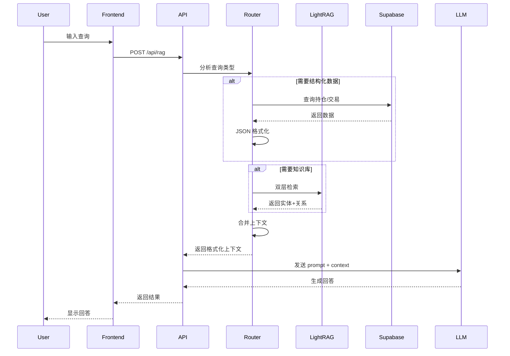

# Design Document: RAG Service Upgrade

## Overview

本设计文档描述投资组合管理系统 RAG 服务的全面升级方案。采用双轨架构：
- **LightRAG** 处理非结构化知识（书籍、文章、笔记）
- **优化的 Context Builder** 处理结构化数据（持仓、交易、风险指标）

升级后的系统将显著提升知识库页面性能、AI 对数据的理解准确性，以及检索的完整性。

## Architecture

### 系统架构图

```mermaid
graph TB
    subgraph Frontend["前端 (React)"]
        UI[DynamicNotes.tsx]
        Chat[Chat Component]
    end
    
    subgraph API["Vercel API Layer"]
        ChatAPI[/api/chat]
        RAGAPI[/api/rag]
        DocAPI[/api/documents]
    end
    
    subgraph RAGService["RAG Service Layer"]
        Router[Query Router]
        ContextBuilder[Context Builder]
        
        subgraph Structured["结构化数据处理"]
            StructuredRetriever[Structured Retriever]
            JSONFormatter[JSON Formatter]
        end
        
        subgraph Unstructured["非结构化数据处理"]
            LightRAGClient[LightRAG Client]
        end
    end
    
    subgraph Backend["Backend Services"]
        LightRAGService[LightRAG Python Service]
        KnowledgeGraph[(Knowledge Graph)]
    end
    
    subgraph Storage["Data Storage"]
        Supabase[(Supabase PostgreSQL)]
        DocMeta[documents_meta]
        DocChunks[document_chunks]
        Positions[stock_positions]
        Transactions[transactions]
    end
    
    UI --> DocAPI
    Chat --> ChatAPI
    ChatAPI --> RAGAPI
    RAGAPI --> Router
    
    Router --> StructuredRetriever
    Router --> LightRAGClient
    
    StructuredRetriever --> Supabase
    LightRAGClient --> LightRAGService
    LightRAGService --> KnowledgeGraph
    
    StructuredRetriever --> JSONFormatter
    JSONFormatter --> ContextBuilder
    LightRAGClient --> ContextBuilder
    
    DocAPI --> DocMeta
    LightRAGService --> DocChunks
```

### 数据流



## Components and Interfaces

### 1. LightRAG Python Service

独立部署的 Python 服务，负责知识图谱管理和检索。

```python
# lightrag_service/main.py
from fastapi import FastAPI
from lightrag import LightRAG
from pydantic import BaseModel

app = FastAPI()
rag = LightRAG(working_dir="./knowledge_graph")

class IndexRequest(BaseModel):
    document_id: str
    content: str
    metadata: dict

class QueryRequest(BaseModel):
    query: str
    mode: str = "hybrid"  # "low", "high", "hybrid"

class QueryResponse(BaseModel):
    entities: list
    relations: list
    context: str

@app.post("/index")
async def index_document(req: IndexRequest):
    """索引新文档到知识图谱"""
    rag.insert(req.content)
    return {"status": "indexed", "document_id": req.document_id}

@app.post("/query")
async def query_knowledge(req: QueryRequest) -> QueryResponse:
    """查询知识图谱"""
    result = rag.query(req.query, param=QueryParam(mode=req.mode))
    return QueryResponse(
        entities=result.entities,
        relations=result.relations,
        context=result.context
    )

@app.delete("/document/{document_id}")
async def delete_document(document_id: str):
    """从知识图谱删除文档"""
    # LightRAG 支持增量删除
    return {"status": "deleted"}

@app.get("/health")
async def health_check():
    return {"status": "healthy"}
```

### 2. RAG Service (TypeScript)

前端调用的 RAG 服务，负责路由和上下文构建。

```typescript
// client/src/services/ragService.ts

interface PortfolioContext {
  summary: PortfolioSummary;
  positions: PositionDetail[];
  options: OptionDetail[];
  transactions: TransactionDetail[];
}

interface KnowledgeContext {
  entities: Entity[];
  relations: Relation[];
  relevantContent: string;
}

interface RAGContext {
  structured: PortfolioContext;
  knowledge: KnowledgeContext;
  formattedContext: string;
}

export const ragService = {
  async getContext(query: string): Promise<RAGContext> {
    const queryType = this.classifyQuery(query);
    
    const [structured, knowledge] = await Promise.all([
      queryType.needsStructured ? this.getStructuredContext() : null,
      queryType.needsKnowledge ? this.getKnowledgeContext(query) : null
    ]);
    
    return {
      structured,
      knowledge,
      formattedContext: this.buildFormattedContext(structured, knowledge)
    };
  },
  
  classifyQuery(query: string): QueryType {
    // 简单的关键词分类，未来可用 LLM 分类
    const structuredKeywords = ['持仓', '仓位', '交易', '买入', '卖出', '盈亏', '净值'];
    const needsStructured = structuredKeywords.some(k => query.includes(k));
    const needsKnowledge = !needsStructured || query.length > 20;
    return { needsStructured, needsKnowledge };
  }
};
```

### 3. Context Builder

负责将检索结果格式化为 AI 可理解的上下文。

```typescript
// client/src/services/contextBuilder.ts

interface PortfolioSummary {
  snapshot_date: string;
  total_net_worth_cny: number;
  total_positions: number;
  total_options: number;
  cash_ratio_percent: number;
  ytd_return_percent: number;
}

interface PositionDetail {
  ticker: string;
  name: string;
  quantity: number;
  current_price: number;
  price_currency: string;
  avg_cost: number;
  market_value_cny: number;
  weight_percent: number;
  unrealized_pnl_percent: number;
}

export function buildStructuredContext(data: PortfolioContext): string {
  const json = {
    portfolio_summary: {
      snapshot_date: data.summary.snapshot_date,
      total_net_worth_cny: data.summary.total_net_worth_cny,
      total_positions: data.summary.total_positions,
      total_options: data.summary.total_options,
      cash_ratio_percent: data.summary.cash_ratio_percent,
      ytd_return_percent: data.summary.ytd_return_percent
    },
    stock_positions: data.positions.map(p => ({
      ticker: p.ticker,
      name: p.name,
      quantity: p.quantity,
      current_price: { value: p.current_price, currency: p.price_currency },
      avg_cost: { value: p.avg_cost, currency: p.price_currency },
      market_value_cny: p.market_value_cny,
      weight_percent: p.weight_percent,
      unrealized_pnl_percent: p.unrealized_pnl_percent
    })),
    option_positions: data.options,
    recent_transactions: data.transactions.slice(0, 10)
  };
  
  return `## 投资组合数据 (JSON 格式)
\`\`\`json
${JSON.stringify(json, null, 2)}
\`\`\`

### 数据说明
- current_price: 当前价格，货币单位见 currency 字段
- market_value_cny: 市值，已换算为人民币
- weight_percent: 占总资产比例
- unrealized_pnl_percent: 未实现盈亏百分比`;
}

export function buildKnowledgeContext(data: KnowledgeContext): string {
  return `## 相关知识库内容

### 相关实体
${data.entities.map(e => `- **${e.name}**: ${e.description}`).join('\n')}

### 实体关系
${data.relations.map(r => `- ${r.source} → ${r.relation} → ${r.target}`).join('\n')}

### 相关文档摘要
${data.relevantContent}`;
}
```

### 4. Document Management API

处理文档的 CRUD 和索引操作。

```typescript
// api/documents.ts

export default async function handler(req: VercelRequest, res: VercelResponse) {
  const supabase = createClient(SUPABASE_URL, SUPABASE_SERVICE_KEY);
  
  if (req.method === 'GET') {
    // 只返回元数据，不返回 embedding
    const { data } = await supabase
      .from('documents_meta')
      .select('id, title, source_type, chunk_count, created_at, metadata')
      .order('created_at', { ascending: false });
    return res.json(data);
  }
  
  if (req.method === 'POST') {
    const { title, content, source_type, metadata } = req.body;
    
    // 1. 创建元数据记录
    const { data: meta } = await supabase
      .from('documents_meta')
      .insert({ title, source_type, metadata })
      .select()
      .single();
    
    // 2. 索引到 LightRAG
    await fetch(`${LIGHTRAG_URL}/index`, {
      method: 'POST',
      headers: { 'Content-Type': 'application/json' },
      body: JSON.stringify({
        document_id: meta.id,
        content,
        metadata: { title, source_type, ...metadata }
      })
    });
    
    return res.json({ success: true, id: meta.id });
  }
  
  if (req.method === 'DELETE') {
    const { id } = req.query;
    
    // 1. 从 LightRAG 删除
    await fetch(`${LIGHTRAG_URL}/document/${id}`, { method: 'DELETE' });
    
    // 2. 从 Supabase 删除
    await supabase.from('documents_meta').delete().eq('id', id);
    
    return res.json({ success: true });
  }
}
```

## Data Models

### 数据库 Schema 变更

```sql
-- 新表：文档元数据（不含 embedding）
CREATE TABLE documents_meta (
  id BIGSERIAL PRIMARY KEY,
  title TEXT NOT NULL,
  source_type TEXT NOT NULL,
  chunk_count INTEGER DEFAULT 1,
  metadata JSONB DEFAULT '{}',
  created_at TIMESTAMPTZ DEFAULT NOW(),
  updated_at TIMESTAMPTZ DEFAULT NOW()
);

-- 索引优化
CREATE INDEX idx_documents_meta_source_type ON documents_meta(source_type);
CREATE INDEX idx_documents_meta_created_at ON documents_meta(created_at DESC);

-- 旧表保留用于迁移，之后可删除
-- documents 表将被 LightRAG 的内部存储替代
```

### LightRAG 存储结构

LightRAG 使用自己的存储格式（NetworkX 图 + 向量索引），存储在 `./knowledge_graph/` 目录：

```
knowledge_graph/
├── graph.graphml          # 知识图谱（实体+关系）
├── entities.json          # 实体详情
├── relations.json         # 关系详情
├── chunks/                # 文档切片
│   ├── doc_001_chunk_001.txt
│   └── ...
└── index/                 # 向量索引
    └── faiss.index
```

### 结构化数据 JSON Schema

```typescript
interface PortfolioContextSchema {
  portfolio_summary: {
    snapshot_date: string;           // ISO 8601 格式
    total_net_worth_cny: number;     // 总净值（人民币）
    total_positions: number;         // 股票持仓数量
    total_options: number;           // 期权持仓数量
    cash_ratio_percent: number;      // 现金比例
    ytd_return_percent: number;      // 年初至今收益率
  };
  stock_positions: Array<{
    ticker: string;                  // 股票代码
    name: string;                    // 公司名称
    quantity: number;                // 持仓数量
    current_price: {
      value: number;
      currency: "USD" | "HKD" | "CNY";
    };
    avg_cost: {
      value: number;
      currency: "USD" | "HKD" | "CNY";
    };
    market_value_cny: number;        // 市值（人民币）
    weight_percent: number;          // 占比
    unrealized_pnl_percent: number;  // 未实现盈亏
  }>;
  option_positions: Array<{
    symbol: string;
    underlying: string;
    option_type: "CALL" | "PUT";
    strike_price: number;
    expiry_date: string;
    quantity: number;
    current_price: number;
    market_value_cny: number;
    weight_percent: number;
  }>;
  recent_transactions: Array<{
    date: string;
    action: "BUY" | "SELL";
    ticker: string;
    quantity: number;
    price: number;
    currency: string;
  }>;
}
```


## Correctness Properties

*A property is a characteristic or behavior that should hold true across all valid executions of a system—essentially, a formal statement about what the system should do. Properties serve as the bridge between human-readable specifications and machine-verifiable correctness guarantees.*

### Property 1: Document List Performance

*For any* Knowledge_Base page load with N documents (where N ≤ 1000), the document metadata SHALL be displayed within 500ms, and the response SHALL NOT contain embedding vectors.

**Validates: Requirements 1.1, 1.3**

### Property 2: Book Aggregation Consistency

*For any* set of documents where multiple documents share a base title with "(Part N)" suffix, the UI SHALL display exactly one aggregated entry per unique base title, with chunk_count equal to the number of parts.

**Validates: Requirements 1.2, 6.1**

### Property 3: Pagination Correctness

*For any* Knowledge_Base with N documents where N > 20, the API SHALL return paginated results with exactly 20 items per page (except the last page), and the total across all pages SHALL equal N.

**Validates: Requirements 1.5**

### Property 4: Entity Extraction Round-Trip

*For any* document containing identifiable entities (company names, concepts, people), after indexing to LightRAG, querying for those entities SHALL return results that reference the original document.

**Validates: Requirements 2.2**

### Property 5: Dual-Level Retrieval Completeness

*For any* query to LightRAG, the response SHALL contain both entity-level results (specific entities matching the query) AND relation-level results (relationships between entities), when both exist in the knowledge graph.

**Validates: Requirements 2.3**

### Property 6: Incremental Update Isolation

*For any* new document added to the knowledge graph, the indexing operation SHALL NOT modify the embeddings or graph structure of previously indexed documents.

**Validates: Requirements 2.4**

### Property 7: Structured Context JSON Validity

*For any* portfolio data, the Context_Builder output SHALL be valid JSON containing: portfolio_summary (with total_net_worth_cny, total_positions, cash_ratio_percent), stock_positions array (each with ticker, current_price.value, current_price.currency, market_value_cny, weight_percent), and recent_transactions array.

**Validates: Requirements 3.1, 3.2, 3.3, 3.4**

### Property 8: Position Truncation with Summary

*For any* portfolio with N positions where N > 20, the Context_Builder SHALL include exactly the top 20 positions by market_value_cny, plus a summary field indicating "(N-20) additional positions not shown".

**Validates: Requirements 3.5**

### Property 9: Migration Document Count Invariant

*For any* migration from the old documents table to LightRAG, the count of successfully migrated documents plus the count of failed documents SHALL equal the original document count.

**Validates: Requirements 4.3**

### Property 10: Query Classification Correctness

*For any* user query, the RAG_Service SHALL classify it as requiring Structured_Data if it contains position/transaction keywords (持仓, 仓位, 交易, 买入, 卖出, 盈亏, 净值), and SHALL classify it as requiring Knowledge_Base if it contains concept keywords (策略, 原则, 理论, 分析) or is longer than 20 characters.

**Validates: Requirements 5.1, 5.4, 5.5**

### Property 11: Context Source Attribution

*For any* merged RAG context containing both Structured_Data and Knowledge_Base results, each section SHALL be clearly labeled with its source type ("投资组合数据" or "相关知识库内容").

**Validates: Requirements 5.2, 5.3**

### Property 12: Cascade Delete Completeness

*For any* book deletion operation, all document chunks associated with that book (identified by matching base title) SHALL be removed from both the metadata table and the LightRAG knowledge graph.

**Validates: Requirements 6.3**

### Property 13: Search Result Grouping

*For any* search query across documents, if multiple chunks from the same parent document match, the results SHALL be grouped under a single parent entry with the matching chunks listed as children.

**Validates: Requirements 6.5**

## Error Handling

### LightRAG Service Failures

```typescript
async function queryWithFallback(query: string): Promise<RAGContext> {
  try {
    const lightragResult = await fetchWithTimeout(
      `${LIGHTRAG_URL}/query`,
      { method: 'POST', body: JSON.stringify({ query }) },
      3000 // 3 second timeout
    );
    return lightragResult;
  } catch (error) {
    console.error('[RAG] LightRAG failed, falling back to vector search:', error);
    
    // Fallback to existing Supabase vector search
    const embedding = await getEmbedding(query);
    const { data } = await supabase.rpc('match_documents', {
      query_embedding: embedding,
      match_threshold: 0.5,
      match_count: 5
    });
    
    return {
      entities: [],
      relations: [],
      relevantContent: data.map(d => d.content).join('\n\n'),
      fallbackUsed: true
    };
  }
}
```

### Migration Error Handling

```typescript
async function migrateDocuments(): Promise<MigrationResult> {
  const { data: documents } = await supabase.from('documents').select('*');
  
  const results = {
    success: [] as string[],
    failed: [] as { id: string; error: string }[]
  };
  
  for (const doc of documents) {
    try {
      await indexToLightRAG(doc);
      results.success.push(doc.id);
    } catch (error) {
      console.error(`[Migration] Failed to migrate doc ${doc.id}:`, error);
      results.failed.push({ id: doc.id, error: error.message });
      // Continue with next document
    }
  }
  
  // Verify counts
  const originalCount = documents.length;
  const migratedCount = results.success.length + results.failed.length;
  
  if (originalCount !== migratedCount) {
    throw new Error(`Count mismatch: ${originalCount} vs ${migratedCount}`);
  }
  
  return results;
}
```

### Health Check and Monitoring

```typescript
// api/health.ts
export default async function handler(req: VercelRequest, res: VercelResponse) {
  const checks = {
    supabase: false,
    lightrag: false,
    timestamp: new Date().toISOString()
  };
  
  // Check Supabase
  try {
    await supabase.from('documents_meta').select('count').limit(1);
    checks.supabase = true;
  } catch (e) {
    console.error('[Health] Supabase check failed:', e);
  }
  
  // Check LightRAG
  try {
    const response = await fetch(`${LIGHTRAG_URL}/health`, { timeout: 2000 });
    checks.lightrag = response.ok;
  } catch (e) {
    console.error('[Health] LightRAG check failed:', e);
  }
  
  const allHealthy = checks.supabase && checks.lightrag;
  res.status(allHealthy ? 200 : 503).json(checks);
}
```

## Testing Strategy

### Unit Tests

单元测试覆盖核心逻辑组件：

1. **Context Builder Tests**
   - 测试 JSON 格式化输出
   - 测试货币单位分离
   - 测试位置截断逻辑
   - 测试空数据处理

2. **Query Classifier Tests**
   - 测试结构化数据关键词识别
   - 测试知识库关键词识别
   - 测试混合查询分类

3. **Book Aggregation Tests**
   - 测试 "(Part N)" 模式匹配
   - 测试 chunk 计数
   - 测试边界情况（单 chunk 书籍）

### Property-Based Tests

使用 fast-check 进行属性测试，最少 100 次迭代：

```typescript
import fc from 'fast-check';

// Property 7: Structured Context JSON Validity
describe('Context Builder Properties', () => {
  it('should always produce valid JSON with required fields', () => {
    fc.assert(
      fc.property(
        fc.array(arbitraryPosition(), { minLength: 0, maxLength: 50 }),
        fc.array(arbitraryTransaction(), { minLength: 0, maxLength: 20 }),
        (positions, transactions) => {
          const context = buildStructuredContext({
            summary: generateSummary(positions),
            positions,
            options: [],
            transactions
          });
          
          // Should be valid JSON
          const parsed = JSON.parse(extractJSON(context));
          
          // Should have required fields
          expect(parsed.portfolio_summary).toBeDefined();
          expect(parsed.portfolio_summary.total_net_worth_cny).toBeTypeOf('number');
          expect(parsed.stock_positions).toBeInstanceOf(Array);
          
          // Each position should have currency info
          parsed.stock_positions.forEach(p => {
            expect(p.current_price.currency).toMatch(/^(USD|HKD|CNY)$/);
          });
          
          return true;
        }
      ),
      { numRuns: 100 }
    );
  });
});

// Property 8: Position Truncation
describe('Position Truncation Properties', () => {
  it('should truncate to top 20 when more than 20 positions', () => {
    fc.assert(
      fc.property(
        fc.array(arbitraryPosition(), { minLength: 21, maxLength: 100 }),
        (positions) => {
          const context = buildStructuredContext({
            summary: generateSummary(positions),
            positions,
            options: [],
            transactions: []
          });
          
          const parsed = JSON.parse(extractJSON(context));
          
          // Should have exactly 20 positions
          expect(parsed.stock_positions.length).toBe(20);
          
          // Should be sorted by market value
          for (let i = 1; i < parsed.stock_positions.length; i++) {
            expect(parsed.stock_positions[i-1].market_value_cny)
              .toBeGreaterThanOrEqual(parsed.stock_positions[i].market_value_cny);
          }
          
          // Should have summary of remaining
          expect(context).toContain(`${positions.length - 20} additional positions`);
          
          return true;
        }
      ),
      { numRuns: 100 }
    );
  });
});

// Property 10: Query Classification
describe('Query Classification Properties', () => {
  it('should correctly classify structured data queries', () => {
    const structuredKeywords = ['持仓', '仓位', '交易', '买入', '卖出', '盈亏', '净值'];
    
    fc.assert(
      fc.property(
        fc.constantFrom(...structuredKeywords),
        fc.string({ minLength: 0, maxLength: 20 }),
        (keyword, suffix) => {
          const query = `${keyword}${suffix}`;
          const classification = classifyQuery(query);
          
          expect(classification.needsStructured).toBe(true);
          return true;
        }
      ),
      { numRuns: 100 }
    );
  });
});
```

### Integration Tests

集成测试验证端到端流程：

1. **Document Indexing Flow**
   - 上传文档 → LightRAG 索引 → 查询验证

2. **RAG Query Flow**
   - 发送查询 → 路由分类 → 检索 → 上下文构建 → 返回

3. **Fallback Flow**
   - 模拟 LightRAG 故障 → 验证降级到向量搜索

### Test Configuration

```typescript
// vitest.config.ts
export default defineConfig({
  test: {
    include: ['**/*.test.ts', '**/*.property.test.ts'],
    coverage: {
      reporter: ['text', 'json', 'html'],
      exclude: ['node_modules/', 'dist/']
    }
  }
});
```
