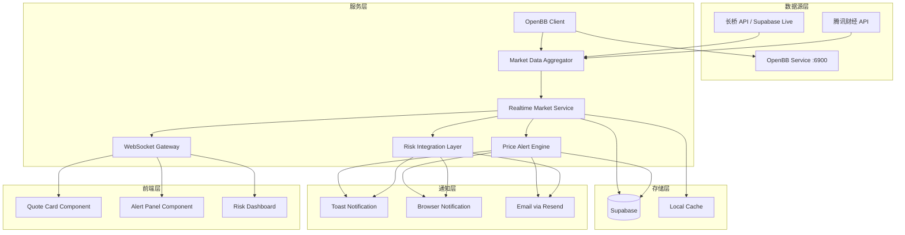

# Design Document: 实时行情平台

## Overview

实时行情平台是 RiskControl 系统的核心模块，提供实时市场数据监控、智能警报触发和自动化风控响应能力。本设计基于 OpenBB 统一数据层，扩展实时推送、价格警报和风控集成功能。

### 依赖关系

- **依赖**: `openbb-integration` - 提供统一的数据获取层（美股备用数据源）
- **被依赖**: `qlib-analytics` - 消费历史行情数据用于模型训练

### 设计原则

1. **统一数据层**：通过 OpenBB Client 获取美股备用数据，长桥/腾讯保留直连
2. **复用优先**：最大化复用现有 `marketData.ts`、`riskAlertService.ts` 等服务
3. **渐进增强**：在现有架构上增量添加功能，避免大规模重构
4. **高可用性**：多数据源冗余，自动故障转移
5. **低延迟**：WebSocket 实时推送，减少轮询开销

## Architecture



> **架构变更说明**：原有的 Finnhub/Yahoo/Polygon 直接调用已迁移到 `openbb-integration` 服务，本模块通过 OpenBB Client 统一调用。详见 `.kiro/specs/openbb-integration/design.md`。

## Components and Interfaces

### 1. Market Data Aggregator (扩展现有 marketData.ts)

```typescript
// 扩展现有 marketData.ts
import { openbbClient } from './openbbClient';

interface DataSourceHealth {
  source: DataSource;
  isHealthy: boolean;
  successRate: number;
  avgLatency: number;
  lastError?: string;
  consecutiveFailures: number;
}

interface MarketDataAggregator {
  // 现有方法
  fetchStockData(ticker: string): Promise<MarketDataResponse>;
  fetchMultipleStocks(tickers: string[]): Promise<Map<string, StockInfo>>;
  
  // 新增方法
  getDataSourceHealth(): DataSourceHealth[];
  setDataSourcePriority(sources: DataSource[]): void;
  onDataUpdate(callback: (quote: LiveQuote) => void): () => void;
}

// 数据源类型：长桥(主)、OpenBB(美股备用)、腾讯(A股)
type DataSource = 'longport' | 'openbb' | 'tencent';
```

### 2. Realtime Market Service

```typescript
interface RealtimeMarketService {
  // 订阅管理
  subscribe(tickers: string[], priority: 'high' | 'normal'): void;
  unsubscribe(tickers: string[]): void;
  
  // 数据获取
  getQuote(ticker: string): LiveQuote | null;
  getQuotes(tickers: string[]): Map<string, LiveQuote>;
  
  // 市场状态
  getMarketStatus(market: Market): MarketStatus;
  getNextTradingSession(market: Market): Date;
  
  // 生命周期
  start(): void;
  stop(): void;
}

interface MarketStatus {
  market: Market;
  status: 'pre-market' | 'open' | 'post-market' | 'closed';
  nextStatusChange: Date;
  countdown: number; // seconds
}
```

### 3. Price Alert Engine

```typescript
interface PriceAlertEngine {
  // 规则管理
  createRule(rule: CreateAlertRuleInput): Promise<AlertRule>;
  updateRule(id: string, updates: Partial<AlertRule>): Promise<AlertRule>;
  deleteRule(id: string): Promise<void>;
  getRules(ticker?: string): Promise<AlertRule[]>;
  
  // 监控
  evaluateRules(quote: LiveQuote): AlertNotification[];
  
  // 历史
  getAlertHistory(options: AlertHistoryOptions): Promise<AlertHistory[]>;
}

interface AlertRule {
  id: string;
  ticker: string;
  conditionType: AlertConditionType;
  targetValue: number;
  notificationChannels: NotificationChannel[];
  enabled: boolean;
  createdAt: Date;
  lastTriggeredAt?: Date;
}

type AlertConditionType = 
  | 'price_above'      // 价格高于
  | 'price_below'      // 价格低于
  | 'change_above'     // 涨幅超过
  | 'change_below'     // 跌幅超过
  | 'break_ma';        // 突破均线

type NotificationChannel = 'toast' | 'browser' | 'email' | 'push';
```

### 4. Risk Integration Layer

```typescript
interface RiskIntegrationLayer {
  // 实时风控计算
  onQuoteUpdate(quotes: Map<string, LiveQuote>): void;
  
  // 获取实时指标
  getRealTimeMetrics(): RealTimeRiskMetrics;
  
  // 阈值检查
  checkThresholds(): RiskAlert[];
}

interface RealTimeRiskMetrics {
  currentLeverage: number;
  dailyPnL: number;
  dailyPnLPercent: number;
  portfolioValue: number;
  unrealizedPnL: number;
  trailingStopDistance: number;
}
```

### 5. WebSocket Gateway

```typescript
interface WebSocketGateway {
  // 连接管理
  connect(): Promise<void>;
  disconnect(): void;
  isConnected(): boolean;
  
  // 订阅
  subscribe(tickers: string[]): void;
  unsubscribe(tickers: string[]): void;
  
  // 事件
  onQuote(callback: (quote: LiveQuote) => void): () => void;
  onConnectionChange(callback: (connected: boolean) => void): () => void;
}
```

## Data Models

### LiveQuote (实时报价)

```typescript
interface LiveQuote {
  ticker: string;
  price: number;
  prevClose: number;
  changePercent: number;
  volume: number;
  timestamp: number;
  source: DataSource;
  market: Market;
  currency: Currency;
}
```

### AlertRule (警报规则) - Supabase 表

```sql
CREATE TABLE price_alert_rules (
  id UUID PRIMARY KEY DEFAULT gen_random_uuid(),
  user_id INTEGER NOT NULL DEFAULT 1,
  ticker VARCHAR(20) NOT NULL,
  condition_type VARCHAR(20) NOT NULL,
  target_value DECIMAL(18, 4) NOT NULL,
  notification_channels TEXT[] NOT NULL DEFAULT ARRAY['toast'],
  enabled BOOLEAN NOT NULL DEFAULT true,
  created_at TIMESTAMPTZ NOT NULL DEFAULT NOW(),
  updated_at TIMESTAMPTZ NOT NULL DEFAULT NOW(),
  last_triggered_at TIMESTAMPTZ,
  cooldown_until TIMESTAMPTZ
);

CREATE INDEX idx_alert_rules_ticker ON price_alert_rules(ticker);
CREATE INDEX idx_alert_rules_enabled ON price_alert_rules(enabled);
```

### AlertHistory (警报历史) - Supabase 表

```sql
CREATE TABLE price_alert_history (
  id UUID PRIMARY KEY DEFAULT gen_random_uuid(),
  rule_id UUID REFERENCES price_alert_rules(id),
  ticker VARCHAR(20) NOT NULL,
  triggered_price DECIMAL(18, 4) NOT NULL,
  condition_type VARCHAR(20) NOT NULL,
  target_value DECIMAL(18, 4) NOT NULL,
  triggered_at TIMESTAMPTZ NOT NULL DEFAULT NOW(),
  notification_sent BOOLEAN NOT NULL DEFAULT false,
  notification_channels TEXT[]
);

CREATE INDEX idx_alert_history_ticker ON price_alert_history(ticker);
CREATE INDEX idx_alert_history_triggered_at ON price_alert_history(triggered_at);
```

### DataSourceMetrics (数据源监控) - 内存存储

```typescript
interface DataSourceMetrics {
  source: DataSource;
  totalRequests: number;
  successfulRequests: number;
  failedRequests: number;
  totalLatency: number;
  consecutiveFailures: number;
  lastRequestTime: number;
  lastError?: string;
}
```

## Correctness Properties

*A property is a characteristic or behavior that should hold true across all valid executions of a system—essentially, a formal statement about what the system should do. Properties serve as the bridge between human-readable specifications and machine-verifiable correctness guarantees.*

### Property 1: Live Quote 结构完整性

*For any* 有效的行情数据请求，返回的 LiveQuote 对象必须包含所有必需字段（ticker、price、prevClose、changePercent、volume、timestamp），且所有数值字段为有效数字。

**Validates: Requirements 1.6**

### Property 2: 数据源故障转移

*For any* 数据源故障场景，当主数据源连续失败 3 次后，系统应自动切换到下一优先级的备用数据源，且切换后能成功获取数据。

**Validates: Requirements 1.5, 9.2, 9.3**

### Property 3: 警报规则 CRUD 一致性

*For any* 警报规则的创建、更新、删除操作，操作完成后查询应返回一致的状态：创建后可查询到、更新后返回新值、删除后不可查询。

**Validates: Requirements 3.1, 3.3, 3.4**

### Property 4: 警报条件评估正确性

*For any* 警报规则和实时价格组合，当价格满足规则条件时必须触发警报，当价格不满足条件时不应触发警报。

**Validates: Requirements 4.1, 3.2**

### Property 5: 警报通知完整性

*For any* 触发的警报通知，必须包含标的代码、当前价格、触发条件、触发时间四个必需字段。

**Validates: Requirements 4.2**

### Property 6: 警报去重机制

*For any* 同一规则在 5 分钟内的多次触发，系统应合并为单次通知，避免重复骚扰。

**Validates: Requirements 4.4**

### Property 7: 风控阈值触发

*For any* 超过预设阈值的风控指标（杠杆率、单日亏损），系统必须触发相应的风控警报。

**Validates: Requirements 5.2, 5.3**

### Property 8: 市场状态计算正确性

*For any* 给定的时间点，系统应返回正确的市场状态（盘前、盘中、盘后、休市），且状态与实际交易时间一致。

**Validates: Requirements 8.1, 8.4**

### Property 9: 数据源健康状态追踪

*For any* 数据源请求，系统应正确记录成功率和延迟，且连续 3 次失败后标记为不健康。

**Validates: Requirements 9.1, 9.2**

### Property 10: WebSocket 订阅状态恢复

*For any* WebSocket 重连场景，重连成功后应恢复之前的所有订阅状态，不丢失任何订阅。

**Validates: Requirements 2.4**

## Error Handling

### 数据源错误

```typescript
class DataSourceError extends Error {
  constructor(
    public source: DataSource,
    public originalError: Error,
    public retryable: boolean
  ) {
    super(`Data source ${source} failed: ${originalError.message}`);
  }
}

// 错误处理策略
const errorHandlingStrategy = {
  // 可重试错误：网络超时、临时不可用
  retryable: ['ETIMEDOUT', 'ECONNRESET', 'RATE_LIMITED'],
  
  // 不可重试错误：无效代码、权限问题
  nonRetryable: ['INVALID_SYMBOL', 'UNAUTHORIZED'],
  
  // 重试配置
  maxRetries: 3,
  retryDelay: 1000, // ms
  backoffMultiplier: 2,
};
```

### WebSocket 错误

```typescript
const wsErrorHandling = {
  // 自动重连
  reconnect: {
    enabled: true,
    maxAttempts: 10,
    initialDelay: 1000,
    maxDelay: 30000,
    backoffMultiplier: 1.5,
  },
  
  // 心跳检测
  heartbeat: {
    interval: 30000, // 30s
    timeout: 5000,   // 5s
  },
};
```

### 警报错误

```typescript
// 通知发送失败时的降级策略
const notificationFallback = {
  // 邮件失败 -> 尝试浏览器通知
  email: ['browser', 'toast'],
  // 浏览器通知失败 -> 尝试 Toast
  browser: ['toast'],
  // Toast 失败 -> 记录日志
  toast: ['log'],
};
```

## Testing Strategy

### 单元测试

使用 Vitest 进行单元测试，覆盖核心逻辑：

1. **警报条件评估** - 测试各种条件类型的评估逻辑
2. **市场状态计算** - 测试不同时区和时间的市场状态
3. **数据源健康检查** - 测试故障检测和恢复逻辑
4. **去重机制** - 测试冷却期内的通知合并

### 属性测试

使用 fast-check 进行属性测试，验证正确性属性：

```typescript
// 测试框架配置
const propertyTestConfig = {
  numRuns: 100,  // 每个属性测试运行 100 次
  seed: undefined, // 随机种子
};
```

**Property Test 1: Live Quote 结构完整性**
- 生成随机的 ticker 和价格数据
- 验证返回的 LiveQuote 包含所有必需字段

**Property Test 2: 警报条件评估**
- 生成随机的规则和价格组合
- 验证评估结果与预期一致

**Property Test 3: 市场状态计算**
- 生成随机的时间点
- 验证返回的市场状态正确

### 集成测试

1. **端到端警报流程** - 创建规则 → 价格变动 → 触发通知
2. **数据源切换** - 模拟主数据源故障 → 验证自动切换
3. **WebSocket 重连** - 模拟断开 → 验证重连和状态恢复
