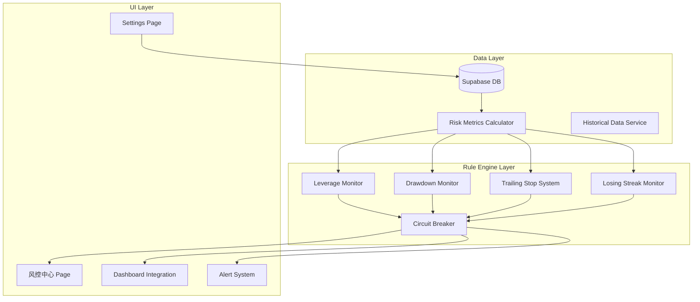

# Design Document: Risk Control System 2026

## Overview

本设计文档描述了基于2025年度投资回顾分析的风控系统升级方案。核心目标是将最大回撤控制在25%以内，杠杆限制在1.5x以下，并通过自动化熔断机制防止情绪化交易。

系统采用分层架构：
1. **数据层** - 风控指标计算和持久化
2. **规则引擎层** - 阈值检测和警报触发
3. **UI层** - 风控仪表盘和交互组件

## Architecture



## Components and Interfaces

### 1. Risk Metrics Service (`riskMetricsService.ts`)

```typescript
interface RiskMetrics {
  // 杠杆相关
  currentLeverage: number;
  leverageStatus: 'normal' | 'warning' | 'critical';
  leverageLimit: number; // 动态限制，回撤期间降低
  
  // 回撤相关
  monthlyDrawdown: number;
  monthlyDrawdownStatus: 'normal' | 'warning' | 'critical';
  monthStartNAV: number;
  distanceToMonthlyStopLoss: number;
  
  // 高水位相关
  highWaterMark: number;
  trailingStopLevel: number;
  distanceToTrailingStop: number;
  trailingStopStatus: 'normal' | 'warning' | 'triggered';
  
  // 连败相关
  currentLosingStreak: number;
  losingStreakStatus: 'normal' | 'warning' | 'critical';
  maxHistoricalLosingStreak: number;
  
  // 综合评分
  overallRiskScore: number; // 0-100, 越低越安全
  overallStatus: 'safe' | 'caution' | 'danger';
}

interface RiskThresholds {
  leverageWarning: number;      // default: 1.5
  leverageCritical: number;     // default: 2.0
  leverageInDrawdown: number;   // default: 1.2
  
  monthlyDrawdownWarning: number;   // default: 10
  monthlyDrawdownCritical: number;  // default: 15
  
  trailingStopPercent: number;  // default: 15
  
  losingStreakWarning: number;  // default: 3
  losingStreakCritical: number; // default: 5
}
```

### 2. Circuit Breaker Service (`circuitBreakerService.ts`)

```typescript
interface CircuitBreakerState {
  isActive: boolean;
  reason: string;
  activatedAt: string;
  expiresAt: string | null;
  severity: 'warning' | 'critical';
  
  // 具体限制
  tradingAllowed: boolean;
  maxAllowedLeverage: number;
  requiresConfirmation: boolean;
  coolingPeriodDays: number;
}

interface CircuitBreakerService {
  checkAndTrigger(metrics: RiskMetrics): CircuitBreakerState;
  acknowledgeAlert(alertId: string): void;
  overrideCoolingPeriod(reason: string): void; // 需要密码确认
  getActiveBreakers(): CircuitBreakerState[];
}
```

### 3. Risk Alert Types

```typescript
type RiskAlertType = 
  | 'LEVERAGE_WARNING'
  | 'LEVERAGE_CRITICAL'
  | 'LEVERAGE_BLOCKED'
  | 'MONTHLY_DRAWDOWN_WARNING'
  | 'MONTHLY_DRAWDOWN_CRITICAL'
  | 'TRAILING_STOP_WARNING'
  | 'TRAILING_STOP_TRIGGERED'
  | 'LOSING_STREAK_WARNING'
  | 'LOSING_STREAK_CRITICAL'
  | 'SEASONAL_RISK'
  | 'NEW_HIGH_WATER_MARK';

interface RiskAlert {
  id: string;
  type: RiskAlertType;
  severity: 'info' | 'warning' | 'critical';
  title: string;
  message: string;
  recommendation: string;
  timestamp: string;
  acknowledged: boolean;
  metrics: Partial<RiskMetrics>;
}
```

## Data Models

### Database Schema Updates

```sql
-- 风控配置表
CREATE TABLE risk_thresholds (
  id SERIAL PRIMARY KEY,
  user_id INTEGER NOT NULL,
  leverage_warning DECIMAL DEFAULT 1.5,
  leverage_critical DECIMAL DEFAULT 2.0,
  leverage_in_drawdown DECIMAL DEFAULT 1.2,
  monthly_drawdown_warning DECIMAL DEFAULT 10,
  monthly_drawdown_critical DECIMAL DEFAULT 15,
  trailing_stop_percent DECIMAL DEFAULT 15,
  losing_streak_warning INTEGER DEFAULT 3,
  losing_streak_critical INTEGER DEFAULT 5,
  updated_at TIMESTAMP DEFAULT NOW()
);

-- 风控日志表
CREATE TABLE risk_logs (
  id SERIAL PRIMARY KEY,
  user_id INTEGER NOT NULL,
  alert_type VARCHAR(50) NOT NULL,
  severity VARCHAR(20) NOT NULL,
  message TEXT,
  metrics JSONB,
  acknowledged BOOLEAN DEFAULT FALSE,
  acknowledged_at TIMESTAMP,
  created_at TIMESTAMP DEFAULT NOW()
);

-- 月度快照表（用于月度回撤计算）
CREATE TABLE monthly_snapshots (
  id SERIAL PRIMARY KEY,
  user_id INTEGER NOT NULL,
  year_month VARCHAR(7) NOT NULL, -- '2026-01'
  start_nav DECIMAL NOT NULL,
  end_nav DECIMAL,
  max_drawdown DECIMAL,
  max_leverage DECIMAL,
  losing_streak_days INTEGER,
  created_at TIMESTAMP DEFAULT NOW(),
  UNIQUE(user_id, year_month)
);

-- 熔断记录表
CREATE TABLE circuit_breaker_events (
  id SERIAL PRIMARY KEY,
  user_id INTEGER NOT NULL,
  reason VARCHAR(100) NOT NULL,
  severity VARCHAR(20) NOT NULL,
  activated_at TIMESTAMP NOT NULL,
  expires_at TIMESTAMP,
  overridden BOOLEAN DEFAULT FALSE,
  override_reason TEXT,
  created_at TIMESTAMP DEFAULT NOW()
);
```

## Correctness Properties

*A property is a characteristic or behavior that should hold true across all valid executions of a system—essentially, a formal statement about what the system should do. Properties serve as the bridge between human-readable specifications and machine-verifiable correctness guarantees.*

### Property 1: Leverage Alert Threshold Consistency
*For any* leverage value L, if L > leverage_warning threshold, the system SHALL return a status of 'warning' or 'critical', never 'normal'.
**Validates: Requirements 1.2, 1.3**

### Property 2: Leverage Blocking Enforcement
*For any* leverage value L > 1.5x, the system SHALL reject new BUY or SHORT orders, returning an error with appropriate message.
**Validates: Requirements 1.5**

### Property 3: Dynamic Leverage Limit in Drawdown
*For any* portfolio state where current_NAV < high_water_mark, the effective leverage limit SHALL be reduced to leverage_in_drawdown (default 1.2x).
**Validates: Requirements 1.6**

### Property 4: Monthly Drawdown Calculation Accuracy
*For any* month_start_NAV and current_NAV, the monthly drawdown SHALL equal (month_start_NAV - current_NAV) / month_start_NAV * 100, with proper handling of edge cases (zero NAV).
**Validates: Requirements 2.1**

### Property 5: Monthly Drawdown Alert Thresholds
*For any* monthly drawdown value D, if D >= 10%, status SHALL be 'warning' or 'critical'; if D >= 15%, status SHALL be 'critical'.
**Validates: Requirements 2.2, 2.3**

### Property 6: Monthly Drawdown Reset on New Month
*For any* date transition from month M to month M+1, the monthly drawdown calculation SHALL reset, using the first NAV of M+1 as the new month_start_NAV.
**Validates: Requirements 2.6**

### Property 7: High Water Mark Monotonicity
*For any* sequence of NAV values, the high_water_mark SHALL be monotonically non-decreasing (HWM can only increase or stay the same, never decrease).
**Validates: Requirements 3.1, 3.2**

### Property 8: Trailing Stop Level Calculation
*For any* high_water_mark H and trailing_stop_percent P, the trailing_stop_level SHALL equal H * (1 - P/100).
**Validates: Requirements 3.3**

### Property 9: Trailing Stop Alert Trigger
*For any* NAV value N and trailing_stop_level T, if N < T, the system SHALL trigger a trailing stop alert.
**Validates: Requirements 3.4**

### Property 10: Trailing Stop Percent Bounds
*For any* user-configured trailing_stop_percent P, the system SHALL enforce 10 <= P <= 25.
**Validates: Requirements 3.7**

### Property 11: Losing Streak Counter Accuracy
*For any* sequence of daily P&L values, the losing streak counter SHALL equal the count of consecutive negative P&L days ending at the current day.
**Validates: Requirements 4.1**

### Property 12: Losing Streak Reset on Profit
*For any* sequence of daily P&L values where the latest day is profitable (P&L > 0), the losing streak counter SHALL reset to 0.
**Validates: Requirements 4.5**

### Property 13: Losing Streak Alert Thresholds
*For any* losing streak count S, if S >= 3, status SHALL be 'warning' or 'critical'; if S >= 5, status SHALL be 'critical'.
**Validates: Requirements 4.2, 4.3**

### Property 14: Risk Score Bounds
*For any* combination of risk metrics, the overall risk score SHALL be in the range [0, 100].
**Validates: Requirements 5.7**

### Property 15: Risk Threshold Configuration Persistence
*For any* valid risk threshold configuration saved by the user, reading the configuration back SHALL return the same values.
**Validates: Requirements 6.6**

### Property 16: Seasonal Risk Detection
*For any* month with historical average return below -5%, the system SHALL flag it as a "weak month" and trigger seasonal risk warning when entering that month.
**Validates: Requirements 7.1, 7.2**

## Error Handling

### Edge Cases

1. **Zero NAV**: When NAV is 0 or negative, skip percentage calculations and display "数据异常" warning
2. **Missing Historical Data**: When monthly snapshots are missing, use earliest available data point
3. **First Day of Month**: Handle gracefully when month_start_NAV is not yet recorded
4. **Network Failures**: Cache last known risk metrics and display "数据可能过时" indicator

### Recovery Strategies

1. **Circuit Breaker Override**: Allow manual override with password confirmation and reason logging
2. **Alert Acknowledgment**: Acknowledged alerts should not re-trigger for same condition within 24 hours
3. **Data Sync Issues**: Implement retry logic with exponential backoff for database operations

## Testing Strategy

### Unit Tests
- Test each risk metric calculation function with edge cases
- Test threshold comparison logic
- Test alert generation logic

### Property-Based Tests
- Use fast-check library for TypeScript
- Minimum 100 iterations per property test
- Each test tagged with: **Feature: risk-control-2026, Property {number}: {property_text}**

### Integration Tests
- Test full flow from data input to alert generation
- Test database persistence and retrieval
- Test UI component rendering with various risk states

### Test Configuration
```typescript
// vitest.config.ts additions
export default defineConfig({
  test: {
    // Property-based test configuration
    testTimeout: 30000, // Allow time for 100+ iterations
  }
});
```
